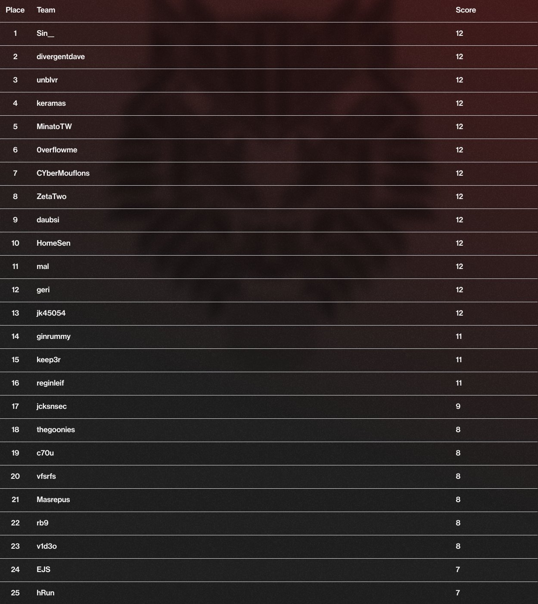

# CrowdStrike's Adversary Quest 2021

CrowdStrike hosted their "first-ever" [Adversary Quest CTF](https://www.crowdstrike.com/blog/join-crowdstrike-intelligence-adversary-quest/) running from 2021-01-18 to 2021-01-29.

It consisted of three tracks for the fictive Cyberthreat actors Catapult Spider, Protective Penguin and Space Jackal. Each track comprised four challenges each.

## Write-Ups

My write-ups for some of the challenges can be found here

- [Catapult Spider - #3 Module Wow](./Catapult%20Spider/Module%20Wow)
- [Protective Penguin - #1 Portal](./Protective%20Penguin/Portal)
- [Protective Penguin - #3 Egg Hunt](./Protective%20Penguin/Egg%20Hunt)
- [Protective Penguin - #4 Exfiltrat0r](./Protective%20Penguin/Exfiltrat0r)
- [Space Jackal - #1 Proclamation](./Space%20Jackal/Proclamation)
- [Space Jackal - #2 Matrix](./Space%20Jackal/Matrix)
- [Space Jackal - #3 Injector](./Space%20Jackal/Injector)

I was able to finish with rank #13.

## Official Walk-Throughs

- [Catapult Spider Track](https://www.crowdstrike.com/blog/adversary-quest-walkthrough-four-catapult-spider-ecrime-challenges/)
- [Protective Penguin Track](https://www.crowdstrike.com/blog/adversary-quest-walkthrough-four-protective-penguin-targeted-intrusion-challenges/)
- [Space Jackal Track](https://www.crowdstrike.com/blog/adversary-quest-walkthrough-four-space-jackal-hacktivist-challenges/)
