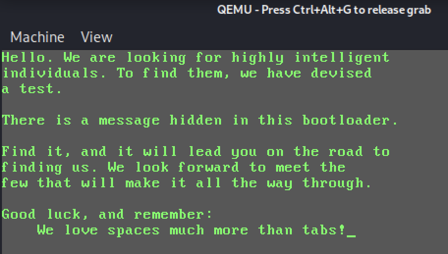
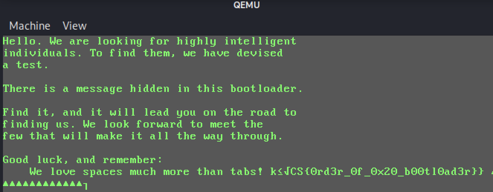

# CrowdStrike Adversary Quest 2021 / Space Jackal / #1 Proclamation

## Challenge Description
A mysterious file appeared on a deep dark web forum. Can you figure out what we can't see right now?
NOTE: Flags will be easily identifiable by following the format CS{some_secret_flag_text}. They must be submitted in full, including the CS{ and } parts.

## General Approach

### Identification of Evidence File
Check evidence for magic bytes via file command
```
$ file proclamation.dat 
proclamation.dat: DOS/MBR boot sector
```

If it is a MBR boot sector, let's have a look what fdisk has to say about it.
```
$ fdisk -l proclamation.dat 
Disk proclamation.dat: 512 B, 512 bytes, 1 sectors
Units: sectors of 1 * 512 = 512 bytes
Sector size (logical/physical): 512 bytes / 512 bytes
I/O size (minimum/optimal): 512 bytes / 512 bytes
Disklabel type: dos
Disk identifier: 0x8587ca82

Device            Boot      Start        End    Sectors  Size Id Type
proclamation.dat1      3939211656 6775681800 2836470145  1.3T 84 OS/2 hidden or Intel hibernation
proclamation.dat2      3669331162 6720349547 3051018386  1.4T 8e Linux LVM
proclamation.dat3      2543294681 6652988866 4109694186  1.9T 86 NTFS volume set
proclamation.dat4      4109694196 8219388391 4109694196  1.9T f4 SpeedStor

Partition table entries are not in disk order.
```
Agreed with fdisk on last sentence for sure...

### MBR Boot Sector Structure (Generic)
Offset | Meaning | Size (Bytes)
--- | --- | ---
0x0 | Bootstrap Code | 446
0x1BE | Partition Table | 4 * 16
0x1FE | Magic Bytes 0x55 0xAA | 2

Link: [Master Boot Record - MBR](https://en.wikipedia.org/wiki/Master_boot_record)

### Behavioural Analysis
Why don't we just emulate a boot with qemu and see what happens?
```
$ qemu-system-i386 proclamation.dat
```


### Strings
Are there additional strings inside the bootsector that we didn't witness during emulation?
```
$ strings proclamation.dat 
you're on a good way.
```

Yes! But... where is the text displayed when running the bootstrap code? Looks like it's kind of encoded/encrypted.

### Disassembly of the Bootstrap Code
MBR bootstrap code runs in [Real Mode](https://en.wikipedia.org/wiki/Real_mode)
It's loaded by the BIOS at address 0x0000:0x7C00 and then jumped to.
The handler for [Interrupt 10h](https://en.wikipedia.org/wiki/INT_10H) has a lot of console output functionality.

Disassemble as 16 bits architecture with radare2
```assembly
r2 -q -b 16 -m 0x7c00 -c "aaa; pd" proclamation.dat 
┌ 88: fcn.00007c00 ();
│           0000:7c00      bc0020         mov sp, 0x2000
│           0000:7c03      b407           mov ah, 7
│           0000:7c05      30c0           xor al, al
│           0000:7c07      31c9           xor cx, cx
│           0000:7c09      b78a           mov bh, 0x8a                 ; 138
│           0000:7c0b      b661           mov dh, 0x61                 ; 'a' ; 97
│           0000:7c0d      b261           mov dl, 0x61                 ; 'a' ; 97
│           0000:7c0f      cd10           int 0x10
│           0000:7c11      b402           mov ah, 2
│           0000:7c13      31d2           xor dx, dx
│           0000:7c15      30ff           xor bh, bh
│           0000:7c17      cd10           int 0x10
└       ┌─< 0000:7c19      eb46           jmp loc.00007c61
        │   ; CALL XREF from loc.00007c61 @ 0x7c61
┌ 70: fcn.00007c1b ();
│       │   0000:7c1b      5e             pop si			;; called from 0x7c61
│ 	│ 							        ;; si = 0x7c64
│       │   0000:7c1c      83c614         add si, 0x14			;; si = 0x7c78 (byte 0x2e)
│       │   0000:7c1f      b209           mov dl, 9			;; some starting value (ascii tab?)
│       │   0000:7c21      6652           push edx			;; save for later
│     ┌┌──> 0000:7c23      b300           mov bl, 0
│     ╎╎│   0000:7c25      b40e           mov ah, 0xe                  ; 14
│     ╎╎│   0000:7c27      8a04           mov al, byte [si]		;; get current char @ [si]
│     ╎╎│   ; CODE XREF from loc.00007c61 @ +0x43
│     ╎╎│   0000:7c29      83c601         add si, 1			;; add si byte pointer
│     ╎╎│   0000:7c2c      665a           pop edx			;; get temporarily saved edx (starts with 0x9)
│     ╎╎│   0000:7c2e      66c1e202       shl edx, 2			;; multiply with 4
│     ╎╎│   0000:7c32      6683c242       add edx, 0x42                	;; add 0x42
│     ╎╎│   0000:7c36      6681e2ff0000.  and edx, 0xff                	;; mask low byte
│     ╎╎│   0000:7c3d      6631d0         xor eax, edx			;; buf[si] XOR (((edx << 2) + 0x42) & 0xff)
│     ╎╎│   0000:7c40      6652           push edx			;; save right side XOR value in edx for reuse next loop iteration
│     ╎╎│   0000:7c42      0c00           or al, 0			;; that's the stop condition (al == 0x0)
									;; if decrypted byte == null, stop
│    ┌────< 0000:7c44      7419           je 0x7c5f			;; jumps to cli/hlt -> game over
│    │╎╎│   0000:7c46      88c2           mov dl, al
│    │╎╎│   0000:7c48      80f20a         xor dl, 0xa			;; if decrypted byte == newline, go 0x7c51
│   ┌─────< 0000:7c4b      7404           je 0x7c51
│   ││╎╎│   0000:7c4d      cd10           int 0x10			;; output decrypted char
│   ││└───< 0000:7c4f      ebd2           jmp 0x7c23			;; loop
│   ││ ╎│   ; CODE XREF from fcn.00007c1b @ 0x7c4b
│   └─────> 0000:7c51      b403           mov ah, 3
│    │ ╎│   0000:7c53      cd10           int 0x10			;; do newline stuff
│    │ ╎│   0000:7c55      b402           mov ah, 2
│    │ ╎│   0000:7c57      fec6           inc dh
│    │ ╎│   0000:7c59      b200           mov dl, 0
│    │ ╎│   0000:7c5b  ~   cd10           int 0x10			;; do newline stuff
│    │ ╎│   0000:7c5c      10eb           adc bl, ch			;; this is crap, 0x10 is used twice
│    │  │   0000:7c5e      c4             invalid			;; correct would be jmp fcn.00007c23
│    │  │   ; CODE XREF from fcn.00007c1b @ 0x7c44
│    └────> 0000:7c5f      fa             cli
└       │   0000:7c60      f4             hlt
        │   ; CODE XREF from fcn.00007c00 @ 0x7c19
        │   ;-- ip:
├ 61: loc.00007c61 (int16_t arg1, int16_t arg3);
│       └─> 0000:7c61      e8b7ff         call fcn.00007c1b
│       ┌─< 0000:7c64      796f           jns 0x7cd5			;; ascii hex bytes interpreted as code
│      ┌──< 0000:7c66      7527           jne 0x7c8f			;; up to 0x7c78
│     ┌───< 0000:7c68      7265           jb 0x7ccf
│     │││   0000:7c6a      206f6e         and byte [bx + 0x6e], ch     ; arg3
│     │││   0000:7c6d      206120         and byte [bx + di + 0x20], ah ; arg3
│     │││   0000:7c70      676f           outsw dx, word [esi]
│     │││   0000:7c72      6f             outsw dx, word [si]
│     │││   0000:7c73      64207761       and byte fs:[bx + 0x61], dh  ; arg3
│    ┌────< 0000:7c77      792e           jns 0x7ca7
│    ││││   0000:7c79      bfc686         mov di, 0x86c6
│    ││││   0000:7c7c      85c4           test sp, ax                  ; arg1
│    ││││   0000:7c7e      cabd8f         retf 0x8fbd
     ││││   0000:7c81      ca8b98         retf 0x988b
     ││││   0000:7c84      8f             invalid
     ││││   0000:7c85      ca8685         retf 0x8586
     ││││   0000:7c88      85818384       test word [bx + di - 0x7b7d], ax
     ││││   0000:7c8c      8d             invalid
     ││││   0000:7c8d  ~   ca8c85         retf 0x858c
│    ││││   ; CODE XREF from loc.00007c61 @ 0x7c66
│    ││└──> 0000:7c8f      8598ca82       test word [bx + si - 0x7d36], bx
```

There might be a disassembly fail at offset 0x7c5c (byte 0x10), which seems to be used twice in the disassembly: Once for int 10h and again as the opcode for adc.
But it should be just 0xeb 0xc4 at offset 0x7c5d following the int 10h.
```
disasm -a 0x7c5d "EBC4"
    7c5d:        eb c4                    jmp    0x7c23
```

What's the stuff behind the call @ 0000:7c61?
```
r2 -q -b 16 -m 0x7c00 -c "aaa; x 412 @ 0x7c64" proclamation.dat 
- offset -  0 1  2 3  4 5  6 7  8 9  A B  C D  E F  0123456789ABCDEF
0000:7c64  796f 7527 7265 206f 6e20 6120 676f 6f64  you're on a good		;; a hint, not displayed when running bootstrap code
0000:7c74  2077 6179 2ebf c686 85c4 cabd 8fca 8b98   way............
0000:7c84  8fca 8685 8581 8384 8dca 8c85 98ca 8283  ................
0000:7c94  8d82 8693 ca83 849e 8f86 8683 8d8f 849e  ................
0000:7ca4  e083 848e 839c 838e 9f8b 8699 c4ca be85  ................
0000:7cb4  ca8c 8384 8eca 9e82 8f87 c6ca 9d8f ca82  ................
0000:7cc4  8b9c 8fca 8e8f 9c83 998f 8ee0 8bca 9e8f  ................
0000:7cd4  999e c4e0 e0be 828f 988f ca83 99ca 8bca  ................
0000:7ce4  878f 9999 8b8d 8fca 8283 8e8e 8f84 ca83  ................
0000:7cf4  84ca 9e82 8399 ca88 8585 9e86 858b 8e8f  ................
0000:7d04  98c4 e0e0 ac83 848e ca83 9ec6 ca8b 848e  ................
0000:7d14  ca83 9eca 9d83 8686 ca86 8f8b 8eca 9385  ................
0000:7d24  9fca 8584 ca9e 828f ca98 858b 8eca 9e85  ................
0000:7d34  e08c 8384 8e83 848d ca9f 99c4 cabd 8fca  ................
0000:7d44  8685 8581 ca8c 8598 9d8b 988e ca9e 85ca  ................
0000:7d54  878f 8f9e ca9e 828f e08c 8f9d ca9e 828b  ................
0000:7d64  9eca 9d83 8686 ca87 8b81 8fca 839e ca8b  ................
0000:7d74  8686 ca9e 828f ca9d 8b93 ca9e 8298 859f  ................
0000:7d84  8d82 c4e0 e0ad 8585 8eca 869f 8981 c6ca  ................
0000:7d94  8b84 8eca 988f 878f 8788 8f98 d0e0 caca  ................
0000:7da4  caca bd8f ca86 859c 8fca 999a 8b89 8f99  ................
0000:7db4  ca87 9f89 82ca 8785 988f ca9e 828b 84ca  ................
0000:7dc4  9e8b 8899 cbea 8119 11a9 b991 da98 8ed9  ................
0000:7dd4  98b5 da8c b5da 92d8 dab5 88da da9e 86da  ................
0000:7de4  8b8e d998 9797 eaf4 f4f4 f4f4 f4f4 f4f4  ................
0000:7df4  f4f4 f4f4 f4f4 f4f4 f4f4 55aa            ..........U.		;; ends with magic bytes of MBR/boot sector
```

The data behind the *hint* is used as the start of a blob that is decrypted. First encrypted byte is at offset 0x7c78 (0x2e).
```
│       │   0000:7c1b      5e             pop si			;; called from 0x7c61
│ 	│ 							        ;; si = 0x7c64
│       │   0000:7c1c      83c614         add si, 0x14			;; si = 0x7c78 (byte 0x2e)
```

## Approach 1 - Write Decrypter
Grab the encrypted bytes beginning at offset 0x78.
```
xxd -p -s 0x78 -c 392 proclamation.dat 
2ebfc68685c4cabd8fca8b988fca8685858183848dca8c8598ca82838d828693ca83849e8f8686838d8f849ee083848e839c838e9f8b8699c4cabe85ca8c83848eca9e828f87c6ca9d8fca828b9c8fca8e8f9c83998f8ee08bca9e8f999ec4e0e0be828f988fca8399ca8bca878f99998b8d8fca82838e8e8f84ca8384ca9e828399ca8885859e86858b8e8f98c4e0e0ac83848eca839ec6ca8b848eca839eca9d838686ca868f8b8eca93859fca8584ca9e828fca98858b8eca9e85e08c83848e83848dca9f99c4cabd8fca86858581ca8c85989d8b988eca9e85ca878f8f9eca9e828fe08c8f9dca9e828b9eca9d838686ca878b818fca839eca8b8686ca9e828fca9d8b93ca9e8298859f8d82c4e0e0ad85858eca869f8981c6ca8b848eca988f878f87888f98d0e0cacacacabd8fca86859c8fca999a8b898f99ca879f8982ca8785988fca9e828b84ca9e8b8899cbea811911a9b991da988ed998b5da8cb5da92d8dab588dada9e86da8b8ed9989797eaf4f4f4f4f4f4f4f4f4f4f4f4f4f4f4f4f4f4f455aa
```

Implement the decryption...
```python
#!/usr/bin/env python3
from binascii import unhexlify

crypted = unhexlify("2ebfc68685c4cabd8fca8b988fca8685858183848dca8c8598ca82838d828693ca83849e8f8686838d8f849ee083848e839c838e9f8b8699c4cabe85ca8c83848eca9e828f87c6ca9d8fca828b9c8fca8e8f9c83998f8ee08bca9e8f999ec4e0e0be828f988fca8399ca8bca878f99998b8d8fca82838e8e8f84ca8384ca9e828399ca8885859e86858b8e8f98c4e0e0ac83848eca839ec6ca8b848eca839eca9d838686ca868f8b8eca93859fca8584ca9e828fca98858b8eca9e85e08c83848e83848dca9f99c4cabd8fca86858581ca8c85989d8b988eca9e85ca878f8f9eca9e828fe08c8f9dca9e828b9eca9d838686ca878b818fca839eca8b8686ca9e828fca9d8b93ca9e8298859f8d82c4e0e0ad85858eca869f8981c6ca8b848eca988f878f87888f98d0e0cacacacabd8fca86859c8fca999a8b898f99ca879f8982ca8785988fca9e828b84ca9e8b8899cbea811911a9b991da988ed998b5da8cb5da92d8dab588dada9e86da8b8ed9989797eaf4f4f4f4f4f4f4f4f4f4f4f4f4f4f4f4f4f4f4")
xor_value = 9
for i in crypted:
   xor_value = ((xor_value << 2) + 0x42) & 0xff
   print("{}".format(chr(i ^ xor_value)), end="")
print()
```

... and run it to get the flag!
```
./solve.py 
Hello. We are looking for highly intelligent
individuals. To find them, we have devised
a test.

There is a message hidden in this bootloader.

Find it, and it will lead you on the road to
finding us. We look forward to meet the
few that will make it all the way through.

Good luck, and remember:
    We love spaces much more than tabs!kóûCS{0rd3r_0f_0x20_b00tl0ad3r}}
```

Flag: **CS{0rd3r_0f_0x20_b00tl0ad3r}**

## Approach 2 - Let the original code do the decryption work!
The decryption code in the bootsector has a stop condition. It stops decrypting when the decrypted byte is a null byte.
```
│     ╎╎│   0000:7c42      0c00           or al, 0			;; that's the stop condition (al == 0x0)
									;; if decrypted byte == null, stop
```

This check could be patched with a different stop condition.
```
msf-nasm_shell
nasm > cmp al,0x40
00000000  3C40              cmp al,0x40
```

Emulate the bootcode again and gain flag.


