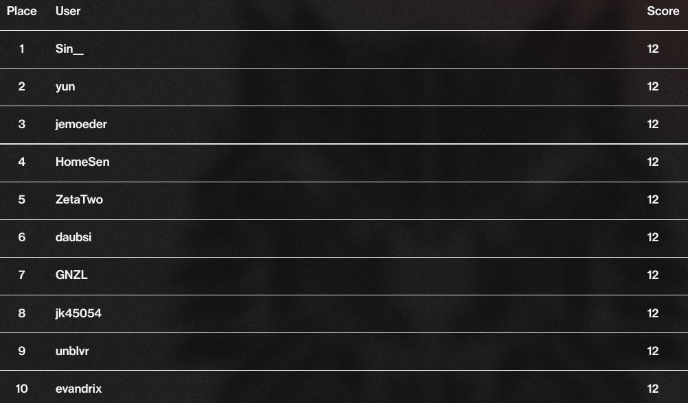

# CrowdStrike's Adversary Quest 2022

CrowdStrike hosted their (hopefully annual) [Adversary Quest CTF](https://www.crowdstrike.com/blog/capture-the-flag-crowdstrike-intelligence-adversary-quest-2022/) this year running from 2022-07-11 to 2022-07-25.

It consisted of three tracks for the fictive Cyberthreat actors Catapult Spider, Protective Penguin and Tabloid Jackal. Each track comprised four challenges each.

## Write-Ups

My write-ups for some of the challenges can be found here

- [Catapult Spider - #1 Very Phish](./Catapult%20Spider/1%20Very%20Phish)
- [Catapult Spider - #2 Such Control Wow](./Catapult%20Spider/2%20Such%20Control%20Wow)
- [Protective Penguin - #1 FrontDoor](./Protective%20Penguin/1%20FrontDoor)
- [Protective Penguin - #2 Backup](./Protective%20Penguin/2%20Backup)
- [Protective Penguin - #3 Lights Out](./Protective%20Penguin/3%20Lights%20Out)
- [Tabloid Jackal - #1 display0](./Tabloid%20Jackal/1%20display0)
- [Tabloid Jackal - #2 Spellcheck](./Tabloid%20Jackal/2%20Spellcheck)
- [Tabloid Jackal - #3 Password](./Tabloid%20Jackal/3%20Password)
- [Tabloid Jackal - #4 tokens](./Tabloid%20Jackal/4%20tokens)

I was able to finish with rank #8.

