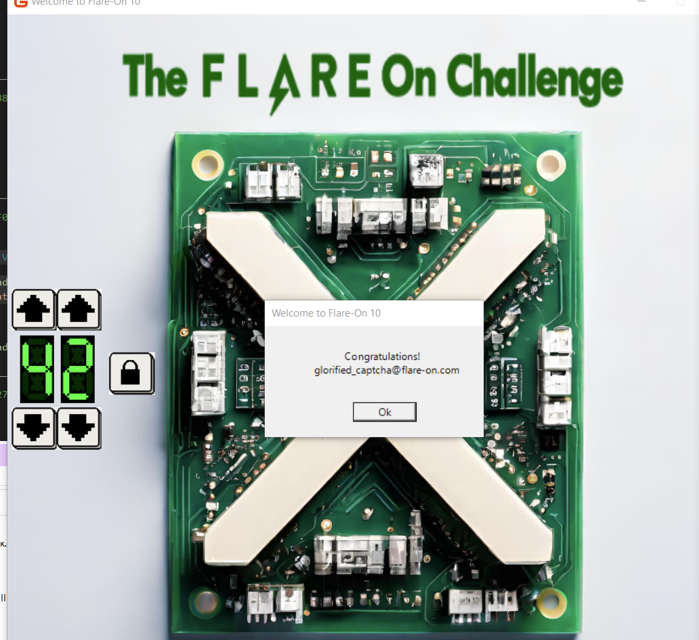

# Flare-On 10, Challenge 1, X

## Challenge Description

Welcome to the 10th Annual Flare-On Challenge!

Statistically, you probably won’t finish every challenge. Every journey toward excellence starts somewhere though, and yours starts here. Maybe it ends here too.

This package contains many files and, I can’t believe i’m saying this, click the one with the “.exe” file extension to launch the program. Maybe focus your “reverse engineering” efforts on that one too.

## Files (Shortened)

Filename | Size | SHA256
--- | --- | ---
X.exe | 296,960 bytes | 7251db58b565d17260b5e73964e21caf051e699e4096a1064d01c67cd780155d
X.pdb | 14,136 bytes | f834421563075811d11e6aecc50aef2efe6c52660ce66a1014b09865ff7af60d
X.dll | 162,304 bytes | 5d29a3ad3546757c367ff787cc768818e784b6045d1eabde8c53d08a3f79bfe5

## High-Level Summary

- **X.exe** is a **.NET Core** AppHost program that loads the OS specific runtime and executes **X.dll**'s main function
- **X.dll** displays an electronic circuit board that is unlocked with a two digit code
- The needed code and the flag reside as plaintext values in function **_lockButtong_Blick**

## Analysis

### Basic Static

- 64-Bit Windows PE GUI executable
- Includes a PDB file

### Basic Dynamic

- Execution shows a microprocessor board

- Left side UI element lets you pick a number between 00 and 99
- Maybe we have to find the correct number?

### Advanced Analysis

- Open **X.exe** in **IDA Pro**, optionally retrieve symbols
- This executable is a **.Net Core** **AppHost** responsible for starting up the runtime and invoking **X.dll**'s entrypoint
- Main program logic resides in **X.dll**
- Open **X.dll** [**dnSpyEx**](https://github.com/dnSpyEx/dnSpy) or [ILSpy](https://github.com/icsharpcode/ILSpy)

Look through the classes in namespace **monogame1**, find **Game1._lockButton_Click()**

```c#
  private async void _lockButton_Click(object sender, EventArgs e)
  {
   if (this._digitDisplays[0].Value * 10 + this._digitDisplays[1].Value == 42)
   {
    this._backgroundDisplay.State = BackgroundDisplay.BackgroundStates.Success;
    await MessageBox.Show("Welcome to Flare-On 10", "Congratulations!\n glorified_captcha@flare-on.com", new string[] { "Ok" });
```

Enter the correct number **42** to retrieve the flag from the executable - or just copy & paste it from plaintext string.



## Flag

Flag: `glorified_captcha@flare-on.com`
