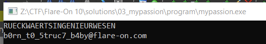

# Flare-On 10, Challenge 3, mypassion

## Challenge Description

This is one of those ones that will work under the right circumstances, Steve. May I call you Steve? Before you take to twitter complaining about a broken challenge, think about how you can be the change you want to see in the world, Steve.

## Files

Filename | Size | SHA256
--- | --- | ---
mypassion.exe | 299,008 bytes | ac6357ea3ab689a774909707559e2ce214e80eb5308dafaaa878d973ca1f2617

## High-Level Summary

- The challenge executable expects a larger command-line argument
- Substrings and certain characters underly constraints whose checks unfold through many stages of shellcode execution
- Data references and API function addresses are passed between stages in a custom data structure
  - Leveraging IDA Pros structure editor tremendously helps analysis
- Some stages use several of the command-line arguments as code bytes
  - We have to understand what these stages do in order to *repair* the code (PEB walking of loaded DLLs, Export Directory walking)

## Analysis

### Basic Static

pestudio

- 64-Bit PE Windows console executable
- high entropy 7.492
- debug section, pdb path `This is one of those ones that will work under the right circumstances, Steve. May I call you Steve? Before you take to twitter complaining about a broken challenge, think about how you can be the change you want to see in the world, Steve.`

## Advanced Analysis

some custom uppercase alphabet string `AZBQCEDTEXFHGOHLIMJFKKLDMVNNOUPBQWRYSGTIUPVAWCXJYRZS`

Destination struct for sub 1400013E0

- size 0x1192
- first 256 chars = argv[1]
- offset 264 = v17

```c
 strcpy_s(Destination, 256ui64, argv[1]);
 *(_QWORD *)&Destination[264] = v17;
 *(_QWORD *)&Destination[792] = GetTickCount;
 *(_QWORD *)&Destination[800] = GetProcAddress;
 *(_QWORD *)&Destination[808] = LoadLibraryW;
 *(_QWORD *)&Destination[816] = GetModuleFileNameW;
 *(_QWORD *)&Destination[824] = CreateFileW;
 *(_QWORD *)&Destination[832] = ReadFile;
 *(_QWORD *)&Destination[840] = WriteFile;
 *(_QWORD *)&Destination[848] = Sleep;
 *(_QWORD *)&Destination[856] = ExitProcess;
 *(_QWORD *)&Destination[864] = VirtualAlloc;
 *(_QWORD *)&Destination[872] = free;
 *(_QWORD *)&Destination[880] = GetStdHandle;
 *(_QWORD *)&Destination[896] = strtol;
 *(_QWORD *)&Destination[904] = sub_140001000;
 *(_QWORD *)&Destination[912] = sub_140002F00;
 *(_QWORD *)&Destination[920] = sub_140002C00;
 *(_QWORD *)&Destination[928] = sub_140002D20;
 *(_QWORD *)&Destination[936] = sub_140002DB0;
 *(_QWORD *)&Destination[944] = sub_1400018B0;
```

may be relevant for stage 2

stage 1 checks - up to first shellcode call @ 0x0000000140001299

argc = 2, pw as argument in argv[1]

c0 = "0"
c1 + 4 * c2 == 295

- example: c1 = 0, c2 = g

c5 = "R"
c6 = "@" used as flProtect for VirtualAlloc @ 0x1400011B0
c7-10 = used as dword value as parameter to first stage shellcode
c11 = written to a local var, no use seen yet?
c12 = used as code byte in shellcode offset 65

- the original shellcode contains a 0x43 here
- could be "C" / 0x43 / 67

## First Stage Shellcode

0x99 bytes size

- VA_alloc = VirtualAlloc(0i64, 0x99ui64, 0x3000u, argv_1_6_flProtect);
- called at 0x140001299 -     `((void (__fastcall *)(int *))VA_alloc)(&v20);`

```txt
>>> from string import printable
>>> for c1 in printable:
...   test = 295 - 4*ord(c1)
...   try:
...     print(f"c2 = {chr(test)} = {test}, c1 = {c1} = {ord(c1)}")
...   except:
...     pass
...
c2 = g = 103, c1 = 0 = 48
c2= c = 99, c1 = 1 = 49
c2 = _ = 95, c1 = 2 = 50
c2 = W = 87, c1 = 4 = 52
c2 = S = 83, c1 = 5 = 53
c2 = O = 79, c1 = 6 = 54
c2 = K = 75, c1 = 7 = 55
c2 = G = 71, c1 = 8 = 56
c2 = C = 67, c1 = 9 = 57
c2 = s = 115, c1 = - = 45
c2 = o = 111, c1 = . = 46
```

first argument construction

012345678901234567890
00gxxR@aaaaxExxxxxxxx

first stage shellcode is called with pointer to a dword value (four chars of argument beginning at offset 7 - aaaa)

- moves string ten\0 @ rbp+18h
- does XOR 0x173b171656 with key "ten"
- inlined strcmp with argument (dword offset 7)
- compares with "brUc3"
- returns value of strcmp, but the return value is not used

next debug run

012345678901234567890
00gxxR@brUc3Exxxxxxxx

```c
struct __declspec(align(8)) custom_struct
{
  char argv_1[256];
  __int64 nix;
  __int64 something1;
  char lpwszDropFilePath[520];
  __int64 GetTickCount;
  FARPROC (__stdcall *GetProcAddress)(HMODULE hModule, LPCSTR lpProcName);
  HMODULE (__stdcall *LoadLibraryW)(LPCWSTR lpLibFileName);
  DWORD (__stdcall *GetModuleFileNameW)(HMODULE hModule, LPWSTR lpFilename, DWORD nSize);
  HANDLE (__stdcall *CreateFileW)(LPCWSTR lpFileName, DWORD dwDesiredAccess, DWORD dwShareMode, LPSECURITY_ATTRIBUTES lpSecurityAttributes, DWORD dwCreationDisposition, DWORD dwFlagsAndAttributes, HANDLE hTemplateFile);
  __int64 ReadFile;
  BOOL (__stdcall *WriteFile)(HANDLE hFile, LPCVOID lpBuffer, DWORD nNumberOfBytesToWrite, LPDWORD lpNumberOfBytesWritten, LPOVERLAPPED lpOverlapped);
  __int64 Sleep;
  void (__stdcall __noreturn *ExitProcess)(UINT uExitCode);
  LPVOID (__stdcall *VirtualAlloc)(LPVOID lpAddress, SIZE_T dwSize, DWORD flAllocationType, DWORD flProtect);
  __int64 free;
  __int64 GetStdHandle;
  __int64 nada;
  __int64 strtol;
  __int64 strnlen;
  __int64 some_str_stuff_slashes_Offset_2300;
  __int64 crypthash_derivekey_2000;
  __int64 decrypt_second_stage_shellcode_2120;
  __int64 temppath_html_writefile_open_21b0;
  __int64 convert_writeconsole_cb0;
};
```

[struct header file here](./files/custom_struc.h)

012345678901234567890
00gxxR@brUc3Exxx/xxx/

012345678901234567890
00gxxR@brUc3Exxx/123/

07KxxR@brUc3Exxx/123xxx/

between first two slashes -> strtol() -> will yield a number if it starts with digits.
strtol endptr is used, so there have to be chars after the digits used as the filename for a dropped file 171kb

calc of k

```c
    for ( i = 0i64; i < number_of_digits; k = (next_char - '0') | (16 * ((next_char - '0') | (16 * k))) )
      next_char = (char)heap_num_digits_plus_2_copy[i++];
```

starts with digits beginning left
first digit = "1" -> take this as high and low nibble in a hex value -> k = 0x11
second digit = "2" -> k = 0x1122
third digit "3" -> k = 0x112233

this value will overwrite 0D DB AA DA (0x1c390)

SystemTime.wDay is used in some mm_unpacking stuff, can only hold values 1-31. its 30 for 30th September
The mm_unpack stuff is likely influenced by wDay value as well

example, wDay = 30, then 0x1F + 0x1E = 0x3D. this value is added to all 174.080 bytes of buffer @ 0x1c3f0
the same value is added to 55 bytes of buffer @ 0x46be0
for 1st octobre, 0x1F + 1 = 0x20 (space char)

one could try to brute force all 31 possible values in cyber chef to see if anything useful plops out - maybe magic bytes of a file type

then the following buffer is written to file on disk, size 174.216, beginning at 0x1c390 (address of value 0x112233 from first strtol)
0x46be0 + 55 - 0x1c390 = 174215 -> file contains 0x112233 (little endian) then some "header" stuff including tickcount and systemtime, then buffer 1 and then buffer 2 from above that were added with (0x1F + wDay)

fixed bytes: `1A 2B 3C 4D 6A 2B 4E 4D 34 2B 53 4D 69 2B 48 4D 1A = +<Mj+NM4+SMi+HM (0x1c394)`
also possibly fixed: `17 B7 45 41 FD 89 D4 5D 56 D1 A2 95 65 48 E4 C7 (0x1c3e0)`

trying to add all possible wDay values 1-31 to the 55 bytes @ 0x46be0 in cyberchef does not yield anything readable. and nothing cyberchef disassemble makes sense of

is it a red herring? the adder, the drop?

turnitup -> SHA256 -> used as AES-CBC-256 key
capture_the_flag -> used as IV
to decrypt second stage shellcode @ 0x1c2e0 size 176

## Second Stage Shellcode

- calls some_str_stuff_slashes_2300 with param cstruct (used as char *, so offset 0 = password), 3
  - returns substring between second and third slash char (or more generic for substring between i-1 and i-th slash if second param is i)
- strtol base 4 value of substring with endptr
- strnlen of endptr must match the base4_value
  - if so, sleep base4_value seconds, if not exitprocess
- then calls convert_writeconsole_cb0

2xx as string?

07KxxR@brUc3Exxx/123xxx/2xx/  <- works

then calls to Convert_WriteConsole_cb0(custom_struct *cstruct)

dropped file has to start with 0x11333377, which means second string must start with 1337

07KxxR@brUc3Exxx/1337xxx/2xx/  

contains anti debug, as it compares new gettickcount value with the one written to the file
does sub again in same loop as before writing using xmm stuff in loop
sub value is first char in third_slash_string_copy. so if weekday added 0x1F + 0x1E (30) = 0x3D (=), this should be first char like this

there are also 5 compares using additional chars from third_slash_string, so it should possibly hold at least 6 chars

07KxxR@brUc3Exxx/1337xxx/2xx/=abcde/

a is compared with something1 + 30
b is compared with something1 + 29
c is compared with something1 + 31
d is compared with something1 + 28
e is compared with something1 + 32

something1 + 28 = A0 F4 6F (o) D6 3B (;) -> this must be a pointer 0x3bd66ff4a0 ?? doesnt make sense otherwise
this is not easy, not all chars printable? -> TODO here
no idea why yet, but let's check this
cstruct->something1 points to unk_3BD66FF4A0 (likely changes between debug runs)

- this holds 0xCAFE0000CB5D at offset 0 -> see main/initialization of something1
- at offset 28 -> "zipza" / 5 chars, would fit
- at offset 0x28 -> pointer to alphabet AZBQCEDTEXFHGOHLIMJFKKLDMVNNOUPBQWRYSGTIUPVAWCXJYRZS

something1 is a struct in itself

a is compared with something1 + 30 = p
b is compared with something1 + 29 = i
c is compared with something1 + 31 = z
d is compared with something1 + 28 = z
e is compared with something1 + 32 = a
yum yum

07KxxR@brUc3Exxx/1337xxx/2xx/=pizza/

also v24 = lpWideCgarStr_copy of substring between slash 1 and 2?
this is compared to a decrypt of dropped file header.

- xor key = dword at offset 4 = 1A 2B 3C 4D
- ciphertext offset 8 = 6A 2B 4E 4D 34 2B 53 4D 69 2B 48 4D 1A
- decrypt until cipherbyte = keybyte
- decrypts to wide char pr.ost
this is compared to first slash string, which is used as the filename
so first slash string endptr(!) should be pr.ost

07KxxR@brUc3Exxx/1337pr.ost/2xx/=pizza/

some stage later:

sixth_slash_string has 7 characters / compared in 1a70
could be "c5b.RU3" (endianess?)

07KxxR@brUc3Exxx/1337pr.ost/2xx/=pizza/4/5/c5b.RU3/

pos crc32 value, dword at offset 0x38 in dropped file = 88 A8 A7 92 (as is, big endian notation)

VA_third_stage_shellcode(cstruct, 5i64, some_buf);

- some_buf possibly len 100
- likely just returns the fourth slash string (between slash 4 and 5, i.e. stage = 5)

looks like fourth slash string is used to patch fourth stage shellcode

- we don't know how yet?
- but since fourth slash string is used as param to allocation of fifth stage shellcode, maybe that has some checks in it?

constraints for fourth slash string regarding fourth stage shellcode (from 1570)

- c0 == c10
- c9 is used at offset 54 / 0x36 in fourth stage shellcode
- c6 at 99 / 0x63  (thats right before the ret)
- c5 at 24 / 0x18
- c12 at 0 (prologue?) -> 0x55 = push rbp = "U" hmm could also be 0x40 0x55 for push rbp, then "@"
- c7 at 80 / 0x50
- c8 at 29 / 0x1d

constraints for fourth slash string regarding fifth stage shellcode (inside alloc fifth shell code 1380)

- c1 at offset 24 / 0x18 in fifth stage shellcode
- c11 at 25 / 0x19
- c4 at 41 / 0x29
- c2 at 108 / 0x6c
- c3 at 138 / 0x8a
- c0 at 146 / 0x92

fifth stage shellcode is called with result of fourth stage shellcode and string "Beep"

- fifth stage shellcode uses first param as VA of image base of something, maybe kernel32.dll
- does PE parsing on this VA
- MZ compare
- offset 0x18 should be 0x4D / M -> c1 = M
- offset 0x19 should be 0x5A / Z -> c11 = Z
- PE compare
- offset 0x29 should be 0x45 / E -> c4 = E
- offset 0x6c should be 0x75 / u -> c2 = u    -> this repairs the short jump/loop to compare the name of current export function with "Beep"?
- offset 0x8a should be 0x24 / $ -> c3 = $     -> this is a correct offset - export directory address of name ordinals - to retrieve the RVA of function "Beep"
- offset 0x92 could be 0x41 / A -> c0 = A      -> would change MOV ECX,DWORD PTR [RCX+1C] to MOV ECX,DWORD PTR [R9+1C]

07KxxR@brUc3Exxx/1337pr.ost/2xx/=pizza/AMu$EUUUUUAZU/5/c5b.RU3/

wDay1 on 1st October, add = 0x1F + 1 = 0x20 = space char before pizza (if the subs should negate the adds)
g_buf_1c3f0 begins un-added with
E5 46 61 7B 4C 33 2A 47  EF CD D6 50 06 26 92 8F
and
05 66 81 9B 6C 53 4A 67  0F ED F6 70 26 46 B2 AF with add 0x20 on wDay1

[online assembler](https://defuse.ca/online-x86-assembler.htm#disassembly)

## Fourth Stage Shellcode

- probably walks PEB to locate kernel32.dll imagebase
- prologue should rather be
- 0:  65 48 8b 04 25 60 00    mov    rax,QWORD PTR gs:0x60
- for start of PEB walking
- hence offset 0 = 0x65 / c12 = e  -> gs:0x60 points to PEB in x64 threads
- 0015 48 8B 42 55             mov     rax, [rdx+55h]   <--- offset 0x18 = 0x55 = damaged
- offset 0x18 = 0x60 / c5 = `   -> offset of BaseDllName.Buffer in LDR_DATA_TABLE_ENTRY struct calculated from InLoadOrderLinks pointer (offset 0)
- offset 0x1d = 0x2e / c8 = .   -> Buffer is wchar string, shellcodes matches L32. at offsets 0xa, 0xc, 0xe and 0x10
- offset 0x36 = ???     -> unsure how anything useful repairs this. the code here may not even be needed to be repaired as KERNEL32.DLL comes second after mypassion.exe and after the match this code is never executed. so we can put here anything we want. db 0x66 0x66 might be a long nop? but who cares here. possibly 0x83 may fix this? going with db 0x66 0x66 would yield char f for substring fAZe, which makes more sense than mAZe
- correct assembly to move forward in InMemoryOrderLinks would be mov rdx, [rdx + 0x10], so offset 0x50 = 0x52
- just pick lowercase m / 0x6d for it to have a nicr word mAZe
- offset 0x50 = 0x52 / c7 = R   --> repair InMemoryOrderLinks.Flink movement
- offset 0x63 = 0x30 / c6 = 0 ---> mov     rax, [rdx+LDR_DATA_TABLE_ENTRY.DllBase]    offset 0x30 into LDR_DATA_TABLE_ENTRY is DllBase pointer

07KxxR@brUc3Exxx/1337pr.ost/2xx/=pizza/AMu$E`0R.fAZe/5/c5b.rU3/

fifth slash string will be decoded using the translation alphabet AZBQCEDTEXFHGOHLIMJFKKLDMVNNOUPBQWRYSGTIUPVAWCXJYRZS stored in cstruct->struct_2->translation_alphabet
it is 52 chars big. from first look, it seems that the normal alphabet is the first char of a 2-tuplet, i.e. AZ BQ CE DT... ZS
This could be a lookup table

```txt
>>> trans = "AZBQCEDTEXFHGOHLIMJFKKLDMVNNOUPBQWRYSGTIUPVAWCXJYRZS"
>>> tr = ""
>>> for i in range(1, len(trans), 2):
...   tr += trans[i]
...
>>> tr
'ZQETXHOLMFKDVNUBWYGIPACJRS'
```

translating could work like this with use of tr

```sh
echo "A" | tr 'A-Z' 'ZQETXHOLMFKDVNUBWYGIPACJRS'
Z
```

debug run with fifth slash string = "A", it is translated back to "V" via tuplet "VA"
forward V->A, backward A->V. the code backward decodes the fifth slash string first

decrypts ciphertext to "RUECKWAERTSINGENIEURWESEN"

and does a memcmp between decoded fifth slash string and this decrypted string. only if that is successful, WriteConsoleA VA is retrieved via fourth stage shellcode

```sh
echo "RUECKWAERTSINGENIEURWESEN" | tr 'A-Z' 'ZQETXHOLMFKDVNUBWYGIPACJRS'
YPXEKCZXYIGMNOXNMXPYCXGXN
```

likely fifth slash string should be YPXEKCZXYIGMNOXNMXPYCXGXN

in stage 7 @ 1a70
check sixth slash string with "ob5cUr3"

07KxxR@brUc3Exxx/1337pr.ost/2xx/=pizza/AMu$E`0R.fAZe/YPXEKCZXYIGMNOXNMXPYCXGXN/ob5cUr3/

a 15 char rc4_key is made from rev_translated_fifth_slash_string, yields REVERSEENGINEER

VA_buffer_size_174135 is filled with dropped file content beginning at offset 0x50, size 174135 (see 0x117a)

carving out original buffer pre-add/sub shizzle (174080 from 0x1c3f0 + 55 from 0x46be0)

```txt
> py.exe .\carve_bufs.py
buffer size 174135 has crc32 of 0x8d4aeb1f
```

the rc4 sub @ 17d0 seems to apply KSA twice and PRGA + encrypt twice as well

on day 1 use space char as first char in third slash string. this may be interpreted as two parameters to tell ida debugger with "" that it is one

"07KxxR@brUc3Exxx/1337pr.ost/2xx/ pizza/AMu$E`0R.fAZe/YPXEKCZXYIGMNOXNMXPYCXGXN/ob5cUr3/"

this negates simd add/subs -> if correctly negated, like on 1st octobre, use space char 0x1F + 1 = 0x20, then crc32 value of rc4-weirdo decrypted buffer works out

decryption of sixth stage shellcode via

cstruct->crypthash_derivekey_2000)(sixth_slash_string, crc32_final, alloc_buffer_size, p_cur_byte);
cstruct->decrypt_shellcode_2120)(&sixth_stage_shellcode_46c20, 960i64);

stage 8 -> sixth stage shellcode execution

-> get seventh slash string (between slashes 7 and 8)
compared with values from p_struct_2->stuff, which holds b"_\x00\x01fin"

- c0 = stuff[3] = "f"
- c1 = stuff[4] = "i"
- c2 = stuff[5] = n

"07KxxR@brUc3E/1337pr.ost/2xx/ pizza/AMu$E`0R.fAZe/YPXEKCZXYIGMNOXNMXPYCXGXN/ob5cUr3/fin/"

stage 8 shellcode uses TEA to decrypt something

crc32 of decrypted flag should be F1 D2 B1 59 (little endian)

```python
>>> hex(crc32(b"b0rn_t0_5truc7_b4by@flare-on."))
'0x59b1d2f1'
```

on command line, this didnt work? during debugging, it worked with a weird exception
7FF91ABC4FD9: unknown exception code 6BA (exc.code 6ba, tid 8308)

sixth stage shellcode then calls temppath_html_writefile_open_21b0 with cstruct ptr and a buffer ptr

- function writes decrypted buffer (html file) to a temp dir file and uses shellexecutea to open it
- it does not contain the flag though
- also carves "com" out of the buffer from offsets 0x1f to 0x21 and returns that to shellcode
- shellcode appends it to the flag and prints it out with WriteConsole

use run.py to generate parameter for mypassion.exe based on wDay

addition
in read_dropped_file_xmmsub_cb0 @ 1090

```c
if ( cstruct->GetTickCount() <= *(_DWORD *)&dropped_file_buf[52] + 8000 )// anti debug, this is offset where first GetTickCount was written to
    ((void (__fastcall *)(_QWORD))cstruct->ExitProcess)((unsigned int)cstruct->p_struct_2->stage);
```

so if new gettickcount <= old gettickcount + 8000 -> exitprocess?
old gettickcount is taken in main_shizzle_7e0 @ ab6 and put into offset 0x34 of buffer that is dropped to disk

so between that gettickcount and read_dropped_file_xmmsub_cb0 one must lay > 8000 milliseconds

- in between that is the second stage shellcode, that sleeps on base4 strtol value!
- let it sleep 9 seconds with 21xxxxxxxxx as second slash string

still shellexecutea call at 22d4 in temppath...21b0 causes an unknown exception code 6ba
otherwise everything works out fine now

use [solve.py to generate parameter](./code/solve.py) for mypassion.exe based on wDay and run the executable

```txt
> py .\solve.py
wDay = 2, todays_char = ! (0x21), param for today = 07KxxR@brUc3E/1337pr.ost/21xxxxxxxxx/!pizza/AMu$E`0R.fAZe/
YPXEKCZXYIGMNOXNMXPYCXGXN/ob5cUr3/fin/
RUECKWAERTSINGENIEURWESEN
```

it should also print out the correct flag, but for some reason doesnt.
debugging runs fine up until ShellExecuteA (see above), which throws an unknown exception 6ba
sad panda. in a debug run, we can make it print it on the console



flow of html data
data source in  exe -> x -> dropped file content -> read file content -> y -> rc4-ish -> crc32

## Flag

Flag: `b0rn_t0_5truc7_b4by@flare-on.com`
