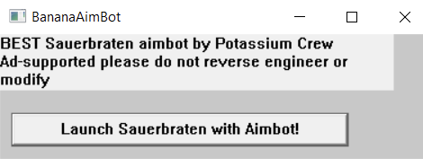

# Flare-On 10, Challenge 4, aimbot

## Challenge Description

I hope this is the only aimbot on your system. Twitch streaming probably pays better than being a mediocre reverse engineer though.

## Files

Filename | Size | SHA256
--- | --- | ---
aimbot.exe | 9,156,608 bytes | 0689f20e973f5834145bf5946f417c3796a891f5a37dddb1430d32895277195b

## High-Level Summary

- The challenge executable claims to be a way of cheating at the Steam game Sauerbraten as an Aimbot
  - It drops a Monero miner and injects an AES decrypted aimbot.dll into it
  - The injected DLL contains five stages of shellcode that are RC4/XOR decrypted based on different configuration files (Steam, Discord, Sparrow, Sauerbraten Map)

## Analysis

### Basic Static

pestudio

- entropy 7.998
- 64 Bit Windows GUI executable
- compiled just in time for flareon10! Timestamp: Wed Sep 27 22:55:04 2023 | UTC
- CAUTION! tls callbacks 0,1
- one large resource with 7.999 entropy
- imports/exports/sections don't even load, nice

Detect It Easy

- Compiler: `MinGW(GCC: (x86_64-posix-seh-rev0, Built by MinGW-W64 project) 8.1.0)[-]`
- Linker: `GNU linker ld (GNU Binutils)(2.30)[GUI64]`

### Basic Dynamic

- running aimbot opens windows "BananaAimbot"
- Has a button "Launch sauerbraten with Aimbot!"


### Advanced Analysis

for main window @ 13db
  v9.lpfnWndProc = (WNDPROC)sauerbraten_402AF0;

in sauerbraten_402AF0:

```c
on button press:
    if ( hButton_409038 == (HGDIOBJ)lParam && (wParam & 0xFFFF0000) == 0 )
    {
      ShowWindow(hWndParent, 0);
      sauerbraten_main_402150();
      ExitProcess(0);
    }
```

tries to open `%PROGRAMFILES(X86)%\\Sauerbraten\\bin64\\sauerbraten.exe`, a steam game and reads its content into heap buffer

does md5 calc on read buffer
compares with  if ( md5_ctx[11] == 0xD7C6F08CA0220B18 && md5_ctx[12] == 0x2DBF0B17FFA57A6C )
aimbot md5 = 3FA4892F3FEDFAD2D4F8631FB106EC45, sha1 d01b20c832eac3f319e891b8e490b55b5d48a900

In order to fulfill this external dependency, we may have to install the steam game Sauerbraten. But we don't like that dependency and try to get around it, somehow...

aimbot.exe also drops two files with content from resource section
1 -> miner.exe  (skips first 42 bytes)
2 -> config.json  (skips first 42 bytes and does not write last 8 bytes? numberofbytestowrite = size - 50)

before dropping, it calls decrypt_resource_401F50(void *buf, size_t Size)
AES_key_derivation_401BA0(aes_ctx, "yummyvitamincjoy");

- AES-256-ECB

then creates process miner.exe

then does a c2 beacon via http

- allocates buffer size 0x4000
- user agent "bananabot 5000"
- url `http://127.0.0.1:57328/2/summary`, no cache usage / INTERNET_OPEN_RELOAD
- reads from url in chunks of 0x4000 bytes (buffer overflow?)

then drops decrypted resource / same decryption as above
3 -> aimbot.dll to %APPDATA%\Sauerbraten (skips first 42 bytes)

creates a remote thread that calls LoadLibraryA with path of aimbot.dll

aimbot.dll seems to be the only interesting part here, being injected into miner.exe
we de-prioritize looking into the miner.exe itself, that could possibly be XMRig or some other monero miner
right now it doesnt look like sauerbraten.exe must be debugged/ran to get on

## aimbot.dll

64 bit Windows DLL, console, ASLR disabled

- exports DllMain and SomeFunction
- TLS callback directory
  - 0,.text:000000000000D540
  - 1,.text:000000000000D510
  - 2,.text:000000000001B910

SomeFunction should just open MessageBoxA with "DLL Message"

call    cs:__imp_DisableThreadLibraryCalls
Disables the DLL_THREAD_ATTACH and DLL_THREAD_DETACH notifications for the specified dynamic-link library (DLL).

DllMain creates three threads

- thread1_62F41C30 / aimbot stuff
- thread2_62F43070 / does C2 stuff
- thread3_62F42340 / anti-debug

### Thread 3

- looks ip DbgBreakPoint from ntdll.dll
- patches first byte with ret/c3 every second
- and checks for debugger presence every second
- ANTI DEBUG FUNC -- function check_debugger_presence_62f42020   -> this is used at many other locations as well
  - resolves and calls NtQueryInformationProcess on itself
  - checks NtCurrentPeb->BeingDebugged
  - enumerates running processes, gets their module base name, to lower case, does ror, 13 name hashing
  - checks if name fits one of these hashes:
  - v26[0] = 0x3755DCD46855AF94i64;
  - v26[1] = 0xF255062FB2C6B4E9ui64;
  - v26[4] = 0x3755DCD46855AF94i64;
  - v26[2] = 0x374755BE5E620917i64;
  - v26[5] = 0xF255062FB2C6B4E9ui64;
  - v26[6] = 0x374755BE5E620917i64;
  - v26[7] = 0x3A083D2B843E42CCi64;
  - v26[3] = 0x3A083D2B843E42CCi64;
  - likely checks ida, debugger, etc
  - retrieves parent process id, obtains handle to it, reads 4 bytes from 0x406220
  - returns dword *(getmodulehandlea(0) + 5096) + sum_ppid_dw_at_406220_plus_0x1337
    - if only i knew what this is supposed to be... lol

### Thread 1

- calls GetAsyncKeyState
- seems to hold aimbot capability, with math functions atan2, sqrt, float calcs etc
- does not seem to do anything evil, or decrypt anything

### Thread 2

- GetLocalTime -> sleep 180s -> GetLocalTime
- convertes both to FileTime and delta must be > 1799.999.999 -> no sleep patching!
- Creates directory c:\depot
- then beacons via C2_beacon_62F43A20
  - decrypt_string_62F439B0 is used to get useragent and url
  - first param 0 -> url, param 1 -> user agent
  - retval_debug_check is used for string decryption... ffs -> looks like we need to understand the return value of check_debugger_presence_62f42020
    - TODO: we could just execute it sauerbraten style, then let it beacon and record URL/user agent in remnux, then derive the correct retval
  - str idx 2, length 16, is possible used as a key name, that is used for strstr in c2 beacon response
    - this part of the c2 response is used as an AES key to decrypt another payload
  - allocs 17520 bytes RWX memory
  - copys buffer 0x62FE7340 to it
  - str idx 3 -> some shellcode check, length 44
    - compares first 44 bytes of decrypted payload with decrypted string
    - likely needed to break AES ECB, as we likely wont get the key from a C2
    - we could emulate a C2 server once we broke the key
  - whats weird though... if str idx 2 is used for strstr, strstr should return a ptr to a string that should match str idx 2... could this be the key?
  - str idx 1 is used as user agent string, length 16. could this be "bananabot 5000" again? although that is only 14 chars long
  - str idx 0 is used as URL, length 36

approach

- execute aimbot.dll and capture the c2 request with remnux inetsim, fakedns, accept-all-ips, wireshark
  - gain c2 url and user agent from the request
- knowing c2 url and ua, try to decrypt the other 2 strings and the payload, as it is AES ECB mode likely
- problem: aimbot.dll checks in anti debug function check_debugger_presence_62f42020 something about parent process. it may not work when executed via rundll32, but has to be injected in the correct process.

approach2

- the crypted shellcode payload in aimbot.dll is decrypted with a key from C2 beacon
- the first 42 decrypted bytes are compared with str idx 3
- we know from aimbot.exe, that first 42 bytes have been the same in all three drops of miner.exe, config.json and aimbot.dll
- which is "the decryption of this blob was successful"
- the decrypted shellcode is executed from VA_buf + 42... so maybe this one also holds that string
- payload len @ g_payload_len_62FE4000 = 0x4470 = 17520
- carve out file offset 0xA6340 size 0x4470 -> crypted payload

approach3

- take str idx 3 crypted = 44 bytes = DD90FC44CD9DFA16D088ED0DC696B90BCFD8ED0CC08BB906C597FB44DE99EA44DA8DFA07CC8BEA02DC949965
- XOR with "the decryption of this blob was successful"
- 00000000  a9 f8 99 64 a9 f8 99 64 a9 f8 99 64 a9 f8 99 64  |©ø.d©ø.d©ø.d©ø.d|
- 00000010  a9 f8 99 64 a9 f8 99 64 a9 f8 99 64 a9 f8 99 64  |©ø.d©ø.d©ø.d©ø.d|
- 00000020  a9 f8 99 64 a9 f8 99 64 a9 f8 ed 0d              |©ø.d©ø.d©øí.|
- str dercryption uses 4 byte XOR key, which is the expected retval_debugger_check return value
- that is obviously = a9 f8 99 64, as it repeats properly. assumption is correct, that str idx 3 = "the decryption of this blob was successful"
- and also that beginning of crypted shellcode is "the decryption of this blob was successful"
- apply that to str idx 0, 1, 2 (starts @ 62FEB820, file offset aa820)

```txt
- 00000000  68 74 74 70 3a 2f 2f 31 32 37 2e 30 2e 30 2e 31  |http://127.0.0.1|
- 00000010  3a 35 37 33 32 38 2f 32 2f 73 75 6d 6d 61 72 79  |:57328/2/summary|
- 00000020  00 03 03 03 62 61 6e 61 6e 61 62 6f 74 20 35 30  |....bananabot 50|
- 00000030  30 30 00 01 22 76 65 72 73 69 6f 6e 22 3a 20 22  |00.."version": "|
- 00000040  00 03 03 03 74 68 65 20 64 65 63 72 79 70 74 69  |....the decrypti|
- 00000050  6f 6e 20 6f 66 20 74 68 69 73 20 62 6c 6f 62 20  |on of this blob |
- 00000060  77 61 73 20 73 75 63 63 65 73 73 66 75 6c 00 01  |was successful..|
```

- 0, C2 URL -> `http://127.0.0.1:57328/2/summary` -> same as in aimbot.exe
- 1, UA -> bananabot 5000 -> same as aimbot.exe
- 2, key strstr -> "version": " (12 chars + null terminator + 3 bytes padding 0x03)

aes key is coming from this

```c
      str_idx_2 = (const char *)decrypt_string_62F439B0(2, 16, retval_debug_check);
      p_substring_resp = strstr(beacon_resp, str_idx_2);
```

possible to run aimbot.dll now that we know the expected retval from debugger check

- patch aimbot.dll check_debugger_presence_62F42300 to always return a9 f8 99 64 and patch thread3 to just C3/ret
  - this should make aimbot.dll executable with rundll32
  - but what would running it help at this point? no extra information gained to decrypt payload

approaches:

- brute force AES-256-ECB last 4 keybytes: the strstr call should point to "version": ", which is 12 chars long. AES-256 key is 16 bytes. maybe we have to brute force the last 4, which likely are picked from ascii printable (the version value)
- retrieve XOR keystream from known plaintext and apply that to chosen ciphertext
  - doesnt seem to work on ECB here. While the XOR keystream bytes are the same for each input, they differ for each different input

ECB check -> file:///C:/Program%20Files/CyberChef_v10.5.2/CyberChef_v10.5.2.html#recipe=AES_Encrypt(%7B'option':'UTF8','string':'yummyvitamincjoy'%7D,%7B'option':'Hex','string':''%7D,'ECB','Raw','Raw',%7B'option':'Hex','string':''%7D)To_Hexdump(16,false,false,false)&input=dGhpcyBpcyAxNiBjaGFyc3RoaXMgaXMgMTYgY2hhcnM

assumption - we dont know the ECB key, but we know it's AES-256-ECB. each block is encrypted with the same keystream XOR bytes
we can get those keystream bytes by XOR'ing first 16 bytes of ciphertext with first 16 bytes of known plaintext "the decryption o"
-> yields dc 53 70 67 1a b7 fa ce 7c ed b1 ee 0a f2 2f ff
XOR second 16 bytes of ciphertext with this yields -> a5 c8 87 d7 91 01 90 bd aa e8 ea 3e 14 3e e9 1d

- but it should yield "f this blob was "

```txt
> py .\crack_aimbot_dll_payload_aes_key.py
Bruteforcing last 4 characters of AES key
Success, key = b'"version": "6.20'
Decrypting aimbot.dll payload
SHA256 = ca34e77d1ca31813e725dc23820252724263d0d8aad9edc560de32eaab05a308
```

[Script link](./code/crack_aimbot_dll_payload_aes_key.py)

### aimbot.dll Payload / First Stage Shellcode

strings

```txt
seg000:00000000000008AE 22 53 65 6E 74 72 79 46…aSentryfile     db '"SentryFile"',0     ; DATA XREF: sub_5FC:loc_693↑o
seg000:00000000000008BB 43 3A 5C 50 72 6F 67 72 aCProgramFilesX db 'C:\Program Files (x86)\Steam\config\config.vdf',0
seg000:00000000000008BB 61 6D 20 46 69 6C 65 73…                                        ; DATA XREF: sub_5FC+11↑o
seg000:00000000000008EA 43 3A 5C 64 65 70 6F 74 aCDepotSteamSsf db 'C:\depot\steam_ssfn',0
seg000:00000000000008EA 5C 73 74 65 61 6D 5F 73…                                        ; DATA XREF: sub_5FC+12D↑o
seg000:00000000000008FE 74 68 65 20 64 65 63 72 aTheDecryptionO db 'the decryption of this blob was successful',0
```

api lookup by hash 0x3b8

- ror 13, upper cased dll name
- ror 13, add, 32 bit function name

run flare ida shellcode hashes plugin, pick ror13AddHash32, get

```txt
seg000:0000000000000882 FB 97 FD 0F                             dd 0FFD97FBh            ; kernel32.dll!CloseHandle
seg000:0000000000000886 A5 17 00 7C                             dd 7C0017A5h            ; kernel32.dll!CreateFileA
seg000:000000000000088A 7E D8 E2 73                             dd 73E2D87Eh            ; kernel32.dll!ExitProcess
seg000:000000000000088E AD 9B 7D DF                             dd 0DF7D9BADh           ; kernel32.dll!GetFileSize
seg000:0000000000000892 AE EC 0E A8                             dd 0A80EECAEh           ; kernel32.dll!GetProcessHeap
seg000:0000000000000896 16 65 FA 10                             dd 10FA6516h            ; kernel32.dll!ReadFile
seg000:000000000000089A 5E 89 EC 99                             dd 99EC895Eh            ; kernel32.dll!CopyFileA
seg000:000000000000089E F2 DB 74 AD                             dd 0AD74DBF2h
seg000:00000000000008A2 26 25 19 3E                             dd 3E192526h            ; ntoskrnl.exe!RtlAllocateHeap
seg000:00000000000008A6 B8 12 DA 00                             dd 0DA12B8h             ; ntoskrnl.exe!RtlFreeHeap
```

RC4 decrypt function @ 7D which decrypts the next stage jumped to @ 7d4

- key in v14
- KSA in func 0xcb
- PRGA in sub 0x188

key len is 16 bytes judging from KSA call
the first 42 bytes of the encrypted next stage payload are again "the decryption of this blob was successful"

shellcode copies filename found in `C:\\Program Files (x86)\\Steam\\config\\config.vdf` under SentryFile to `C:\\depot\\steam_ssfn`

the first 16 bytes of config.vdf are used as rc4 key for next stage shellcode

a config.vdf starts with

```txt
"InstallConfigStore"
{
    "Software"
    {
        "Valve"
        {
            "Steam"
            {
```

RC4 key should be `"InstallConfigSt`

### aimbot.dll Second Stage Shellcode

next stage shellcode len = 11176

- looks like same resolve API func ror13add32 @ 96b

```txt
- 0000000000000E71 FB 97 FD 0F                             dd 0FFD97FBh            ; kernel32.dll!CloseHandle
- seg000:0000000000000E75 A5 17 00 7C                             dd 7C0017A5h            ; kernel32.dll!CreateFileA
- seg000:0000000000000E79 7E D8 E2 73                             dd 73E2D87Eh            ; kernel32.dll!ExitProcess
- seg000:0000000000000E7D 78 59 54 23                             dd 23545978h            ; kernel32.dll!FindClose
- seg000:0000000000000E81 65 C0 D6 63                             dd 63D6C065h            ; kernel32.dll!FindFirstFileA
- seg000:0000000000000E85 97 AC E1 A5                             dd 0A5E1AC97h           ; kernel32.dll!FindNextFileA
- seg000:0000000000000E89 AD 9B 7D DF                             dd 0DF7D9BADh           ; kernel32.dll!GetFileSize
- seg000:0000000000000E8D AE EC 0E A8                             dd 0A80EECAEh           ; kernel32.dll!GetProcessHeap
- seg000:0000000000000E91 16 65 FA 10                             dd 10FA6516h            ; kernel32.dll!ReadFile
- seg000:0000000000000E95 5E 89 EC 99                             dd 99EC895Eh            ; kernel32.dll!CopyFileA
- seg000:0000000000000E99 D8 85 B5 EE                             dd 0EEB585D8h           ; kernel32.dll!ExpandEnvironmentStringsA
- seg000:0000000000000E9D F2 DB 74 AD                             dd 0AD74DBF2h
- seg000:0000000000000EA1 26 25 19 3E                             dd 3E192526h            ; ntoskrnl.exe!RtlAllocateHeap
- seg000:0000000000000EA5 B8 12 DA 00                             dd 0DA12B8h             ; ntoskrnl.exe!RtlFreeHeap
```

RC4 decrypt of next stage shellcode

- KSA @ 0xcb
- PRGA @ 0x188
- Decrypt @ 0x7D

third stage shellcode

- searches for *.ldb file in path `%APPDATA%\\Discord\\Local Storage\\leveldb`
- searches for "dQw4w9WgXcQ" in the contents of the each ldb file
  - if found, copies this file to ?
- reads first 16 bytes of file `"%APPDATA%\\Discord\\Network\\Cookies"` as rc4 key to decrypt next stage shellcode
  - key: "SQLite format 3\x00", hex 53514c69746520666f726d6174203300

### Third Stage Shellcode

```txt
seg000:0000000000000EF4 FB 97 FD 0F                             dd 0FFD97FBh            ; kernel32.dll!CloseHandle
seg000:0000000000000EF8 A5 17 00 7C                             dd 7C0017A5h            ; kernel32.dll!CreateFileA
seg000:0000000000000EFC 7E D8 E2 73                             dd 73E2D87Eh            ; kernel32.dll!ExitProcess
seg000:0000000000000F00 78 59 54 23                             dd 23545978h            ; kernel32.dll!FindClose
seg000:0000000000000F04 65 C0 D6 63                             dd 63D6C065h            ; kernel32.dll!FindFirstFileA
seg000:0000000000000F08 97 AC E1 A5                             dd 0A5E1AC97h           ; kernel32.dll!FindNextFileA
seg000:0000000000000F0C AD 9B 7D DF                             dd 0DF7D9BADh           ; kernel32.dll!GetFileSize
seg000:0000000000000F10 AE EC 0E A8                             dd 0A80EECAEh           ; kernel32.dll!GetProcessHeap
seg000:0000000000000F14 16 65 FA 10                             dd 10FA6516h            ; kernel32.dll!ReadFile
seg000:0000000000000F18 5E 89 EC 99                             dd 99EC895Eh            ; kernel32.dll!CopyFileA
seg000:0000000000000F1C D8 85 B5 EE                             dd 0EEB585D8h           ; kernel32.dll!ExpandEnvironmentStringsA
seg000:0000000000000F20 F2 DB 74 AD                             dd 0AD74DBF2h
seg000:0000000000000F24 26 25 19 3E                             dd 3E192526h            ; ntoskrnl.exe!RtlAllocateHeap
seg000:0000000000000F28 B8 12 DA 00                             dd 0DA12B8h             ; ntoskrnl.exe!RtlFreeHeap
```

same as second stage > import struct

```txt
struct API_pointers
{
  void * kernel32_CloseHandle;
  void * kernel32_CreateFileA;
  void * kernel32_ExitProcess;
  void * kernel32_FindClose;
  void * kernel32_FindFirstFileA;
  void * kernel32_FindNextFileA;
  void * kernel32_GetFileSize;
  void * kernel32_GetProcessHeap;
  void * kernel32_ReadFile;
  void * kernel32_CopyFileA;
  void * kernel32_ExpandEnvironmentStringsA;
  void * ntoskrnl_RtlAllocateHeap;
  void * ntoskrnl_RtlFreeHeap;
};
```

next stage size = 7116

something with Sparrow wallets

RC4

- KSA @ 0xD1
- PRGA @ 0x18e
- Decrypt @ 0x83
- key len 17 bytes
- searches for *.db in `%APPDATA%\\Sparrow\\wallets`
  - copies found files to c:\depot
- searches for pattern *.db in file `%APPDATA%\\Sparrow\\config`
  - searches for last open square bracket [ backwards from pattern hit
  - searches for last double quotes " backwards from above hit
  - searches again for last double quotes " backwards from above hit
    - String between "str" in front of [ in front of pattern match
- copies 17 chars as rc4 key bytes: "recentWalletFiles"

### Fourth Stage Shellcode

```txt
seg000:0000000000000CEF 17 CA 2B 6E             dword_CEF       dd 6E2BCA17h            ; DATA XREF: sub_0+3A↑o
seg000:0000000000000CF3 FB 97 FD 0F                             dd 0FFD97FBh            ; kernel32.dll!CloseHandle
seg000:0000000000000CF7 A5 17 00 7C                             dd 7C0017A5h            ; kernel32.dll!CreateFileA
seg000:0000000000000CFB 7E D8 E2 73                             dd 73E2D87Eh            ; kernel32.dll!ExitProcess
seg000:0000000000000CFF 78 59 54 23                             dd 23545978h            ; kernel32.dll!FindClose
seg000:0000000000000D03 65 C0 D6 63                             dd 63D6C065h            ; kernel32.dll!FindFirstFileA
seg000:0000000000000D07 97 AC E1 A5                             dd 0A5E1AC97h           ; kernel32.dll!FindNextFileA
seg000:0000000000000D0B AD 9B 7D DF                             dd 0DF7D9BADh           ; kernel32.dll!GetFileSize
seg000:0000000000000D0F AE EC 0E A8                             dd 0A80EECAEh           ; kernel32.dll!GetProcessHeap
seg000:0000000000000D13 16 65 FA 10                             dd 10FA6516h            ; kernel32.dll!ReadFile
seg000:0000000000000D17 1F 79 0A E8                             dd 0E80A791Fh           ; kernel32.dll!WriteFile
seg000:0000000000000D1B F2 DB 74 AD                             dd 0AD74DBF2h
seg000:0000000000000D1F 26 25 19 3E                             dd 3E192526h            ; ntoskrnl.exe!RtlAllocateHeap
seg000:0000000000000D23 B8 12 DA 00                             dd 0DA12B8h             ; ntoskrnl.exe!RtlFreeHeap
seg000:0000000000000D27 A4 A2 9F ED                             dd 0ED9FA2A4h
seg000:0000000000000D2B 9F 76 DE F7                             dd 0F7DE769Fh           ; wininet.dll!HttpOpenRequestA
seg000:0000000000000D2F FA 45 2F FB                             dd 0FB2F45FAh           ; wininet.dll!HttpQueryInfoA
seg000:0000000000000D33 9D BE E6 2D                             dd 2DE6BE9Dh            ; wininet.dll!HttpSendRequestA
seg000:0000000000000D37 C7 69 9B FA                             dd 0FA9B69C7h           ; wininet.dll!InternetCloseHandle
seg000:0000000000000D3B 0E E8 4B 1E                             dd 1E4BE80Eh            ; wininet.dll!InternetConnectA
seg000:0000000000000D3F 29 44 E8 57                             dd 57E84429h            ; wininet.dll!InternetOpenA
seg000:0000000000000D43 8B 4B E3 5F                             dd 5FE34B8Bh            ; wininet.dll!InternetReadFile
```

next stage size = 3496

C2 url: `bighackies.flare-on.com/stolen`, port 443

- exfiltrates `c:\depot\output`, which is a concatenation of all files copied to `c:\depot` by previous stages
- tries to read data from C2 server
  - first bytes of C2 response should be CRC32 of exfildata 0...n
  - second bunch of bytes of C2 response should be CRC32 of exfil 1...n-1 // this possibly bytes 4-7 instead of 0-3
  - third bunch of bytes of C2 response should be CRC32 of exfil 2...n-2 // this is possibly bytes 8-11 instead if 2-5
  - fourth bunch of bytes of C2 response should be CRC32 of exfil 3...n-3  // this is possibly bytes 12-15 instead of 3-6
  - for some reason, InternetReadFile is called with dwNumberOfBytesToRead = 7, but lpBuffer should contain a 0x10 (16 bytes read)
    - this would make more sense, as the server could return 4x crc32 values, see // notes above

next stage is xor encrypted with a 4 byte key

- key = 0x1234567 * lpBuffer
- lpBuffer is an integer value, output value of HttpQueryInfoA with Queryflags:
  - HTTP_QUERY_CONTENT_LENGTH (5)
  - Retrieves the size of the resource, in bytes.
  - HTTP_QUERY_FLAG_NUMBER (0x20000000)
  - Returns the data as a 32-bit number for headers whose value is a number, such as the status code.
- whatever that value may have been, it follows the usual check against "the decryption of this blob was successful"
  - we can just XOR that phrase with the first 32 (whatever) ciphertext bytes of fifth stage and get the XOR key
  - 70 56 34 12 -> looks like lpBuffer returned 0x10 then.

## Fifth Stage Shellcode ---

same API hashing as before

```txt
seg000:0000000000000CF8 FB 97 FD 0F                             dd 0FFD97FBh            ; kernel32.dll!CloseHandle
seg000:0000000000000CFC A5 17 00 7C                             dd 7C0017A5h            ; kernel32.dll!CreateFileA
seg000:0000000000000D00 7E D8 E2 73                             dd 73E2D87Eh            ; kernel32.dll!ExitProcess
seg000:0000000000000D04 04 49 32 D3                             dd 0D3324904h           ; kernel32.dll!GetModuleHandleA
seg000:0000000000000D08 AE EC 0E A8                             dd 0A80EECAEh           ; kernel32.dll!GetProcessHeap
seg000:0000000000000D0C 16 65 FA 10                             dd 10FA6516h            ; kernel32.dll!ReadFile
seg000:0000000000000D10 AC 08 DA 76                             dd 76DA08ACh            ; kernel32.dll!SetFilePointer
seg000:0000000000000D14 D8 85 B5 EE                             dd 0EEB585D8h           ; kernel32.dll!ExpandEnvironmentStringsA
seg000:0000000000000D18 F2 DB 74 AD                             dd 0AD74DBF2h
seg000:0000000000000D1C 26 25 19 3E                             dd 3E192526h            ; ntoskrnl.exe!RtlAllocateHeap
```

GetModuleHandle -> is this aimbot.dll or the injected process?

- could be of sauerbraten.exe
- looks for string "spcr" at offset 0x2A58C0
- byte ptr @ hMod + 0x2A58C4 should be non zero (if not)
- expands `%%PROGRAMFILES(X86)%%\\Sauerbraten\\packages\\base\\%s.cfg` with `%s = spcr` (some chars may follow, thats char * @ hMod 0x2a58c0)

reads from `%%PROGRAMFILES(X86)%%\\Sauerbraten\\packages\\base\\spcr2.cfg`

- 4 bytes from offset 0 into dd_file_offset_4, call @ 0xa45
  - 6D 61 70 73  / maps
- 8 bytes from offset 81 into flag[:8], call @ 0xa73
  - 63 6F 6D 70 75 74 65 72 / computer

calculations:

```c
  flag[8] = *(_BYTE *)(hMod + 0x30EE);          // byte @ sauerbraten mapped 0x30ee. 1 byte game state?
  dd_file_offset_4_xor_0x4203120c = dd_file_offset_4 ^ 0x4203120C;
  flag[9] = dd_file_offset_4 ^ 0xC;
  flag[10] = (unsigned __int16)((dd_file_offset_4 ^ 0x120C) & 0xFF00) >> 8;
  flag[11] = ((dd_file_offset_4 ^ 0x4203120C) & 0xFF0000u) >> 16;
  flag[12] = ((dd_file_offset_4 ^ 0x4203120C) & 0xFF000000) >> 24;
  dd_file_offset_4_xor_0x4203120c = dd_file_offset_4 ^ 0x1715151E;
  qmemcpy(&flag[13], &dd_file_offset_4_xor_0x4203120c, 4ui64);
  dd_file_offset_4_xor_0x4203120c = dd_file_offset_4 ^ 0x15040232;
  qmemcpy(&flag[17], &dd_file_offset_4_xor_0x4203120c, 4ui64);

  v12 = *(_DWORD *)(hMod + 0x229450) ^ 0x32061E1A;// winning condition / game state check
  qmemcpy(&flag[21], &v12, 4ui64);
  flag[25] = 0;
  if ( (unsigned int)crc32_5C((__int64)flag, 0x19ui64) != 0xA5561586 )// flag check
```

since we dont know that sauerbraten hMod value for last 4 chars (even if @ is expected / known), we have to brute those last chars
luckily we have the crc32 check in place to verify the correct flag value

```txt
> py .\solve.py
Flag is: computer_ass1sted_ctfing@flare-on.com
```

[See script here](./code/solve.py)

## Flag

Flag: `computer_ass1sted_ctfing@flare-on.com`
