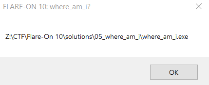

# Flare-On 10, Challenge 5, where_am_i

## Challenge Description

I wish we had more easy challenges for you this year for you to rack up your personal high score. It wouldn’t help you improve but it would feel great and that is what is most important.

## Files

Filename | Size | SHA256
--- | --- | ---
where_am_i.exe | 950,272 bytes | d576f23d8825e6a46d873df3631e9ff19d847837cfe5a749301608dae104ff83

## High-Level Summary

- The challenge executable's control-flow is heavily obfuscated, reminiscient of VMProtect
- It contains two encrypted resource data blobs, being decrypted with RC4 and RC6 respectively
  - Key material is hidden in PE slack space right in front of code section
- It performs Process Hollowing on explorer.exe and injects code from previously decrypted resource data
  - Code in explorer.exe decrypts and loads two more stages, last being a DLL payload with zeroed PE header
    - A hint is placed that a prior stage may have applied RC6
    - DLL also contains an encrypted blob embedded between magic marker bytes BAADBEEF
- We can instrument the original PE's code to decrypt the last stage's ciphertext to yield the flag

## Analysis

### Basic Static

pestudio

- 32 bit windows GUI executable
- no aslr bit
- import directory invalid?
- lots of resources
- descrption: xTuService
- product name: Intel(R) Extreme Tuning Utility

Detect It Easy

- Operation system: `Windows(2000)[I386, 32-bit, GUI]`
- Compiler: `EP:Microsoft Visual C/C++(2008-2010)[EXE32]`
- Compiler: `Microsoft Visual C/C++(15.00.21022)[C++]`
- Library: `MFC[static]`
- Linker: `Microsoft Linker(9.00.21022)`
- Tool: `Visual Studio(2008)`

### Basic Dynamic

- Trying to initially run where_am_i.exe in win10 yields "This app can't run on your PC"
- tiny_tracer v2.7 run yields some interesting entries in tag file
- running where_am_i.exe again after tiny_tracer run does not yield the error
- after some execution time, pops up a window with its path


Noriben

- where_am_i.exe (pid 1124) launches a child process explorer.exe (pid 6196) after 3 seconds

```csv
2:28:31,Process,CreateProcess,python.exe,5708,Z:\CTF\Flare-On 10\solutions\05_where_am_i\where_am_i.exe,1124
2:28:32,Network,UDP Send,svchost.exe,2540,192.168.58.130:53
2:28:32,Registry,RegSetValue,where_am_i.exe,1124,HKLM\System\CurrentControlSet\Services\bam\State\UserSettings\S-1-5-21-954752387-1323369113-1004073005-1001\\Device\HarddiskVolume3\Windows\SysWOW64\explorer.exe,  =  74 E6 D6 B9 09 F7 D9 01 00 00 00 00 00 00 00 00
2:28:32,Process,CreateProcess,where_am_i.exe,1124,Explorer.exe,6196
```

Tiny_Tracer

- getprocaddress of fls functions very early, first at rva 4d28b
- weird call to heap @ rva 48725, after that its crazy sh...
- base is 0x400000
  - Virtualalloc @ 448add

Trying to create a minidump of where_am_i.exe process or its child process seems to fail

### Advanced Analysis

in sub_448A63 called from 448650

```txt
48a9c;kernel32.FindResourceA
- resource name from imagebase + 0x3e0
- 3e0: 01 00 00 00 01 00 00 00 02 00 00 00 01 00 00 00
- RT_BITMAP, name = 1
- size 27716, entropy 7.993
    - name 2 RT_BITMAP, size 86368 has also entropy 7.993
- language korean - fits to chollimas
48aab;kernel32.SizeofResource
48aba;kernel32.LoadResource
48ac7;kernel32.LockResource
48add;kernel32.VirtualAlloc   <- RWX 
```

!! -> likely that resource 2 is decrypted as well, possibly with key material from 0x3f8 and 0x3fc C2 9A EF 46 EF BE AD BA

func getImageBase_plus_0x3F4_448B33

```txt
- 3f0 data in where_am_i.exe: DA AD 12 60 67 C6 8F 1E C2 9A EF 46 EF BE AD BA
- 3f4 data: 67 C6 8F 1E
- key[0] = key_part_3f4 & 0xff
- key[1] = key_part_3f4 >> 8 & 0xff
- ...
- key[4] = key_part_3f0 & 0xff
- ...
- key array is 0x100 bytes, there is no modulo?
- key = 67C68F1EDAAD12600000000000000000000000000000000000000000000000000000000000000000000000000000000000000000000000000000000000000000000000000000000000000000000000000000000000000000000000000000000000000000000000000000000000000000000000000000000000000000000000000000000000000000000000000000000000000000000000000000000000000000000000000000000000000000000000000000000000000000000000000000000000000000000000000000000000000000000000000000000000000000000000000000000000000000000000000000000000000000000000000000000000000000
```

func RC4_ish_448733 called from sub 448650

sub @ 448650 seems malicious
its called from all over the place, including Afx stuff

- reminiscient of chollima modified stuff
- 4486c3 looks like a function prologue

debugging with x32dbg

- bp on VirtualAlloc
- bp on LockResource
- both are hit twice, once from normal code and once from decrypted first stage shellcode
- first stage shellcode seems like virtualization based obfuscation, like vmprotect
- when returning from second call to virtualalloc, put hardware breakpoint execute on new mem (eg. 2320000)
  - hit is successful
  - but there seems to be another thread running by then that shows the usual popup message and terminates the original process (= stop debugging)
  - bps on CreateThread and CreateProcess are not hit
  - pause execution when second alloc memory is filled to dump that

first code has

- call virtualallocex @ 2321a9d
- call exitprocess @ 232003e
- a ret @ 232198e, @ 2321f75, @ 2322eaf, @ 23247df, @ 2324b23, @ 2324f14, @ 2325920, @ 2325e3a, @ 2326abd
- call createfilea @ 232250c
- call exitprocess @ 2322bb6, @ 2326117
- call pathfileexistsa @ 232328c
- call resumethread @ 2323601
- call queueuserapc @ 2324bc6
- call writefile @ 2325565
- call getatomnamea @ 2325744
- call RtlAllocateHeap @ 232594b
- call openmutexa @ 2325ca6
- call writeprocessmemory @ 2326538
- call createprocessa @ 2326a59

second decrypted shellcode seems to range from

- 2330031 to 2330684. after that could be encrypted stuff\
  - 23300AE has an XOR?

```txt
    - 023300AE | 3007                     | xor byte ptr ds:[edi],al                |
    - 02330291 | 89042F                   | mov dword ptr ds:[edi+ebp],eax          |  <-- seems to copy memory
    - 0233032A | 8D3C01                   | lea edi,dword ptr ds:[ecx+eax]          |
    - 023303C3 | E8 A2020000              | call 233066A                            |  <- one of few calls?
    - 023303E6 | 8A0406                   | mov al,byte ptr ds:[esi+eax]            |
    - 02330542 | FF55 FC                  | call dword ptr ss:[ebp-4]               |
```

approach

- api calls in first stage shellcode smell like process hollowing, targeting explorer.exe?
- there dont seem to be calls to second stage shellcode, so maybe that is injected into the hollowed explorer.exe?

setting bps

```txt
Type     Address  Module/Label/Exception            State   Disassembly                       H Summary
Software                                                                                        
         76DF2E60 <kernel32.dll.OpenMutexA>         Enabled mov edi,edi                       1 
         76DF9790 <kernel32.dll.QueueUserAPC>       Enabled mov edi,edi                       0 
         76DFF3C0 <kernel32.dll.VirtualAlloc>       Enabled mov edi,edi                       2 
         76E018F0 <kernel32.dll.ResumeThread>       Enabled mov edi,edi                       0 
         76E03130 <kernel32.dll.CreateFileA>        Enabled jmp dword ptr ds:[<&CreateFileA>] 0 
         76E035B0 <kernel32.dll.WriteFile>          Enabled jmp dword ptr ds:[<&WriteFile>]   0 
         76E12D90 <kernel32.dll.CreateProcessA>     Enabled mov edi,edi                       0 
         76E15240 <kernel32.dll.WriteProcessMemory> Enabled mov edi,edi                       0 
```

- 2x VirtualAlloc
  - called @ 448ae3
    - allocs memory for first stage shellcode / resource 1 RT_BITMAP, decrypted with RC4 with key 67C68F1EDAAD12600000000000000000000000000000000000000000000000000000000000000000000000000000000000000000000000000000000000000000000000000000000000000000000000000000000000000000000000000000000000000000000000000000000000000000000000000000000000000000000000000000000000000000000000000000000000000000000000000000000000000000000000000000000000000000000000000000000000000000000000000000000000000000000000000000000000000000000000000000000000000000000000000000000000000000000000000000000000000000000000000000000000000000
    - key is from pe file, 2 DWORD @ 0x3f0/3f4
  - called @ 23111b2 (11b2 inside first stage shellcode)
    - allocs memory for second stage shellcode / resource 2 RT_BITMAP, decryption yet unknown
    - key could be from pe file, 2 DWORDs @ 0x3f8,3fc
- OpenMutexA
  - called @ 2315cac (5cac shellcode 1) with dwDesiredAccess = MUTEX_ALL_ACCESS
  - name "welcome_main"
- CreateProcessA
  - called @ 2316a5f (6a5f sc1)
  - lpCommandLine "Explorer.exe", dwCreationFlags = CREATE_SUSPENDED
- WriteProcessMemory
  - called @ ...
  - hProcess = 0x210 (likely the newly created Explorer.exe)
  - lpBaseAddress = 0x2f80000
  - lpBuffer = 0x2330031 (sc2, offset 0x31)
  - nSize = 0x1512f = 86319   (resource 2 held 86368 bytes, delta 49 = 0x31, fits)
- QueueUserAPC
  - called @ 2314bcc (4bcc sc1)
  - pfnAPC = 0x2f80000 (address of injected sc2)
  - hThread = 0x20c (thread in explorer.exe)
  - dwData = 0
- ResumeThread
  - called @ 2313607 (3607 sc1)
  - hThread = 0x20c (see above)
  - before returning from bp -> attach debugger to Explorer.exe and set breakpoint at 0x2f80000
  - returning from resumethread in where_am_i will then make Explorer.exe sc2 hit the bp!

Explorer.exe / sc2 thread

- is likely decrypting another stage inside Explorer.exe
- XOR @ 2f8007d
- strange call to [ebp-4] @ 2f80511, could be start of sc3
- set bps on RVA 7d, 392, 3b5 and 511
- rva 0x1a9 prepares to fetch and transform XOR key byte
- starts XOR decrypting something @ RVA 0x665, single byte XOR, first key byte 0xc5 to plainbyte 0xc2
- takes 2. XOR byte from RVA 0x656
  - XOR "base" key bytes could be @ 02F80655: 95 FB A3 D2 EF 76 42 D9 33 44 48 83 BE 22 13 37
  - second key byte 0x2c to plainbyte 0x4a (from 0x66)
- 3. XOR byte from 0x657 (a3), add 0x30 (@17), add ecx (@19) counter now 0x2 -> yield 3. XOR value 0xd5
- 4. XOR byte from 0x658 (d2), add 0x30, add ecx=3 -> xor value 0x05
- 5. xor base byte 0xef from 0x659, add 0x30, add ecx=4 -> xor value 0x23
- 6. 0x76 from 0x65a, add 0x30, add ecx=5 -> xor value 0xab
- 7. 0x42 from 0x65b, add 0x30 add ecx=6 -> xor value 0x78
- 8. 0xd9 from 0x65c, add 0x30 add ecx=7 -> xor value 0x10
- now jl @ 0x3d6 isnt taken (8=8)
- value 0x14ac2 moved into edx @ rva 0x566 (0x14ac2 = 84674)
- dword ptr from recently decrypted offset 0x669 (0x665 + 0x14) is put into EDI
- 9. xor base byte 0x95 from 0x655 again -> XOR key has len 8, base value 95 FB A3 D2 EF 76 42 D9
- disable bps 7d and 3b5, hit run -> land at bp 0x511
  - call decrypted sc3 @ rva 0xe9f
  - this actually looks like usable code without jmp obfuscation
  - dump memory region 0x2f80000 to disk
    - write down OEP = 0xe9f == sc3 main
    - starting register values
      - ESI = 02F8066D, EAX = ESI
      - EBX = 02F80655 (XOR base key)
      - arg_0 (esp + 4) = 0x2f4f25c (stack), value = 0x2f4f228 (stack)
        - points to `02F4F228 F8 34 B3 61 8C F2 F4 02 01 00 00 00 00 C0 13 03 ø4³a.òô......À..`

Explorer.exe / sc3

- put bp on
  - 0x1291 -> call esi at the end, possibly next stage
  - 0x10b2 -> call virtualalloc RWX
- looks like reflective dll loading code
- api hashing likely ror 13 -> plugin flare ida shellcode hashes ids all func hashes
- first sub gets [ebp + 4] = 0x2f80ec3
- then something like backward egghunting for 0xf143
  - identifies 0x2f8066d
  - magic marker dword f1 43 13 37
  - saves 0x2f8066f on stack [ebp - 8]
- end of code in this region = 0x2f8d2ad / 0xd2ad
- what follows could be a dll payload with zeroed PE header beginning at @ 0x2f8d2b2
  - funny strings following about RC6
  - 02F91FA5 00 5F 00 00 80 5F FF FF FF FF 5C 5C 2E 5C 70 69 ._..._ÿÿÿÿ\\.\pi
  - 02F91FB5 70 65 5C 5C 77 68 65 72 65 61 6D 69 00 00 46 4C pe\\whereami..FL
  - 02F91FC5 41 52 45 2D 4F 4E 20 31 30 3A 20 77 68 65 72 65 ARE-ON 10: where
  - 02F91FD5 5F 61 6D 5F 69 3F 00 00 00 00 66 6C 61 72 65 00 _am_i?....flare.
  - 02F91FE5 00 00 43 3A 5C 55 73 65 72 73 5C 50 75 62 6C 69 ..C:\Users\Publi
  - 02F91FF5 63 5C 00 00 00 00 48 65 61 72 64 20 74 68 65 72 c\....Heard ther
  - 02F92005 65 27 73 20 52 43 36 20 73 6F 6D 65 77 68 65 72 e's RC6 somewher
  - 02F92015 65 2C 20 69 73 20 74 68 61 74 20 74 72 75 65 3F e, is that true?
  - maybe something like "FLARE-ON 10: where_am_i?" is written or read to pipe \\.\pipe\\whereami
  - hint about RC6
    - rc6 constants = Pw 0xB7E15163 for 32 bit words, 0xB7E151628AED2A6B for 64 bit and
      - Qw = 0x9E3779B9 (32) / 0xB7E151628AED2A6B (64)
- debug sc3
  - break at virtualalloc / 0x10b2
  - try to identify source of payload
  - lpAddress = 0
  - dwSize = 0x19000
  - flAllocationType = 0x3000
  - flProtect = 0x40 PAGE_EXECUTE_READWRITE
  - returns 0x36a0000
  - put hw bp write on this
  - at this call, edi = 0x2f8066f / esi = 0x2f8066d
  - seems to point to a struct that resembles a PE section, name .sst0 (likely .text in an obfuscated PE header payload)
  - counts ebx = 5, so maybe 5 sections to map
  - finishes section mapping @ 0x10fe -> bp there
- break @ 10fe
  - starts accessing bytes @ 0x2f8082f (BEEF)
  - copies 0x500 bytes from 0x2f8082f to 0x36a03fc
    - magic markers BAADBEEF start and end
  - ten follows IAT resolving
  - break at call to loaded dll @ 0x1291
    - step into OEP @ 0x18bd / 0x36a18bd
    - dump memory region
      - stack arg_0 = 0x36a0000, arg_8 = 1 (DLL_PROCESS_ATTACH), arg_10 = 0x2f4f25c (stack) ptr to f8 34 b3 61
      - inside DllEntrypoint / stage4
        - PDB path "C:\\devel\\ReflectiveDLLInjection\\Release\\reflective_dll.pdb"
        - Scrolling through Code
          - Start of code section 0x1000
          - sub 0x1000
            - 0x1092 - CreateNamedPipeA
            - 0x109d - ConnectNamedPipeA, followed ReadFile, DisconnectNamePipe, CloseHandle, MessageBoxA (final popup!)
            - 0x111d - pushes C:\Users\Public on stack
            - BAADBEEF magic marker check @ 1134
            - 0x1147 - pushes "Heard there's RC6 somewhere, ..." on stack, then ExitProcess
          - sub 0x1170 - capa: resolves function by hash
            - sub looks like reflective loading as well, with some int 3 opcodes in between
            - no xrefs to this function
          - 0x1cda does some PE parsing, but that's gonna fail because our DLL payload doesn't have a DOS/NT header
          - 0x1e91 - call IsDebuggerPresent
          - 0x1eb1 - SetUnhandledExceptionFilter
          - cpuids @ 1fbb, 0fa2
          - interesting XOR @ 1fb0, 1feb, 206f
          - XMM stuff @ 219e, 3269, 3540, 3620,
          - 0x37b1 - call GetProcAddress
          - 0x37d1, 3803,  - call LoadLibraryExW
          - 0x4c36, 6294 - call TerminateProcess
          - 0x4c48 - call ExitProcess
          - 0x4ce9 - call GetModuleHandleExW - mscoree.dll / followed by CorExitProcess...
          - 0x67de - call GetUserNameA
          - End of code section seems to be @ 0xd57e
          - API addresses around 3a6e000, incl. DisconnectNamedPipe
          - idascope found MT19937 coefficient @ 0x101ba and 0x31b0 as possible crypto func
        - bp @ 0x1170 - pos dll loading
        - bp @ 0x17f2 - call pipe stuff
        - bp @ 0x1000 - pipe stuff
        - bp @ 0x1687 - call mz/pe parsing
        - bp @ 0x169d - call something
        - bp @ 0x16a3 - call esi
        - bp @ 0x1f27 - call edi
        - hw bp access byte @ 0x0400 -> that 0x500 bytes blob between the magic markers BAADBEEF
      - what happens @ DLL_PROCESS_ATTACH?
        - writes two dwords @ 0x3b5000
          - could be 0BB40E64Fh + not of that
          - could be something else
          - in debug run it was 036B5000 5D 98 55 29 A2 67 AA D6
      - then goes on with call 0x1787
        - installs 0x2f4f19c as new SEH head @ 0x1f40, pointing to new SEH[0] = 0x36a2420
        - im lost... where am I?
        - just do the bps above and run it...
      - first bp hit @ 0x17f2 calling 0x1000
        - call LocalAlloc size 0xa00 PAGE_EXECUTE_READWRITE @ 0x1071
        - Creates, Connects Pipe \\.\pipe\whereami
        - Tries to read 0x104 bytes from pipe
        - Disconnects, Closes, MessageBoxA -> the know one with FLARE-ON 10: where_am_i? and then path
        - GetUserNameA -> compares with flare @ 0x10f4
          - success? -> call 0x2170 with C:\Users\Public
          - MessageBoxA with hint Heard there's RC6 somewhere, is that true?
      - what's happening in 0x2170
        - looks like a string compare of path string read from pipe and compare with path C:\users\public
        - so if username == flare and check(path part read from pipe, C:\users'public), we might get a second messagebox with the rc6 hint displayed
        - dead end?
      - dll loading code @0x1170 - no xrefs to it
        - does egg hunting on f1431337 again, backwards - looks like same code as in sc3 that loaded this dll

so what now?

- we dug deep, but all we got was the hint that somewhere might be RC6
- the pipe is not relevant, or so it seems
- backtracking... what are we missing?

first stage shellcode was decrypted with rc4, key material: 2 dwords orig exe 3f0 & 3f4, rest 0s, also value 3e0 was used as resource name.

- place hw bp access on 3e8 (possible resource name 2) and hw bp access on 3f8 (possible key material for decrypting second stage shellcode - that is to be injected into explorer)
  - 3fc dword is read @ 0x1a10
  - C2 9A EF 46 EF BE AD BA
  - bp @ lockresource, which will retrieve the second stage shellcode -> maybe we can change that pointer to the baadbeef block (offset x)
    - they were copied 0x500 bytes from 0x2f8082f (in sc3) to 0x36a03fc
    - exchange lockresource 2 result with 0x2f8082f (sc3) -> where is this in sc2? look for BAADBEEF!
    - 2nd lockresource returns 0x48b67c
    - -> approach cant work: since sc2 is not yet decrypted, we cant copy the baadbeef block...
    - but what is possible: after second virtualalloc, when the buffer is filled with encrypted sc2
      - -> overwrite that with baadbeef block from sc3/dll to let the code decrypt it!
    - even better.
    - at 0x23109a1, ecx <- 0x48b67c, which is the encrypted sc2 data. eax got 0x15160, which is the encrypted sc2 data len
    - copy baadbeef block from sc3/dll into 0x48b67c and change eax/len to x
    - call @ 0x2311fe9 copied crypted data into 0x2320000
    - call @ 0x231667a to 0x231380d may setup rc6, maybe KSA? after execution, eax holds 0x4003fc (key material)
    - call @ 0x2315478 to 0x231620d may setup rc6, after execution eax holds 0x4003f8, key material
    - call @ 0x23169df to 0x23119f0 decrypts

YAY

```txt
Where am I? I'm lost in cyber,
A place where bits and bytes conspire,
To take me on a journey far,
From whereú I am to where you are.

The world is vast and full of wonder,
But here I am, just lost in thunder,
Of data streams and endless code,
A place where ones anÎd zeroes explode.

But still I search, for what I seek,
A place where answersÎ come to meet,
My questions deep and full of thought,
A place where knowledge can be sought.
Ê
And then I see, a light so bright,
It shines so true, it's quite a sight,
Oh my FLARE, there you are, WheR3_4m_I_fr0m_0TF@flare-on.com
My guiding star, my shining star.
```

## Flag

Flag `WheR3_4m_I_fr0m_0TF@flare-on.com`
