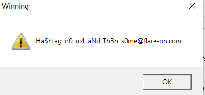

# Flare-On 10, Challenge 6, FlareSay

## Challenge Description

You’re doing great champ! This challenge is a modern (and retro) take on the classic game Simon Says. The cool thing about this one though is it will make you give up, and maybe take that sales job after all. It’s better for everybody that way.

## Files

Filename | Size | SHA256
--- | --- | ---
FlareSay.exe | 39,592 bytes | 403c8813fbaf328198b72437dcd348c0516d7d4772d936fa0a6365b4a4f0685c

## High-Level Summary

- **FlareSay** is a polyglot DOS COM / Windows PE executable
- The 16-Bit DOS program implements a Simon Says like game
  - To fulfill all winning conditions, we need to beat 128 level
    - The level layout is based on an LCG PRNG that is seeded on a timer value
    - This can be avoided by entered the Konami code at the beginning
    - The keyboard scancodes entered to solve each level transform an 128-Bit Bignum implemented in 16-Bit word size
  - Once the last level is won, the DOS program patches the executable with the value of the Bignum
- Running the Windows PE file afterwards yields the flag after the Bignum value is validated with a Rol7XorAdd hash
  - The flag seems to be decrypted with a ChaCha20-like crypto algorithm

## Analysis

### Basic Static

pestudio

- error parsing directories, no imports
- funny strings
  - lol @ `A220 I7 D1 H5 T6` .... is it a soundblaster?

Detect It Easy

- Operation system: `Windows(Server 2003)[AMD64, 64-bit, GUI]`
- Overlay: Binary

CFF Explorer

- AddressOfEntryPoint 0x8f40 (invalid)
- no dll can move bit set

### Basic Dynamic

- Executing as-is as a Windows PE file, nothing seems to happens

## Advanced Analysis

### Failing to Realize the Polyglotness

Opening in IDA Pro seems to fail auto-analysis
AoEP = 0x8f40
go there, convert to code gives a proper function

constraint 1 / stage 1

- first call to 0x408e6a with mode = 1 should yield rax = rip = 408E85, its a call/pop/ret
- transformed with a ROL, 7 + XOR loop has to yield value 0x31D9F5FF
- otherwise -> exit
- 4 loop iterations, 4 bytes each processed = 16 bytes
- this is building a hash over 16 code bytes beginning at 0x408e87
- 16 bytes at 0x408e87 are all null... seems they have to be patched

the description reads that the challenge is a take on the classic game Simon Says.

Simon Says is a children's game for three or more players. One player takes the role of "Simon" and issues instructions (usually physical actions such as "jump in the air" or "stick out your tongue") to the other players, which should be followed only when prefaced with the phrase "Simon says". Players are eliminated from the game by either following instructions that are not immediately preceded by the phrase, or by failing to follow an instruction which does include the phrase "Simon says". It is the ability to distinguish between genuine and fake commands, rather than physical ability, that usually matters in the game; in most cases, the action just needs to be attempted.

The object for the player acting as Simon is to get all the other players out as quickly as possible; the winner of the game is usually the last player who has successfully followed all of the given commands. Occasionally, however, two or more of the last players may all be eliminated at the same time, thus resulting in Simon winning the game.

some rickroll strings in the exe

which strings in the exe are 16 bytes long?

- 7777777777777777
- A220 I7 D1 H5 T6
- 0000000000000000
- never gonna give
- none of those fulfills the hash

maybe we have to use the game phrase "Simon says" as prefix (10 chars)
leaves 6 to brute force for hash, ascii printable

trying to brute the hash didnt work

### Face Palm

imagebase = 0x400000, AoEP = 0x8F40 (RVA), e_lfanew = 0x99a0 (NT header at the end of the file)

maybe the soundblaster string was a hint that this is (also) a valid DOS program?

- load in IDA as MS-DOS executable
- Alternatively: Use DOSBox / DOSBox-X to emulate and debug

sub_108c3

- reads 11 characters from keyboard or up to return
- compares scancodes with `HHPPKMKMBA`

```txt
0x41 = F7 = A
0x42 = F8 = B
0x48 = Up arrow = H
0x4B = Left arrow = K
0x4D = Right arrow = M
0x50 = Down arrow = P
```

The 10 scan codes are: Up Up Down Down Left Right Left Right F8 F7 (Konami Code)

unknown yet: role of function jump table 1102d

on winning condition -> decrypt these strings

```txt
>>> "".join(chr(a ^ 0xd2) for a in s)
'           Never Give Up!!!Ò'
>>> s = unhexlify("949494949494949494949494E0FCF5FAFF94EDFBE194F9F5E6FDFB9500")
>>> "".join(chr(a ^ 0xb4) for a in s)
'            THANK YOU MARIO!´'
>>> s = unhexlify("D1D1D1D1D1D1D1D1D1B3A4A5D1BEA4A3D1A1A3B8BFB2B4A2A2D1B8A2D1B8BF00")
>>> "".join(chr(a ^ 0xf1) for a in s)
'         BUT OUR PRINCESS IS INñ'
>>> s = unhexlify("868686868686868686E7E8E9F2EEE3F486E5E7F5F2EAE38700")
>>> "".join(chr(a ^ 0xa6) for a in s)
'         ANOTHER CASTLE!¦'
```

shortly before that, disk_file_stuff_1051A is called

could this be the leap to PE code?

- this could possibly write the 16 bytes to the PE offset that are needed to run the PE (rol7xoradd hash check)

disk_file_stuff

- decrypts 2 strings / data
- off 5ae -> seems pre-filled with 0x37, len 0x10 -> the 16 '7's, xor key 0xfb
  - yields 16 * 0xCC
  - used as egg
- off 5c2 -> A5AFA2B1A6B0A2BAEDA6BBA600 en 0xd, xor key 0xc3
  - flaresay.exe
- file is read 16 bytes at a time
- looking for 16* CC (the egg)
- then lseek
  - al = 1 -> seek from here by cx:dx bytes
  - so +5 from 16*CC in flaresay.exe
- then writes 16 bytes from p_data_1059a

```txt
Offset(h) 00 01 02 03 04 05 06 07 08 09 0A 0B 0C 0D 0E 0F
00008E70  CC CC CC CC CC CC CC CC CC CC CC CC CC CC CC CC  ÌÌÌÌÌÌÌÌÌÌÌÌÌÌÌÌ
00008E80  E8 E5 FF FF FF 00 00 00 00 00 00 00 00 00 00 00  èåÿÿÿ...........
00008E90  00 00 00 00 00 B8 54 00 00 00 C3 E8 CA FF FF FF  .....¸T...ÃèÊÿÿÿ
```

awesome. so the DOS program fills file offset 0x8e85 with 16 bytes from 96f -> this is used for rol7xoradd hash when executing the file as a Windows PE

but where/how is the buffer filled?
looks like something is copied into it in pos_level_setup_105e1 -> call pos_some_copy_funcs_1017e

simon says show level possibly in 0x67b

- level data in 0x97f

input konami code HHPPKMKMBA at splash screen to statically seed the LCG PRNG

- some hash is calc'd based on that beginning at 924
  - possibly 0x0c0a
- used as level generation seed value
  - LCG PRNG: `seed = seed * 0x5a7f + 0x3079`
- if code is entered wrong, takes seed value based on RTC minutes + seconds

level gen -> in 641

- based on HHPPKMKMBA -> hash -> seed
- level data (scancodes of keys to press) saved at 97f + x with x = level - 1
  - 641 gets next level key
  - calls random 9a(0, 3)
    - range = 3 - 0
    - calls get_random b1()
      - seed = (seed * 0x5a7f + 0x3079) & 0xffff
    - calc seed * (range + 1)
    - result: 0 = H, 1 = P, 2 = K, 3= M

- possibly used? off 96d used in 6ca

level data -> in 97f

level score = sum_scancodes -> saved in 63f and 96d

17e seems to calc this:
`bignum_96f = (bignum_96f * 64) + (bignum_96f * 65536) + bignum_sum_scancode(level) - bignum_96f`

level 1 = K

```txt
0000 0000 0000 0000 0000 0000 0000 4b00
```

level 2 = KP

```txt
0000 0000 0000 0000 0000 0000 4b00 1013
```

its an 128-Bit Bignum implemented with 8 16-Bit words. The Bignum is "big endian" (most significant word first), but each word in itself is stored little endian. Thanks for that brain bump!

level 3 = KPM

```txt
.... 4b 00 89 25 d6 b1
```

Now we know everything we need to know to [fully re-implement all calculations in Python](./code/solve.py) without having to actually play/run the DOS game. We might miss out some serious beauty in gfx and sfx here :-/

The Python solution calculate the correct Bignum value, patches the challenge file and runs it a a Windows PE file to yield the flag.



## Flag

Flag: `Ha$htag_n0_rc4_aNd_Th3n_s0me@flare-on.com`
