# Flare-On 10, Challenge 7, flake

## Challenge Description

Subject: need your help...
Oliver Shrub, Gardens Department Head, keeps bragging about his high score for this rip off Snake game called Flake. I'm pretty sure he found a way to cheat the game because there is no way it's possible to score 10,000 points...I mean the game ships with a sketchy TXT file so there must be something fishy going on here.
Can you look at the game and let me know how I can beat Oliver's high score?
Best,
Nox Shadows Department Head

## Files

Filename | Size | SHA256
--- | --- | ---
demo_conf.txt | 76 bytes | 13373a4146e6f0403c46c8892d106524315ef840539ed9979f946c218b132e60
mail.txt | 475 bytes | aee86302595094814447a06c3b04e98a17389a794b74741b13621565285cd5da
flake.exe | 10,389,504 bytes | d772ac77cfb560c5d5a3053c3596c05467617f01bda5b9e4dca28e4f2271fa99

## High-Level Summary

- flake.exe is a Snake-like game implemented in Python, compiled and bundled with Nuitka
- Nuitka translates Python code to C, so that it is not possible to restore the original Python source/byte code
- To *earn* the flag, we must fulfill two winning conditions
  - Achieve a new high score of over 10k points
  - Pass an *Anti-Cheat check*: the length of the snake must equal the end score
- The first condition can be achieved by constructing a proper flake configuration file
- The following check can be patched after identifying its exact assembly location
- Alternative solutions comprise
  - Identifying and decrypting the flag which is
    - RC4 encrypted and
    - The RC4 key being XOR encrypted itself with a key encryption key (KEK)
  - Completely bypassing everything with PyInjector

## Initial Analysis Steps

The challenge comprises three files

- A mail
- A configuration file
- An executable

### The Mail

In the file `mail.txt`, a person named **Nox** asks us for help with beating the highscore of a person named **Oliver Shrub**. **Nox** accuses **Oliver** of cheating and hints us to a *sketchy* text file.

### The Configuration File

A file named **demo_conf.txt** is part of the challenge. Its contents seem to be base64 encoded, but - ad hoc - we have no idea yet about what the decoded data may mean.

```hexdump
00000000  59 33 a1 dd 18 33 d7 b3 63 5a d4 df 77 7d e5 96  |Y3¡Ý.3׳cZÔßw}å.|
00000010  4f 70 e5 9a 02 41 e3 90 02 67 a0 cf 02 39 d5 9a  |Opå..Aã..g Ï.9Õ.|
00000020  4f 7e b8 dd 0e 33 a0 dd 18 24 bd dd 10 33 ab cf  |O~¸Ý.3 Ý.$½Ý.3«Ï|
00000030  0e 33 a2 dd 18 23 ec                             |.3¢Ý.#ì|
```

### The Challenge Executable

The challenge binary is called **flake.exe**. We can perform some basic analysis steps on it to generate some first ideas.

### Basic Static Analysis

Using [Detect It Easy](https://github.com/horsicq/Detect-It-Easy), we can gather some first insights:

- Operating System: `Windows(Vista)[AMD64, 64-bit, Console]`
- Compiler: `Microsoft Visual C/C++(19.36.32822)[LTCG/C]`
- Linker: `Microsoft Linker(14.36.32822)`
- The first resource entry has a size of `0x9ba120`, which is about 98% of the whole binary.
- The overall entropy has a value of 7.995 and is marked as **packed**.

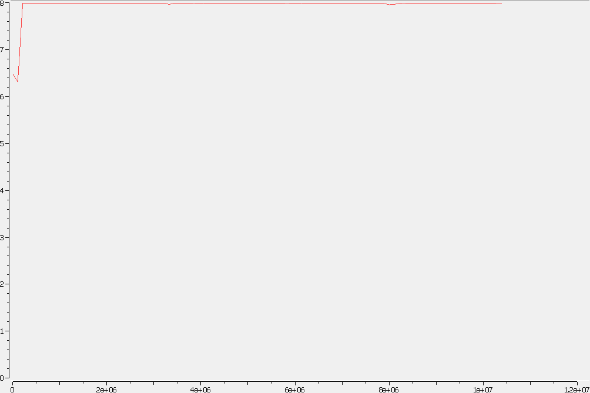

### Basic Dynamic Analysis

Running the file opens up a window with title **FLAKE Ultimate Pro v10**.

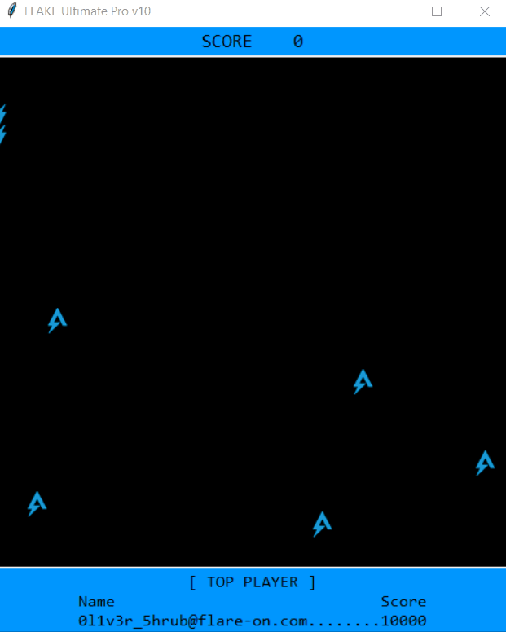.

In the console window, we see the output `[!] could not find configuration file in directory C:\Users\default\Desktop - using prod configuration`.

It looks like the binary searches for a configuration file, but did not find one in the current directory. Maybe the filename of the challenge supplied configuration file is not what the binary expects.

Since it seldom hurts to throw [**Tiny Tracer**](https://github.com/hasherezade/tiny_tracer) against a binary to gather some initial tracing insights, we do that as well and find some interesting hints (output shortened for readability):

```txt
afc8;kernel32.FindResourceA
afd3;kernel32.LoadResource
afdc;kernel32.LockResource
b2a1;kernel32.CreateFileW
CreateFileW:
  Arg[0] = ptr 0x00007ff60b5ce5d0 -> L"C:\Users\DEFAUL~1\AppData\Local\Temp\onefile_5532_133411353950746739\flake.exe"
[..]
b357;kernel32.SetEnvironmentVariableA
SetEnvironmentVariableA:
  Arg[0] = ptr 0x00007ff7fa3988a8 -> "NUITKA_ONEFILE_PARENT"
  Arg[1] = ptr 0x00000067e1cffa00 -> "1556"
b3bf;kernel32.CreateProcessW
CreateProcessW:
  Arg[0] = ptr 0x00007ff7fa39ddb0 -> L"C:\Users\DEFAUL~1\AppData\Local\Temp\onefile_1556_133411362509597028\flake.exe"
[...]
```

Great alternative tools like [**Noriben**](https://github.com/Rurik/Noriben) or running [**ProcMon**](https://github.com/Rurik/Noriben) would make us spot the some things quickly as well:

- The challenge binary unpacks a set of files in a temporary directory named `onefile_<pid>_<number>`
- It then spawns a new process with the unpacked binary **flake.exe** from this directory
- This folder gets deleted after closing the window

To preserve the files for further analysis, we just make a copy of them and saved them on the desktop under `unpacked` for further inspection.

The name of the environment variable being set, `NUITKA_ONEFILE_PARENT`, gives a hint about what we are dealing with: A self-extracting launcher for a Nuitka compiled Python program. [Nuitka is a Python to C compiler](https://github.com/Nuitka/Nuitka).

## The Unpacked flake.exe

So let's inspect the **unpacked flake.exe** some more (from here just dubbed **flake.exe**).

### Basic Static Analysis Part 2

Using **Detect It Easy** again for PE file inspection

- Operation system: `Windows(Vista)[AMD64, 64-bit, Console]`
- Library: `Python(3.8)[-]`
- Compiler: `Microsoft Visual C/C++(19.36.32822)[C]`
- Linker: `Microsoft Linker(14.36.32822)`
- Overall entropy of 6.335 with no apparent spikes means we don't expect large encrypted data regions
- Again, we find a rather large resource entry with size `0x401c30`, spanning roughly half of the binary

To ease future debugging approaches, we remove the `Dll can move` Bit from `IMAGE_OPTIONAL_HEADER > DllCharacteristics` using **CFF Explorer**.

A working assumption would be, that the Nuitka compiled code may reside - in parts - in the resource section. But we don't really know yet.

Some interesting strings can be found

```txt
get_flag
Crypto.Cipher
ARC4
check_snake_length
shame
flag.py
[!] bad configuration file - using prod configuration
[!] configuration file found and decoded with key - using demo configuration
[!] could not find configuration file in directory 
 - using prod configuration
XOR-encode d3m0_c0nf.txt with 0x22,0x11,0x91,0xff (I think Nuikta strips Python docstrings during compilation so no worries about this comment making its way into the wrong hands)
```

Oh sweet, especially the last few ones point out some very useful hints about how to decrypt the configuration file's contents and what the expected filename could be.

## Advanced Analysis

We already found out that this binary has been compiled from Python to C using Nuitka, so we don't expect to be able to decompile the main program back to Python code. We will have to dig some deeper (or take a short circuit).

Armed with the knowledge we gained from the strings output above, we can start to understand the game's configuration file.

### Decrypting the Challenge Configuration File

If we apply the multibyte XOR key `0x22 0x11 0x91 0xff` to the base64 decoded contents of `demo_config.txt`, we get `{"0":"FLAKE Ultimate Pro v10 (Demo)","1":5,"2":0,"3":2}`.

This looks like possibly JSON structured values for the variables `"0"`, `"1"`, `"2"` and `"3"`. While the first apprarently could be the name of the game (used as window title), we do not know yet what the others mean.

We also know now the correct name of the configuration so that it will be used: **d3m0_c0nf.txt**. If we rename the challenge supplied configuration file to that, **flake.exe** will use that!

As already assumed, the value of config variable `"0"` is used for the window title string and it seems like variable `"3"` is used as a point value for each picked up symbol, as we now get a score increase of 2 instead of 1!

### A Config Generator

We write a [launcher script](./code/launch.py) that takes input for the four configuration variables from the command line, generates a valid and correctly named configuration file and then launches **flake.exe** with it.

Playing around with the values and observing gameplay changes, we find out the meaning of all variables:

Variable Name | Meaning
--- | ---
`"0"` | Window Title String
`"1"` | Amount of Food Tiles (maximum 10)
`"2"` | Starting Score
`"3"` | Score per food pickup

### Breaking the Highscore

If we now launch the game with window title string `EasyWin`, `10` food items on the game board, a starting score of `9999` and a score increase per food of `1337`, we can easily beat the high score of the **Shrub**. The config value for that is `WTOh3Rgz1J5RaMaWTDO93RMzq84SPbPNACuoxhsovd0RM6vOESKmgg==`.

Yay, already done!?

```txt
> .\flake.exe
[!] configuration file found and decoded with key - using demo configuration
[!] Snake.length property, not including start length, is 1 but it must equal the final score which is 11336!
```

Oh noes!!!11 Looks like we only managed to pass the first winning condition, which is beating the highscore. But there seems to be a sanity check (second winning condition) in place. Some kind of anti-cheat mechanism!

## Picking a Path to Win

We are now at a crossroad, where we have to choose the path to take.

1. We can reverse **flake.exe** up to the point where we understand where that anti-cheat check is done and then patch that
2. We can focus on locating the (likely) encrypted flag bytes and decrypt it (ignoring the anti-cheat check)
3. Take the super shortcut and just call the win method (lame!)

## Path 1: In-Depth Rabbit-Holing **flake.exe**

Of course we may try to procrastinate just after having chosen this path... and try adding some more parameters to the configuration file or trying some format string injection into the window title string. But we picked the hard path, and that is supposed to be hard. ;-)

### Getting more Debug Output

So we fire up **IDA Pro** on **flake.exe** and start reversing. We can identify the executable's *main* function `0x140489F20` as the Nuitka runtime setup and spot that it is deliberately trying to set some Python internal flags for us.

```c
int __fastcall __noreturn nuitka_main_140489F20(int argc, const char **argv, const char **envp)
{
[...]
  Py_DebugFlag = 0;
[...]
  Py_VerboseFlag = 0;
[...]
}
```

But being reverse engineers, we would rather have verbose and debug output. In order to achieve that, especially with the goal of collecting module load and import details, we can patch **Py_DebugFlag** and **Py_VerboseFlag** in module **python38.dll** from `0` to `1` at any given time after above instructions have executed. This will give us console output whenever modules are loaded and imported.

The Nuitka main function clears both flags at addresses `0x140489F60` and `0x140489FA3`. We could permanently patch these instructions or use conditional breakpoints. In order to do the latter, we put the following **IDA Python** snippet in the condition for breakpoints at `0x140489FA5` and `0x140489F62`:

```python
ea = idc.get_reg_value("rax")
ida_bytes.patch_byte(ea, 1)
```

### Nuitka Runtime Setup / Module Load Order

If we now step over each function call in the Nuitka runtime setup function, we can collect [the names and order of modules](./files/nuitka_runtime_init.log) that the Nuitka code loads.

Spending some deeper dives into the different code paths for module loading and importing, we can identify some relevant functions

- `load_pyd_1404BC310`
- `__import__1404A0850`
- `import_x_from_y_1404A0E80`
- Calls to `PyImport_ImportModule`

Backtracking to Nuitka runtime setup function `0x140489F20`, we keep on debugging to find out that at address `0x14048A044`, it calls a function that looksup metadata of the actual challenge code.

```asm
[...]
.text:14048A03C  call    nuitka_setup_version_140001000
.text:14048A041  mov     rcx, rbx
.text:14048A044  call    nuitka_lookup_main_module_14046E660
[...]
```

Function `0x14046E660` does not seem to effectively do anything (output wise). Diving a bit deeper here will reveal, that it leverages the function `0x1404BC0E0` to look up metadata for a module/symbol whose name is supplied via the register **R8** and returns a pointer to the result data structure via register **RDX**.

```c
const char *__fastcall lookup_main_14046E660(__int64 a1) {
  const char *result; // rax
  if ( !main_res_lookup_done_14052EDA8 )  {
    result = lookup_metadata_for_symbol_1404BC0E0(a1, &main_metadata_14052EDB0, "__main__");
    main_res_lookup_done_14052EDA8 = 1;
  }
  return result;
}
```

We can find out via cross references to function `lookup_metadata_for_symbol_1404BC0E0` that it is referenced from 112 other functions in this binary. It plays a central part for understanding the puzzle pieces of Nuitka compiled Python code, as the plaintext string parameter passed in via register **R8** allows us to identify the name of the module/symbol whose metadata is being looked up.

If we take a look at what's happening inside of function `lookup_metadata_for_symbol_1404BC0E0`, we can see that it uses the windows API functions `FindResourceA`, `LoadResource` and `LockResource` to get a pointer to the 4 MiB resource data we already spotted during basic analysis. It will initially create eight different Python dictionary objects for different Python object types and uses these for lookup purposes.

Debugging further, we find out that the Nuitka runtime main function will eventually invoke the flake main module at address `0x14048A184` with a call to `nuitka_invoke_main_140489360`.

Letting it just execute for the moment, we [collect all debug output regarding the module imports from flake's main](./files/nuitka_flake_imports.log) for further investigation.

The most interesting parts seem to be

```txt
[...]
Loaded Crypto.Cipher.ARC4
import 'Crypto.Cipher.ARC4' # <class 'nuitka_module_loader'>
Loaded flag
import 'flag' # <class 'nuitka_module_loader'>
[!] configuration file found and decoded with key - using demo configuration
[...]
```

We can guesstimate here, that the flake main module imports a module named **flag**, which in turn imports **Crypto.Cipher.ARC4**. Interesting observation!

### Identifying Flake's Modules

We know from analyzing the Nuitka runtime main function, that it already looked up the module/symbol `__main__` and that it used function `lookup_metadata_for_symbol_1404BC0E0` for that. The latter uses register **R8** as a plaintext string parameter.

If we cross reference the address of the global string `__main__` (address `0x1404DEAF0`), we can spot the rather large function `0x140482CA0` and assume for the moment that this could be the Nuitka compiled C function for flake module main.

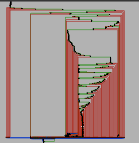

And while we're at identifying Nuitka compiled modules, why don't we try to auto rename all other looked up modules/symbols [with some IDA Python magic](./code/process_symbol_lookups.py)? This script will only rename functions whose name starts with `sub_` and [log the looked up symbols](./files/process_symbol_lookups.log), hopefully not destroying hours of previous RE work... ^^

The result will look like this (shortened).

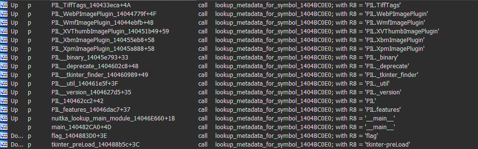

### Identifying the Modules' Methods

After debugging flake's main module for a while, we realize that a lot of initialization is happening at the beginning of a Nuitka compiled module. It seems to roughly follow these steps before actually executing any real code:

1. Variable initialization
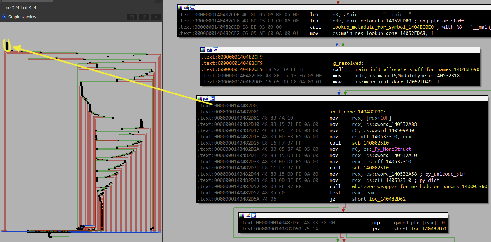
2. Importing of other modules
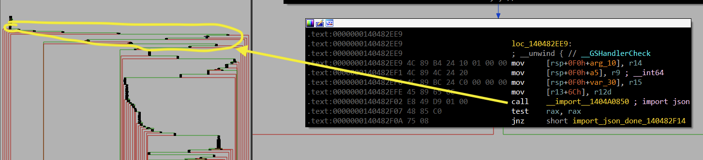
3. Initialization of this module's methods
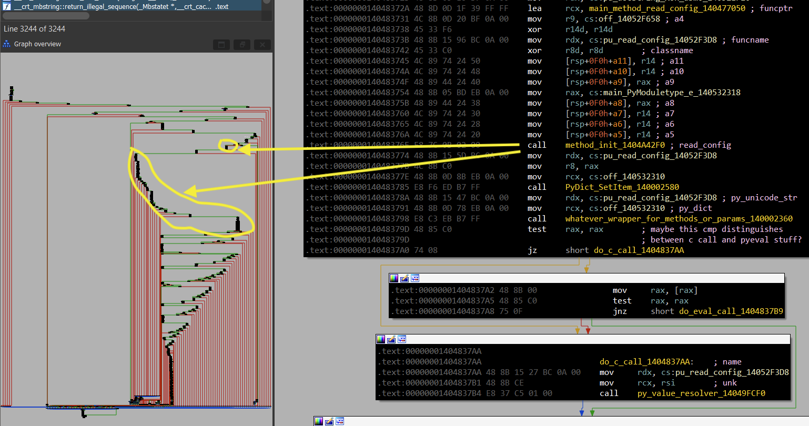

Identifying the functions for each module's compiled methods is a tremendous help for further analysis. We could try to limit the effort here by focussing on the custom modules **main** and **flag** as well as for **Crypto.Cipher.ARC4**.

We can see in above screenshot, that the function `method_init_1404A42F0` plays a pivotable role in method initialization. It is referenced 1244 times! While it seems to take up to 11 arguments, the first three are the most important for understanding what it does:

- **RCX** is assigned the pointer to the Nuitka compiled function for this method
- **RDX** holds the method's name as a **PyUnicode_Type** structure
- **R8** holds - if applicable - the method's full class name as **PyUnicode_Type** structure

The actual values for the **PyUnicode** strings are assigned dynamically at runtime, which makes it a bit harder to analyze statically. But we can leverage **IDA Pro's** conditional breakpoint feature to execute [this IDA Python script](./code/process_method_inits.py) whenever the method initialization function is executed.

It will try to dereference the strings in registers **RDX** and **R8** and tries to auto-rename the function that **RCX** points to. Classnames - if supplied via **R8** - take precedence. As before, already manually renamed functions are not touched, unless they begin with `sub_`. Example log output (shortened for readability):

```txt
[*] bp, RCX='ARC4_init_140002660', RDX='__init__', R8='ARC4Cipher.__init__'
[*] bp, RCX='ARC4_encrypt_140003960', RDX='encrypt', R8='ARC4Cipher.encrypt'
[*] bp, RCX='ARC4_decrypt_140004470', RDX='decrypt', R8='ARC4Cipher.decrypt'
[*] bp, RCX='ARC4_new_140004A80', RDX='new', R8=''
[*] bp, RCX='flag_get_flag_1404868D0', RDX='get_flag', R8=''
[*] bp, RCX='flag_check_snake_length_1404875F0', RDX='check_snake_length', R8=''
[*] bp, RCX='flag_shame_140487880', RDX='shame', R8=''
[*] bp, RCX='main_read_config_140477050', RDX='read_config', R8=''
```

As this script requires an active debugging session, it will iteratively rename functions as they are identified. A longer output can be found [here](./files/process_method_inits.log). Part of the result could look like this:

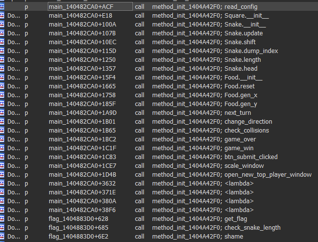

So now that we were able to identify the most important module's main functions as well as their compiled method's addresses, we can start following the code's logic up to the anti-cheat check.

### Finding the Anti-Cheat Check

With the knowledge about the modules and their method functions, we can *surgically* set breakpoints and properly make sense of call stacks during further debugging. Good candidates for breakpoints are

```txt
0x1404875F0 flag_method_check_snake_length_1404875F0 // promising
0x140487880 flag_method_shame_140487880              // interesting
0x140003960 ARC4_method_encrypt_140003960
0x140004470 ARC4_method_decrypt_140004470
0x140004A80 ARC4_method_new_140004A80
0x140475970 main_method_game_win_140475970           // this is our goal?
0x14052F150 open_new_top_player_window_14052F150
0x1404868D0 flag_method_get_flag_1404868D0           // or this?
```

Beating the highscore in a debug run, we unsurprisingly hit the breakpoint at `flag.check_snake_length()`. From the callstack we can find out, that it has been called from `main.next_turn()` at address `0x140473856`. It has been passed the score and the snake length and it returns - oh wonder - **False**.

Continuing the program, we hit the breakpoint at `flag.shame()`, called from `main.next_turn()` at address `0x140473A45`. So the essential comparison must have been made somewhere between both breakpoints inside `main.next_turn()`.

We finally find the one conditional jump that decides our fate after beating the highscore - located at address `0x140473893`!

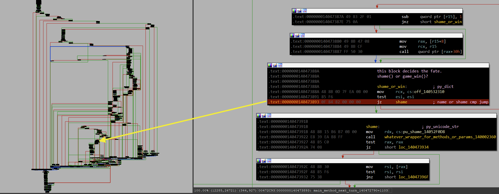

### Patching the Win-or-Shame Comparison

Now all we have to do to depart from this valley of tears is to negate the check. We can patch the **JZ** instruction with a **JNZ** instruction and claim our rightful place in the highscore list!

Running the [auto-patching launcher script](./code/solve.py) yields

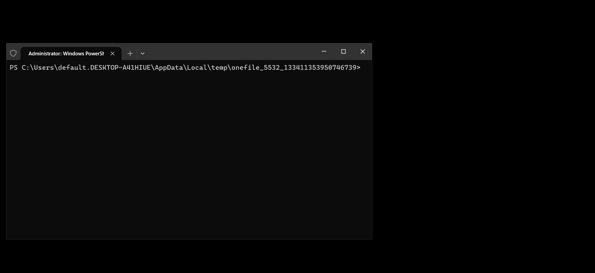

## Path 2: Decrypting the Flag

Okay, we already got the flag. Can we move on now? Not yet! Because we want to know *excactly* where the flag is and how it is decrypted, don't we?

With all the preparation we have already done, it should be *relatively* easy to achieve this.

### Identifying the RC4 Key

We know that the module **flag** has a method `get_flag()` and that it imports the module **Crypto.Cipher.ARC4**. So we can assume, that the flag is RC4 encrypted somewhere in the binary.

We run the patched flake binary with breakpoints on

```txt
0x140003960 ARC4_method_encrypt_140003960  // because, why not?
0x140004470 ARC4_method_decrypt_140004470  // we expect that to be used
0x140004A80 ARC4_method_new_140004A80      // constructor gets the key!
0x1404868D0 flag_method_get_flag_1404868D0 // sounds great, doesn't it?
```

First breakpoint hit after beating the highscore and passing the anti-cheat check is at the entrypoint of `flag.get_flag()`. But it is - after all - still a Nuitka compiled function with lots of interfacing to **python38.dll**. Let's continue execution.

Next in line is `Crypto.Cipher.ARC4.new()`. Not unexpected! From **PyCryptoDomes's** documentation, we would expect the key bytes being passed into it. In a normal fastcall setting, that would be register **RCX**. In this environment, we find the keybytes passed to the ARC4 constructor in a **PyBytes_Type** data structured pointed to by register **R8**.

```txt
debug121:00000000093A09F0 p_RC4_key_93A09F0 dq 2                  ; DATA XREF: Stack[00001144]:pp_RC4_key↑o
debug121:93A09F8  dq offset python38_PyBytes_Type
debug121:93A0A00  dq 32h
debug121:93A0A08  dq 0FFFFFFFFFFFFFFFFh
debug121:93A0A10  db 4Fh, 0BAh, 4Ah, 93h, 7Ch, 43h, 0D3h, 75h, 63h, 0C7h
debug121:93A0A1A  db 1Dh, 46h, 43h, 8, 0D2h, 7Ch, 40h, 4Eh, 0BCh, 9Dh, 2Bh
debug121:93A0A25  db 5Eh, 0C8h, 2, 0F1h, 2Eh, 9Fh, 2Dh, 8Ch, 0D7h, 45h, 0C3
debug121:93A0A30  db 0A2h, 0C8h, 0B3h, 33h, 0F3h, 50h, 81h, 28h, 89h, 34h
debug121:93A0A3A  db 25h, 18h, 0F4h, 12h, 2, 86h, 0ACh, 39h
```

So the RC4 key is 0x32 bytes long and has the value of `4FBA4A937C43D37563C71D464308D27C404EBC9D2B5EC802F12E9F2D8CD745C3A2C8B333F350812889342518F4120286AC39`.

Now let's inspect the call stack up to this breakpoint (shortened):

Address | Module | Function
--- | --- | ---
140004A80 | flake.exe | ARC4_method_new_140004A80
140487285 | flake.exe | flag_method_get_flag_1404868D0+0x9B5
14047A16D | flake.exe | main_method_open_new_top_player_window_140479C70+0x4FD
140493CA7 | flake.exe | wrap_evalframeex_evalcodeex_140493C50+0x57
140475DF5 | flake.exe | main_method_game_win_140475970+0x485
140493CA7 | flake.exe | wrap_evalframeex_evalcodeex_140493C50+0x57
1404738FC | flake.exe | main_method_next_turn_140472790+0x116C

Now we can reap the fruits of earlier investments. The flag decryption is triggered via `main.next_turn()` -> `main.game_win()` -> `main.open_new_top_player_window()` -> `flag.get_flag()`. We can use the call stack addresses to mark/breakpoint each step of that call chain, if we want to follow along in detail.

### Locating the Encrypted Flag

The next breakpoint hit is at `Crypto.Cipher.ARC4.decrypt()`. We can grab the encrypted flag bytes the same way as we got the RC4 key above. If we dereference register **R8** looking for **PyBytes_Type** we find:

`BB68D55088C3241B4DDCC29D89AA664778A6DB8202C656CEBB95407F272A60EEC069`

We can [verify that this is the encrypted flag using CyberChef](https://gchq.github.io/CyberChef/#recipe=RC4(%7B'option':'Hex','string':'4FBA4A937C43D37563C71D464308D27C404EBC9D2B5EC802F12E9F2D8CD745C3A2C8B333F350812889342518F4120286AC39'%7D,'Hex','Latin1')&input=QkI2OEQ1NTA4OEMzMjQxQjRERENDMjlEODlBQTY2NDc3OEE2REI4MjAyQzY1NkNFQkI5NTQwN0YyNzJBNjBFRUMwNjk).

Both call stacks let us complete the picture and locate each call in `flag.get_flag()`.

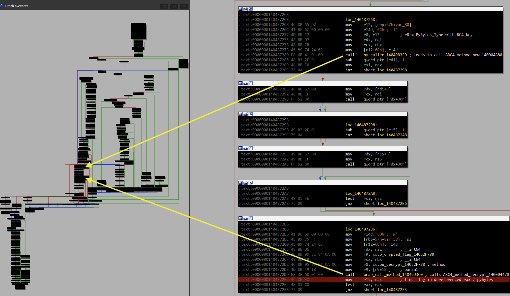

Knowing the encrypted flag bytes, we can identify it inside the flake binary at offset `0x91680E` (offset `0x40196E` inside the large resource). So the encrypted flag was *hidden* inside the resource data just behind the strings `ARC4`, `new` and `decrypt`.

But wait... what about the RC4 key? We can't find that in a similar way!?

### The *Encrypted* Encryption Key

With our accumulated knowledge, we could probably fuzz around with some XOR'ing of other suspiciously looking byte sequences near the encrypted flag bytes since we also know the RC4 key length. But let's trace it down *properly*.

Did `flag.get_flag()` have a parameter being passed from `main.open_new_top_player_window()`? If so, what was it/what were those?

Re-winning the game with the same breakpoints, we inspect register **R8** value at the start of `flag.get_flag()` and find several **PyBytes_Type** structures in some kind of array:

- First item holds the value `1BBA8C1B`
- Second item holds the value `5400C68867F95F6E787D915D58B25E675BF4308630E44419EA941336976DC9D8B9723F28E8EA0D33928EA903EFA88E9DB783`

If we follow along the code, we find that these values are worked on in a loop, performing a byte-wise XOR operation on the second bytestring with something reminiscient of `itertools.cycle()` on the first. The result of this operation is then our known RC4 key.

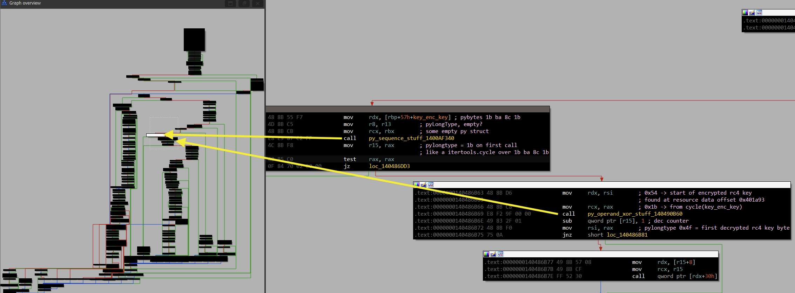

We have identified the encrypted RC4 key `5400C688...`, which is located in the flake binary at offset `0x916933` (resource data offset `0x401A93`). It is XOR decrypted with the **key encryption key (KEK)** value `1BBA8C1B`.

Not *fully* done yet: what is the origin of the **KEK**? It is passed from `main.open_new_top_player_window()` with variable name `xk`. Funnily, the encrypted RC4 key is not passed that way, but still seems to be a parameter value for `flag.get_flag()`. We can guesstimate here, that it may be a default parameter value...

Taking a deep look at where the **KEK** may be defined, we eventually locate it as a global variable initialized in the main module.

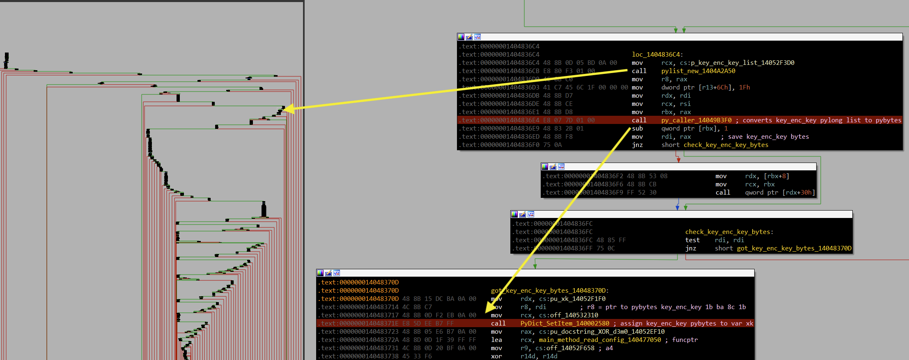

Nifty, so the **KEK** was built from a list of **PyLong_Type** values. *Now* we can properly locate it in the flake binary at offset `0x9163D2` (resource data offset `0x401532`). That's why we didn't easily spot it, even if we knew its bytestring value.

```hex
00401530        6C 1B 00 00 00 6C BA 00 00 00 6C 8C 00 00    l....lº...lŒ..
00401540  00 6C 1B 00 00 00
```

Phew. And now to the last solution path for this write-up.

## Path 3: Easy-Mode PyInjector

Now that we spent roughly *cough* 42 minutes on paths 1 and 2, we can lay back and enjoy the easy mode track... with [**PyInjector**](https://github.com/call-042PE/PyInjector)!

We put [code.py](./files/pyInjector/code.py) in the unpacked directory, which is just a one-liner to call `main.game_win()` and inject the DLL into the flake process. Tada. Going that route may have placed us a few ranks better, but we would have denied ourselves the fun and glory of reversing Nuitka compiled binaries, wouldn't we?

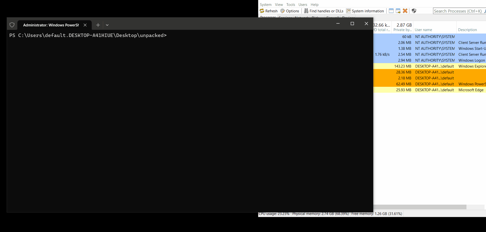

## Flag

Flag: `n0Pe_N0t_T0dAy_Nu1TkA@flare-on.com`
