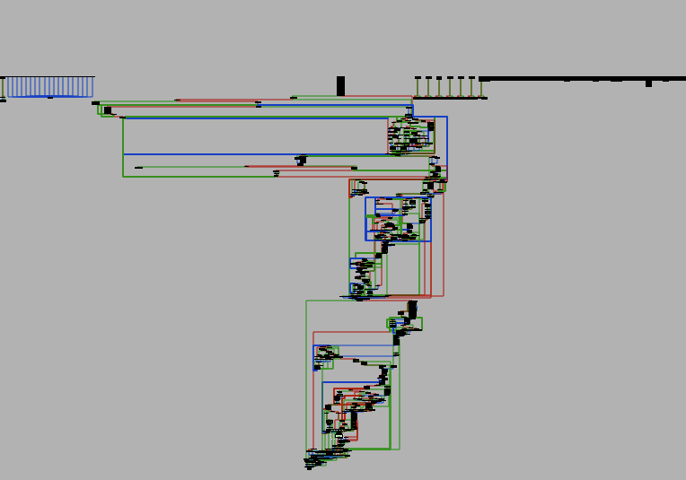
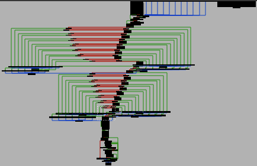

# Flare-On 10, Challenge 8, AmongRust

## Challenge Description

Our customer recently found the following malware executing on one of their machines. The system was left with a very silly looking wallpaper, and a lot of executables on the machine had stopped working. The customer had successfully restored from backup, but we are still interested in understanding all capabilities of the malware. A packet capture file has been provided to aid your analysis.

## Files

Filename | Size | SHA256
--- | --- | ---
06_27_2023_capture.pcapng | 4,185,396 bytes | 3487b69a39e845b58af12b53b723e551b46208b125720b1a9c1c5af29d02ba65
infector.exe.mal_ | 802,816 bytes | dbdae3c9409523591f936feefa32ddea96ff408d0647aed5b9303255df92acb0
readme.txt | 405 bytes | 5dce08df6b417e2566349179bb9c072ca0b978ede4f590b9373e7b360ac77b66

## High-Level Summary

- The challenge executable is a Windows file infector malware implemented in Rust
- It infects PE files found in the user's home directory / AppData
- One will be installed as an ASEP with a red herring / rick roll payload
- A network listening payload is appended to another PE file that is then executed
  - It listens on TCP port 8345 and handles C2 connections after an initial crypto material setup
  - C2 protocol allows command execution and file uploads
  - Uploaded files are symmetrically decrypted
- PCAP file contains threat actor commands and encrypted file transfers of a PowerShell script and a PNG
- Replaying / Re-implementing the C2 protocol with crypto material from PCAP and uploading the encrypted files will decrypt them again

## Analysis

### Basic Static / exe

pestudio

- tls callback 0,.text:0000000000027EC0
- imports: bcrypt.dll, AddVectoredExceptionHandler, Map/UnmapViewOfFile

Detect It Easy

- Operation system: `Windows(Vista)[AMD64, 64-bit, GUI]`
- Compiler: `Microsoft Visual C/C++(19.34.31823)[C]`
- Linker: `Microsoft Linker(14.34.31937)`
- Tool: `Visual Studio(2022 version 17.4)`

Strings

```txt
 /rustc/9eb3afe9ebe9c7d2b84b71002d44f4a0edac95e0\library\std\src\io\mod.rs
 src\infect.rs
 cPeterr@cPeterr@cPeterr@cPeterr@cPe
 C:\Users\chuong.dong\.cargo\registry\src\github.com-1ecc6299db9ec823\rand_chacha-0.3.1\src\guts.rs
 expand 32-byte k
 PoisonErrorcannot access a Thread Local Storage value during or after destruction/rustc/9eb3afe9ebe9c7d2b84b71002d44f4a0edac95e0\library\std\src\thread\local.rs
```

- looks like the repeating string cPeterr@ is used to decrypt strings, lots of peters there
- C:\Users\chuong.dong\.cargo\registry\src\github.com-1ecc6299db9ec823\rand_chacha-0.3.1\src\guts.rs
- expand string hints at use of chacha or salsa

### Fist impression / pcap

Wireshark

- 5556 packets
- IPv6
  - 3 packets Multicast Domain Name System / googlecast
- IPv4
  - UDP
    - 2923 packets QUIC / roughly 50%
    - 144 packets DNS
    - 9 packets NetBIOS Name Service / DESKTOP-1CMR3QL
    - 4 packets SSDP / discover messages
  - TCP
    - 585 packets TLS
    - 28 packets HTTP
    - 230 packets "data" / ports 51885 <-> 8345 and 49769 <-> 7680
  - ICMP
    - 8 packets DNS / Port unreachable

### Basic Dynamic

Tiny_Tracer

### Advanced Analysis

### Network

tcp.stream eq 61 starts with

```txt
et!,.M.4....G|.jp.;<3.-h..\.&.
.ACK_K
..........H...|`hI..^.I.\.....8.ACK_N
exec whoami
desktop-1cmr3ql\user

exec mkdir C:\Users\user\AmongRust

upload C:\Users\user\AmongRust\wallpaper.PNG 122218
ACK_UPLOAD
```

and ends with

```txt
*.=GP.....@..O.[^ |:N.s.@<Ro.a...........8[A....e..u.b..........;..~ACK_UPLOAD_FIN
upload C:\Users\user\AmongRust\wallpaper.ps1 708
ACK_UPLOAD
m1.|.............`$......Cp...6JK.Ux.H..=.../...Q..!l..
.\.d}e.7.=Q.......-...P..."."..}...F..pTo.)......&r....asf9;.?Y`.:..J..g.....+...a.|.:....@
~3H......->2..'&...>|Yx.....l"..KD..'m.9<:.dQ...X.Rl....?....{U..RY.q}.q...Y
(...e.f........~.....y.........C\8....L'.:n*>...a...j.SL.ch...74.hD.B&.6....c.\./L....K..k......PE.-+....!.0J...T.....7.j.F.P\AS.V.-d.;...(.Pah.
........w...j?V..5..N.....8....]7.......).6>9p.."..).....*.7....m........$.=
....l.>..
..#...O..B9/....,..:BZ..i.p......J.T.M...f.K.p?.a......Qr.o.........A7..v`..7.~.Q}...<5...t..=
.c.....i.#...v. s.?...m].h!.)|./"........*./.^....I_(.[...H....S.T	.7.IfzZ.%...#yf...:dj.....s..E.......R.m............n...=qD%...F.7.:f.....=....+gm....0.NACK_UPLOAD_FIN
exec powershell C:\Users\user\AmongRust\wallpaper.ps1

exec del C:\Users\user\AmongRust\wallpaper.ps1 /q

exec del C:\Users\user\AmongRust\wallpaper.PNG /q

exec rmdir C:\Users\user\AmongRust

exit
```

so C2 remote shell traffic contained

- a file named wallpaper.PNG which could be a next stage payload
- a powershell script called wallpaper.ps1

looks like the C2 traffic caused the infector to execute on the host
so infector may be a payload of a later stage (the ransomware)
and we maybe have to track back.
find more out about the powershell script and the wallpaper

ACK_N / ACK_K could be C2 ACKs for crypto key material like a nonce and a key

packet 3645, 192.168.189.213 sends 32 byte to 192.168.189.128 port 8345

- 6574212c9b4d9334d893bec2477cb86a70983b3c33952d68a8cc5c0226070abf

packet 3646, answer len 6 with ACK_K

- could be acknowledgement for key reception

packet 3647, .213 -> .128, len 32

- 0e02f4a9a8b5beeaba8348d6d2f87c606849df9a5eef49a65c98cf07d4c238a6

packet 3648, answer, lent 6 with ACK_N

- could be nonce
- exe has chacha references
- but 32 byte would be too much
- maybe this is nonce + counter + X

packet 3670 .213 sends command upload wallpaper.PNG, size 122218
packet 3671 ACK_UPLOAD
then data transfer, encrypted
packet 3957, .128 sends ACK_UPLOAD_FIN

p3960, .213 command upload wallpaper.ps1, len 708
p3691, .128(?) ACK_UPLOAD
p3962 & 3964 data, len 512 + 196 = 708
p3965 .128 ACK_UPLOAD_FIN

p4010, .213 command to exec the ps script
then follows deletion of uploaded files, dir, and exit of C2 remote shell session

possible to decrypt the first 8 bytes of the ps1
ciphertext (png - A5 05 A1 16 B5 E0 E6 DC) ^ plaintext (png - 89 50 4E 47 0D 0A 1A 0A) = keystream (2c 55 ef 51 b8 ea fc d6)
keystream (2c 55 ef 51 b8 ea fc d6) ^ ciphertext (ps1 - 6D 31 8B 7C EC 93 8C B3) = Add-Type (41 64 64 2d 54 79 70 65)

### Infector exe

Remove DLL can move flag from optional header

TLS callback @ 0000000140027EC0

Capa Explorer / IDA Pro Plugin

- Higher prio
  - mw_parse_PE_14000CF90
  - mw_cant_inject_win32_and_ntwritefile_140006780
    - str rretePc@
    - called by mw_svchost_wrap_call_cant_inject_140007A50
    - called by mw_create_thread_140003BC0
  - mw_reateFileMappingW_14000CD40
  - mw_reateMutexA_dbghelp_API_lookups_and_calls_14001E0F0
    - Creates mutex Local\\RustBacktraceMutex
  - CreateProcessW
    - mw_huge_createprocessw_1400223E0
      - IPtoStateMap_1400BA534 IPtoStateMap <rva mw_top_call_createprocessw_140002880, -1>
  - base64
    - mw_huge_createprocessw_1400223E0
  - Crypto
    - nw_bcrypt_random_systemfunc36__14000C8E0
    - XOR xmm_xor_14000A090
      - calls xmm_xor_14000B690
      - and xmm_xor_3_14000BE00
      - downstream from mw_create_thread_140003BC0
    - xmm_xor_not_spaghetti_140035360
      - jumped to from xmm_stuff_14002AC00
        - called from runneradmin
          - mw_jmptable_call_runneradmin_14002FF90
            - mw_funny_graph_14002F5C0
    - mw_pos_rc4_prga_140017FF0
  - enum files windows
    - mw_huge_capa_enum_files_140003FA0
  - dynamic linking/api lookup
    - mw_getproc_waitonadrr_wakebysingle_14001E440
    - mw_api_ndtll_ntreadfile_140029140
    - mw_get_ntdll_NtWriteWile_1400291C0

- Low prio
  - CreateThread in mw_create_thread_140027950
    - Thread code in thread_140027ab0  // possibly not interesting
    - could be rust runtime

Also

- VEH_140029540
  - does stuff with Thread local storage
  - could be rust runtime

likely red herring `.rdata:00000001400B2C00 52 55 35 54 5F 52 33 5F aRu5tR3IsHellaF db 'RU5T_R3_iS_heLLA_FuN@flare-on.com'`

some libraries may be included, like backtrace,
other rust source file names seem custom, like infect.rs

lets try to focus on some high prio functions

- mw_cant_inject_win32_and_ntwritefile_140006780
- mw_huge_capa_enum_files_140003FA0
- mw_huge_createprocessw_1400223E0
- mw_bcrypt_and_pipe_140021990
- mw_switch_getcurproc_duplhandle_call_bcrypt_and_pipe_140026730
- mw_CreateFileW_infect_rs_140006490
- mw_create_thread_crypto_inject_140007E30

[sandbox run report hybrid analysis](https://www.hybrid-analysis.com/sample/dbdae3c9409523591f936feefa32ddea96ff408d0647aed5b9303255df92acb0/652445b352a933070b06b554)

- Creates Process "svchost.exe" at non-system pathway "%APPDATA%\Microsoft\Windows\Start Menu\Programs\Startup\svchost.exe
- Anti VM Found VM detection artifact "CPUID trick" in "sample.bin" (Offset: 232880)
- "infector.exe" allocated memory in "C:\infector.exe"
- "0.0.0.0:8345Could not bind"

debugging original amongrust.exe

- copies system32\svchost to L"C:\\Users\\default.DESKTOP-A41HIUE\\AppData\\Roaming\\Microsoft\\Windows\\Start Menu\\Programs\\Startup\\svchost.exe"
- copies 40 63 50 65 74 65 72 72 / @cPeterr in a buffer / put hw bp on access (origin? maybeeee 58ec)
- decrypts MZ payload with @cPeterr as XOR key @ loop 0000000140006B32, strange loop jumping back and forth?
  - MZ payloads encrypted like that @ 0x3a200, 0x64e00
- creates file svchost.tmp in same dir as above
  - writes 0x2ac00 bytes from buffer 0x51a320 (heap)
    - another rust binary, contains rick roll url Flare-On flag `https://bit.ly/flare-on-flag`
- CreateFileMapping, MapViewOfFile of svchost.exe
  - call func parse pw 14000cf90 on the file mapping heap address
    - compares e_lfanew with value 0x1000000?
    - checks some values for code section? and machine type 32/64 bit, but doesnt write something
- Does some kind of appending of svchost.tmp to svchost.exe
  - also did some minor writes to the svchost.exe beforehand / unsure what exactly
- creates thread with code from mw_huge_capa_enum_files_home_dir_140003FA0   / thread 7, tid 2612
  - enums files in user home dir
  - may do some nasty shit, suspend thread ;-)
- creates another thread with code from thread_140027ab0  / thread 8, tid 8864
  - i may be blind, but its a null sub?  / may get code copied to  / gets code from 27ab0 as well
- creates yet another thread with huge capa enum / thread 9, tid 11792
  - gets code from 27ab0 as well

looks like it just drops an svchost.exe, modifies it and appends a payload to it

- modification in func with several ntwritefiles  / TODO to understand / may be just some inject.rs lib to load the piggybacked payload
- piggybacked payload is svchost.tmp, may as well just inspect that?
- didnt get to the CreateProcessW call... froze on third thread creation
- TODO: could patch the create thread calls away

analysis of svchost.tmp, the malicous piggyback to the modified system svchost / it does contain the red herring rick roll url though

analysis of svchost.exe (appended/modified one)

- from overlay perspective, the original svchost.exe is appended to svchost.tmp
- resources hold an icon
- holds high entropy regions
- remove DLL can move bit

dbg run / svcost.exe (that was merged)

- bps TODO
- breaks 3 times on getprocaddress, similar lookups to dbghelp
  - terminates soon after looking up SetThreadDescription
    - calls it @ 0xc81a, returns 5
  - rva 35fb call prints out rick roll flag uri Flare-On flag: `https://bit.ly/flare-on-flag`
  - 1b82e could be debug detect -> call jmp.exit afterwards
    - calls __scrt_is_managed_app -> then exits
    - thats already behind call main @ 0x1b827
  - ok this drop sucks lol, it's a red herring with rick roll

back to debug / exec of orig infector

tiny tracer run

- at some point, a process dismhost.exe is started and all others terminated
- asks for fw permission

drops fake flag exe in autostart / ASEP
seems to infect all .exe under home dir with itself

```txt
2540d;kernel32.CreateProcessW
CreateProcessW:
        Arg[0] = ptr 0x00000000005f6d80 -> L"C:\Users\default.DESKTOP-A41HIUE\AppData\Local\Temp\54824D3B-738C-4D17-AD41-C5A7E6B5C06B\DismHost.exe"
        Arg[1] = ptr 0x00000000005bb8d0 -> L""C:\Users\default.DESKTOP-A41HIUE\AppData\Local\Temp\54824D3B-738C-4D17-AD41-C5A7E6B5C06B\DismHost.exe""
        Arg[2] = 0
        Arg[3] = 0
        Arg[4] = 0x0000000000000001 = 1
        Arg[5] = 0x0000000000000400 = 1024
        Arg[6] = 0
        Arg[7] = 0
        Arg[8] = ptr 0x000000001dd4f460 -> L"h"
        Arg[9] = ptr 0x000000001dd4f8f0 -> {\x00\x00\x00\x00\x00\x00\x00\x00}
```

noriben run with --cmd "blub"

run 2

- [CreateProcess] `infector.exe:8436 > "%UserProfile%\.vscode\extensions\yzane.markdown-pdf-1.4.4\node_modules\puppeteer-core\.local-chromium\win64-722234\chrome-win\chrome.exe" [Child PID: 6036]`

injected in 35 exe (some loop)
then createprocess
then starts listening server

noriben run 3

```txt
PS C:\> netstat -ano

Active Connections

  Proto  Local Address          Foreign Address        State           PID
  TCP    0.0.0.0:135            0.0.0.0:0              LISTENING       952
  TCP    0.0.0.0:445            0.0.0.0:0              LISTENING       4
  TCP    0.0.0.0:5040           0.0.0.0:0              LISTENING       5124
  TCP    0.0.0.0:5357           0.0.0.0:0              LISTENING       4
  TCP    0.0.0.0:8345           0.0.0.0:0              LISTENING       8664
```

this is the same port opening/listening as in the pcap
approach: connect to it, possibly replay traffic from pcap

interact with port 8345 through nc

take noriben run 3 - createdump.exe as the server binary
find ws2_32 imports, bind, listen, accept, recv, send

mw_c2_handler_140001490


- expects 32 byte key at beginning of connection
  - sends ACK_K, else
  - 140001573 E8 88 2C 01 00          call    mw_c2_send_140014200 ; invalid key size
- expects 32 bytes nonce
- recv up to 512 bytes c2 cmd next
  - exit, exec or upload
  - upload receives data in 512 byte chunks

140004CD0 seems to be the decrypt function

c2 upload function


```txt
__int64 __fastcall mw_crypto_pos_murmur3_hash_140004CD0(__int64 buf_or_len, __int64 len_or_buf, const void *key, unsigned __int64 pos_key_size, void *pos_nonce, size_t pos_nonce_size);
```

bps in createdump.exe (the c2 endpoint with listen port 8345)

```txt
Location | Type | Pass | count | Hardware | Condition | Actions | State | Comment
0x7FF7FCE81207 (mw_c2_pos_exec_call_140001150+B7) Abs Break Enabled
0x7FF7FCE81490 (mw_c2_handler_140001490) Abs Break Disabled mw_c2_handler_140001490
0x7FF7FCE81B8C (mw_c2_handler_140001490+6FC) Abs Break Enabled
0x7FF7FCE81BDA (mw_c2_handler_140001490+74A) Abs Break Enabled
0x7FF7FCE82DEC (mw_c2_handler_140001490+195C) Abs Break Enabled
0x7FF7FCEB5CFC (start) Abs Break Enabled start
```

We can now re-implement the whole C2 protocol and upload the encrypted files again so that they are decrypted by the infected process.
[see c2_replay.py for full C2 implementation of a c2 client](./code/c2_replay.py) inspired by the pcap session (tcp stream 61)

This way we can retrieve the [PowerShell Script wallpaper.ps1](./files/wallpaper.ps1) which sets the [decrypted PNG file](./pics/04_wallpaper.PNG) as the desktop wallpaper.


## Flag

Flag: `n0T_SuS_4t_aLl@flare-on.com`
