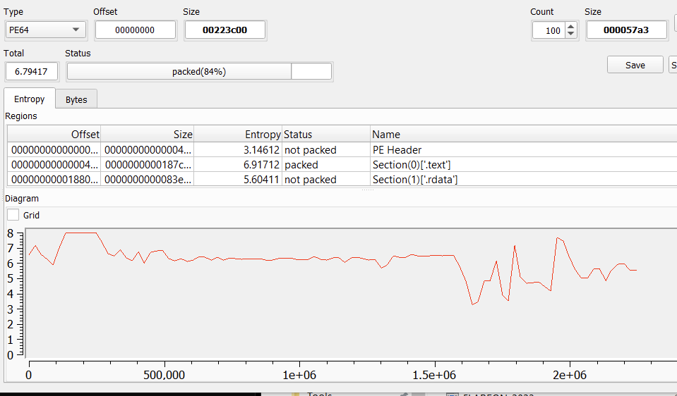

# Flare-On 10, Challenge 11, over_the_rainbow

## Challenge Description

I’m told this one is easy if you are really good. Based on your solve times so far Google Bard predicts your performance will be: “1 out of 5 stars. I’d give it 0 stars if I could. Food arrived over an hour late, covered in oil. I wouldn’t feed it to my dog”

## Files

Filename | Size | SHA256
--- | --- | ---
FLAREON_2023.exe | 2,243,584 bytes | 3d808c4d28c679e4b1097852810ecc701c275b5c40c9c4c856286390656c5f7f
very_important_file.d3crypt_m3 | 317 bytes | 7d3e8c4d2b234692130942a100da50fcfad69c14361adc41a7e6f5f152c2c56b

An executable and a file that was possibly encrypted by it.

## High-Level Summary

- **FLAREON_2023** is a ransomware-like programm that encrypts all files with extension `3ncrypt_m3` in a supplied path
- It leverages a statically linked OpenSSL library to apply some of the crypto algorithms
- It uses a 2048 Bit public RSA key to asymmetrically encrypt the key material that was used to symmetrically encrypt the file contents
  - The RSA ciphertext is then appended to the file
  - The symmetric crypto algorithms used are ChaCha20 (with an uncommon init state) and a multi-byte XOR cipher
- The way that RSA is used is vulnerable to a Coppersmith Stereotype Message attack (small exponent, partially known plaintext, relatively small unknown plaintext)

## Basic Analysis

### Basic Static Analysis

Detect It Easy

- Operation system: `Windows(Vista)[AMD64, 64-bit, Console]`
- Compiler: `Microsoft Visual C/C++(19.34.31937)[LTCG/C++]`
- Linker: `Microsoft Linker(14.34.31937)`
- Tool: `Visual Studio(2022 version 17.4)`
- Code section (`.text`) has a super high entropy blob somewhere between file offsets 138000 and 251000


CFF Explorer

- DLL Imports
  - ws2_32.dll
  - crypt32.dll and bcrypt.dll
- Remove `DLL can move` Bit

Strings

- Lots of OpenSSL related strings and names of crypto algorithms
- Could be statically linked
- `18bca0 C:\Users\kleymenov.nikita\.conan\data\OpenSSL\1.1.1b\conan\stable\build\fce9be1511a149a4af36b5997f7e611ab83b2f58\binaries\lib\engines-1_1`

### Basic Dynamic Analysis

Executing FLAREON_2023_noaslr.exe for the first time

```txt
usage: Z:\CTF\Flare-On 10\solutions\11_over_the_rainbow\FLAREON_2023_noaslr.exe [path]
```

So it wants a path. Let's give it one. And put a file in it, as it might be a crypter that produced the other likely encrypted challenge file.

```txt
PS Z:\CTF\Flare-On 10\solutions\11_over_the_rainbow> .\FLAREON_2023_noaslr.exe test
PS Z:\CTF\Flare-On 10\solutions\11_over_the_rainbow>
```

Nothing immediately observable here. Let's do some tracing next.

## Advanced Analysis

Trace it with Tiny Tracer (see [params.txt](./files/openssl-1.1.1s.tar.gz), [run_me.bat](./files/run_me.bat) and [TinyTracer.ini](./files/TinyTracer.ini))

```txt
160d2d;kernel32.CreateThread
CreateThread:
 Arg[0] = 0
 Arg[1] = 0
 Arg[2] = ptr 0x0000000140160b9c -> {@SH\x83\xec H\x8b}
 Arg[3] = ptr 0x000000000057ff90 -> {\x80S\x08@\x01\x00\x00\x00}
 Arg[4] = 0
 Arg[5] = ptr 0x000000000014fe20 -> {\xcb\x00\x00\x00\x00\x00\x00\x00}

160d2d;kernel32.CreateThread
CreateThread:
 Arg[0] = 0
 Arg[1] = 0
 Arg[2] = ptr 0x0000000140160b9c -> {@SH\x83\xec H\x8b}
 Arg[3] = ptr 0x000000000057fed0 -> {\x80S\x08@\x01\x00\x00\x00}
 Arg[4] = 0
 Arg[5] = ptr 0x000000000014fe20 -> "l%"
```

Likely used to enumerate the supplied path. what does it look for?

```txt
1562e7;kernel32.FindFirstFileExW
156268;kernel32.FindNextFile
```

After that there is not much activity to be seen.
But we can import that .tag file into IDA Pro via IFL (Load Names)

Calls to create thread wrapper in main @ 000000014008067A
Not much to find here on the first view either.

### Disassembly

IDA Pro

- awesome, just 4598 functions. ez

Take a look at the super high entropy region around file offset 138k, find

- qword_140020000
  - xref lea     r14, qword_140020000
    - used in mw_xref_entropy_1400DC470
      - part of what looks like a vftable @ 1401B4950

And if you mix decimal with hex notation, you land in some crypto code

- mw_crypto_chacha_or_salsa_140138FA0
- finding xrefs
  - called from mw_wrap_crypto_140109E20
    - could be part of a vftable @ 1401bfcc8
    - constructor could be sub_140109AA0
- mw_wrap_crypto_2_140111290

Capa found stackstring creation in sub mw_dir_entry_expand_32_byte_k_14007EE60

- "expand 32-byte k" -> salsa or chacha state init

```txt
.rdata:00000001401FB528 mw_dir_entry_expand_key_1401FB528 dq offset mw_dir_entry_expand_32_byte_k_14007EE60
.rdata:00000001401FB4A0 mw_thread_1_recursive_3ncrypt_m3_1401FB4A0 dq offset mw_thread_1_recursive_3ncrypt_m3_14007FD20

in _BYTE *__fastcall sub_14007FD20(__int64 a1)
    sub_14007E310("recursive_directory_iterator::recursive_directory_iterator", v5, v52);
and
*(_QWORD *)&v49 = ".3ncrypt_m3";
```

from main

```c
  *v14 = &mw_thread_1_recursive_3ncrypt_m3_1401FB4A0;
  v14[2] = v15;
  v16 = operator new(0x10ui64);
  v17._Hnd = v16;
  *(_OWORD *)v16 = 0i64;
  *v16 = &mw_dir_entry_expand_key_1401FB528;
  v16[1] = v12;
  mw_thread_create_14007EDC0(v14, &v19);
  mw_thread_create_14007EDC0(v16, &v20);
```

So we have interesting code leads in front of thread creation calls

- thread 1 code @ 14007FD20 (bp it)
- thread 2 code @ 14007EE60 (bp)
- they are called one after another (main thread blocks execution while a thread executes) via Thrd_join

address pointers to both are passed in a data structure offset 0 to sub mw_thread_create_14007EDC0

shared thread struct is allocated in @ 1400805A, size 0x80

- offset 0x8 is passed to _Mtx_init_in_situ
  - offset 0x8 <- rdx param to Mtx_init = 2
  - offset 0x10 is set to offset ??_7stl_critical_section_win7@details@Concurrency@@6B@
    - offset 0x18 is rcx param to InitializeSRWLock (Type PSRWLOCK)
      - likely some or/and on PSRWLOCK value @ 140158F78
- offset 0x58 size 0x28 gets memset to 0
- offset 0x58 <- p to heap size 0x18 (thread 1 sub struct)

Weirdly indirected / obfuscated way to start the threads

- mw_thread_create_14007EDC0 is passed a data struct with malicious thread address in offset 0
  - calls beginthreadex which calls CreateThead with StartAddress bmw_thread_caller_code_140085380
    - Through the passed arglist->field_8 comes double_deref_jmp_1400853C8, which invokes arglist->field_0
    - which holds the pointer for each mw thread code

### Thread 1 - mw_thread_1_recursive_3ncrypt_m3_14007FD20

- creates or calls @ 14008045E something called recursive_directory_iterator::recursive_directory_iterator
- uses that filename extension string is very similar from the challenge files, somewhere

```c
 *(_QWORD *)&v49 = ".3ncrypt_m3";
 *((_QWORD *)&v49 + 1) = 11i64;
```

seems to call @ 140080488 directory_entry::file_size

guesswork: does a recursive directory lookup searching for files with the extension 3ncrypt_m3

- thread 1 may just do that, find / iterate for these files
- doesnt look like it actually encrypts stuff

### Thread 2 - mw_thread_2_dir_entry_expand_key_1401FB528

Knowing that main thread waits for thread 1 to finish, it seems likely that thread 2 is going to process the files that thread 1 found

- maybe only these files are encrypted
- and then renamed to d3cryptn_m3? (like the challenge files)

```txt
014007F2CA 48 8D 0D 1F C0 17 00    lea     rcx, aD3cryptM3 ; ".d3crypt_m3"
```

- we already found this with capa, that identified the salsa/chacha initial state string expand 32-byte k
- call @ 14007F8E8 to something with directory_entry::file_size

- sub does rol 7, 8, 12, 16 <- together with expand 32-byte k this identifies chacha
- there is a loop with counter 10 over 8 quarter rounds = 20 rounds, so its chacha20
- chacha20_do_rounds_14007F8F0

```c
      v62[0] = (__int64)".d3crypt_m3";
      v62[1] = 11i64;
      pos_write_encrypted_file_14007D0D0(&Src, v31, v62);
```

this looks like the important parts

```c
     crypto_rand_lib_140086A00(v76, 48i64);
      qmemcpy(&v77, "expand 32-byte k", sizeof(v77));
      memset(v79, 0, sizeof(v79));
      crypto_rand_lib_140086A00((char *)&v79[10] + 8, 24i64);
      v79[12] = v76[0];
      v79[13] = v76[1];
      v79[14] = v76[2];
      v79[15] = v77;
      pos_chacha20_init_state_140085470(256i64, v79, &v25[v18], v61, 3);
      for ( i = 0i64; i < v18; ++i )
      {
        if ( (i & 0x3F) == 0 )
          chacha20_do_rounds_14007F8F0(a1, v76, v78);
        v25[i] = *((_BYTE *)v22 + i) ^ v78[i & 0x3F] ^ *((_BYTE *)&v79[10] + i + -24 * (i / 0x18) + 8);
      }
      sub_14007DA30(v70, v13 + 32);
      v31 = _std_fs_code_page();
      v62[0] = (__int64)".d3crypt_m3";
      v62[1] = 11i64;
      pos_write_encrypted_file_14007D0D0(&Src, v31, v62);
      v58 = v57 | 6;
      sub_14007D5A0(v70);
```

this could delete the source files

```txt
.text:000000014007F8C8 48 8D 0D 15 BA 17 00    lea     rcx, aRemove    ; "remove"
.text:000000014007F8CF E8 3C EA FF FF          call    sub_14007E310
```

### Debugging Approach

- place a file with extension 3ncrypt_m3 into the path given as argument
- find out where the crypto material (key, iv, nonce) are generated and possibly stored in the file
- we can feed it chosen plaintext

breakpoints in thread 2

```txt
- 14007F193  call crypto_rand_lib_140086A00, likely used for key byte generation
- 14007F249  call pos_chacha20_init_state_140085470
    - we need to see how key, iv and nonce are generated
    - and more importantly, how they are written to the file (offset, decoding, ...)
- 14007F2EB pos_write_encrypted_file_14007D0D0
```

encrypting file with content in dir test with name super_important.3ncrypr_m3

```hexdump
Offset(h) 00 01 02 03 04 05 06 07 08 09 0A 0B 0C 0D 0E 0F
00000000  30 31 32 33 34 35 36 37 38 39 61 62 63 64 65 66  0123456789abcdef
00000010  0D 0A 41 41 41 41 41 41 41 41 41 41 41 41 41 41  ..AAAAAAAAAAAAAA
00000020  41 41 0D 0A 42 42 42 42 42 42 42 42 42 42 42 42  AA..BBBBBBBBBBBB
00000030  42 42 42 42                                      BBBB
```

first do a tiny tracer

after the run, the file has been encrypted as expected and the extension changed to d3crypt_m3
new content

```hexdump
Offset(h) 00 01 02 03 04 05 06 07 08 09 0A 0B 0C 0D 0E 0F
00000000  94 EF 64 DF CD 1F 5F 50 F0 89 C6 2F 43 3B 0E D0  ”ïdßÍ._Pð‰Æ/C;.Ð
00000010  23 CF FA 8A A6 5F 70 45 34 2A C0 08 98 EF BF EA  #ÏúŠ¦_pE4*À.˜ï¿ê
00000020  83 02 45 84 0E 2A 80 77 85 93 A0 73 38 6E 01 45  ƒ.E„.*€w…“ s8n.E
00000030  D3 3E 1D 6A 43 4A 06 2D C6 0F EE A1 7B C1 EC 4B  Ó>.jCJ.-Æ.î¡{ÁìK
00000040  65 12 D6 52 0E 4D A3 23 9E 41 30 0B 83 B2 73 F3  e.ÖR.M£#žA0.ƒ²só
00000050  75 BF D7 B1 D1 F8 99 BE 38 1E 37 F9 2C C5 9A A4  u¿×±Ñø™¾8.7ù,Åš¤
00000060  18 30 AE 6D 0C E5 CF 71 FC 43 AD 46 52 01 02 D2  .0®m.åÏqüC.FR..Ò
00000070  55 3A 1A 38 E1 C4 2C C4 0D 63 03 C7 98 C9 D6 8C  U:.8áÄ,Ä.c.ǘÉÖŒ
00000080  24 4E 2D 49 D7 7F 04 94 BB 3C 81 AF C4 9B 4A F8  $N-I×..”»<.¯Ä›Jø
00000090  D7 95 4A E3 97 30 6E 0A 88 94 C2 FC 03 CD 0C 29  וJã—0n.ˆ”Âü.Í.)
000000A0  2B F7 6B 83 01 FC A7 AB B6 B6 EE 0C 8D BF 61 6F  +÷kƒ.ü§«¶¶î..¿ao
000000B0  15 D3 9E FB 9D 84 46 67 11 9E AD 0A 5B 1A BC 20  .Óžû.„Fg.ž..[.¼ 
000000C0  DF F0 37 33 55 B8 51 7F 1B 49 EB 35 38 19 40 19  ßð73U¸Q..Ië58.@.
000000D0  91 1C 33 AE E0 CB BC F7 53 F4 2F 52 58 43 9F 14  ‘.3®à˼÷Sô/RXCŸ.
000000E0  D8 05 57 6B 69 54 DA 3F AD 0E 9E 8F D4 8D 22 6A  Ø.WkiTÚ?..ž.Ô."j
000000F0  00 92 AD 2E 2E 80 AF 05 97 F2 DE 55 7E 8C AB 23  .’...€¯.—òÞU~Œ«#
00000100  1A DE E0 72 87 74 97 9B DA CB 8A F9 8D C4 90 19  .Þàr‡t—›ÚËŠù.Ä..
00000110  C8 70 74 81 07 EE B2 66 2F 7E 14 20 7B DE 39 2E  Èpt..î²f/~. {Þ9.
00000120  FF 06 5E 3C FB 32 09 A1 E8 65 8C 46 FE 10 29 25  ÿ.^<û2.¡èeŒFþ.)%
00000130  82 35 4F FA                                      ‚5Oú
```

the size increased by exactly 0x100 bytes

in order to decrypt the contents, we would need to recover the initial state.
let it encrypt the same file again for comparison

```hexdump
Offset(h) 00 01 02 03 04 05 06 07 08 09 0A 0B 0C 0D 0E 0F
00000000  37 FF 66 5F 95 6A A0 A4 E5 4F F4 C0 E4 7E F7 8E  7ÿf_•j ¤åOôÀä~÷Ž
00000010  E8 D7 63 53 C3 80 3B DA 00 E2 77 5C 9C F6 0F FE  è×cSÀ;Ú.âw\œö.þ
00000020  14 23 1D 68 03 EE 29 59 2F 3A CB 15 09 26 B0 09  .#.h.î)Y/:Ë..&°.
00000030  3B E5 A6 60 78 E3 CF 38 95 A1 17 FA 11 E0 A1 DA  ;å¦`xãÏ8•¡.ú.à¡Ú
00000040  0E A2 62 D4 DD 2E 22 41 B8 67 70 86 96 E6 4C 19  .¢bÔÝ."A¸gp†–æL.
00000050  13 BE F1 96 3E 04 BD 4C 46 CB CA 83 77 2E 14 B7  .¾ñ–>.½LFËʃw..·
00000060  12 F1 A9 9B FB 83 B2 70 99 48 32 7A 56 A5 80 A3  .ñ©›ûƒ²p™H2zV¥€£
00000070  34 68 EA 22 D1 9F 6C CA 0F 7F 7F 2B BC 92 F2 53  4hê"ÑŸlÊ...+¼’òS
00000080  CD A8 B9 15 1A 11 2C 96 6A 10 6A DA 16 1B CF 27  ͨ¹...,–j.jÚ..Ï'
00000090  EC D9 50 55 B2 14 4B D8 5D 19 6C 20 95 42 F4 23  ìÙPU².KØ].l •Bô#
000000A0  00 42 BD 41 90 B5 E5 A2 39 DA A8 7E 49 DF 45 9B  .B½A.µå¢9Ú¨~IßE›
000000B0  E8 9D 44 40 CD 41 E0 96 66 46 BA DE FE 4F 06 CD  è.D@ÍAà–fFºÞþO.Í
000000C0  86 97 D2 67 0A EB 3B 5D 5F 8B 9E A6 61 96 E8 58  †—Òg.ë;]_‹ž¦a–èX
000000D0  8D AB 16 55 20 2A EA D3 C8 F8 2A A1 CE 33 20 31  .«.U *êÓÈø*¡Î3 1
000000E0  2E 8E F2 48 3F 36 71 4B B2 5C F4 64 F3 92 D3 6E  .ŽòH?6qK²\ôdó’Ón
000000F0  3C 58 B6 FF 6C E2 C8 3C F8 76 A6 77 7C 37 B0 55  <X¶ÿlâÈ<øv¦w|7°U
00000100  3F 07 B9 ED 35 A1 27 A2 46 49 19 56 B4 D6 DF 9C  ?.¹í5¡'¢FI.V´Ößœ
00000110  2B DA F5 42 26 55 99 E8 DD 9E 4F 4D 61 E7 C0 93  +ÚõB&U™èÝžOMaçÀ“
00000120  B7 88 D3 ED 2B 34 AB 72 E9 35 50 AA 53 8F 0F 07  ·ˆÓí+4«ré5PªS...
00000130  19 72 34 2F                                      .r4/
```

nothing that immediately hits the eye. this makes it hard to guess where what key material might be located!

anything new and interesting in the tracer file? yeah we got

```txt
185556;kernel32.CreateFileW
CreateFileW:
 Arg[0] = ptr 0x0000000000426d00 -> L"Z:\CTF\Flare-On 10\solutions\11_over_the_rainbow\test\super_important.d3crypt_m3"
 Arg[1] = 0x0000000040000000 = 1073741824
 Arg[2] = 0x0000000000000003 = 3
 Arg[3] = ptr 0x000000001ad9f678 -> {\x18\x00\x00\x00\x00\x00\x00\x00}
 Arg[4] = 0x0000000000000002 = 2
 Arg[5] = 0x0000000000000080 = 128
 Arg[6] = 0

176a9e;kernel32.WriteFile
176d0e;kernel32.CloseHandle

15667b;kernel32.CreateFileW
CreateFileW:
 Arg[0] = ptr 0x000000000040e860 -> L"Z:\CTF\Flare-On 10\solutions\11_over_the_rainbow\test\super_important.3ncrypt_m3"
 Arg[1] = ptr 0x0000000000010180 -> {\x00\x00\x00\x00\x00\x00\x00\x00}
 Arg[2] = 0x0000000000000007 = 7
 Arg[3] = 0
 Arg[4] = 0x0000000000000003 = 3
 Arg[5] = 0x0000000102200000 = 4330618880
 Arg[6] = 0

15675c;kernel32.CloseHandle
```

First call to CreateFileW is located in wsopen_nolock @ 140185556

- xrefs upstream land in calls from fopen() which makes sense
- these calls seem to be made through c++ vftables, maybe even through openssl subs

WriteFile may come through c function write or fwrite
it is just one call though, so it will have already been passed the full package (crypted content + key material)

First call to CloseHandle possibly initiated from wrap_fclose_stuff_140082B20

Second call to CreateFileW is initiated through 14007F3F2 E8 A9 72 0D 00          call    __std_fs_remove in thread 2

### Thread 2 Beginning

looks like a public key is decrypted
and then an object is created from it

```c
  j = 0;
  pub_key = enc_pub_key_14020F9B0;
  do                                            // something is decrypted here, likely the public key
    *pub_key++ ^= 45 * j++ + 123;
  while ( j < 0x1C3 );
  v5 = sub_140087EC0();
  v6 = sub_1400860E0((__int64)v5);
  v7 = v6;
  len_pub_key = -1i64;
  do
    ++len_pub_key;
  while ( enc_pub_key_14020F9B0[len_pub_key] );
  crypto_bio_lib_stuff_140086550((__int64)v6, (__int64)enc_pub_key_14020F9B0, len_pub_key);
  some_obj_with_public_key = something_public_key_140087730((int)v7, 0, 0i64, 0i64);
```

encrypted public key:

```txt
$ openssl rsa -in pubkey.txt -pubin -text -noout
RSA Public-Key: (2048 bit)
Modulus:
    00:c9:c3:30:72:8f:68:08:7a:fc:60:a1:33:e4:9b:
    9d:3d:e4:9f:0f:f9:99:5c:5e:12:e5:c6:5c:11:89:
    7b:c7:18:e3:e4:d2:72:d5:a5:8c:e4:63:75:5b:2c:
    63:46:7f:0d:09:f9:3c:31:cb:67:fe:31:88:09:af:
    7f:c8:b2:c8:c7:21:ab:54:7c:e4:db:63:db:df:ff:
    5d:9b:06:c8:57:99:fd:ee:69:0f:90:c4:79:c6:d0:
    b9:e3:a3:f6:6e:55:d6:30:29:ce:5a:02:ef:84:c6:
    aa:dc:5e:22:41:68:30:24:cc:65:d7:56:42:af:e0:
    ba:be:76:f2:9a:67:7c:eb:15:9b:e4:8b:b3:26:5e:
    bd:2b:d5:19:a2:af:7e:03:6c:c2:e6:40:1c:37:55:
    57:61:a8:1c:3d:1d:28:a4:56:c3:8b:91:b5:59:03:
    5b:ff:01:3d:da:04:39:05:3b:9e:96:f4:b2:78:f7:
    19:e9:39:e6:77:d0:58:bc:6e:98:00:5a:ff:23:08:
    14:a4:97:ab:34:b7:fa:90:2b:66:6d:18:0d:e8:4e:
    24:e9:0f:75:3d:79:db:0b:72:17:ac:b5:c4:6f:4d:
    1a:a5:6b:ee:57:3f:2d:47:a4:33:7d:dd:1e:2b:96:
    7e:dc:70:38:fe:eb:09:0d:ec:74:92:d9:4d:96:89:
    bb:61
Exponent: 3 (0x3)
```

### ChaCha20 Init State Encryption

our chacha20 init state is encrypted with something using a public key

```c
      crypto_rand_lib_140086A00((__int64)block_in, 0x30u);
      qmemcpy(&block_in[3], "expand 32-byte k", sizeof(__int128));
      memset(crypto_material, 0, sizeof(crypto_material));// 0x100 size, thats the value encrypted file sizes increase!
      crypto_rand_lib_140086A00((__int64)&crypto_material[10] + 8, 0x18u);
      crypto_material[12] = block_in[0];
      crypto_material[13] = block_in[1];
      crypto_material[14] = block_in[2];
      crypto_material[15] = block_in[3];

      pos_encrypt_crypto_material_for_appending_140085470(// this creates the appended data
        256i64,
        (__int64)crypto_material,
        (__int64)&p_heap_filesize_encrypted[filesize_source],
        some_obj_with_public_key);
```

### Debug Run

```txt
14007EEDA E8 E1 8F 00 00          call    BIO_s_mem_140087EC0
14007EEE2 E8 F9 71 00 00          call    BIO_new_ex_1400860E0   // triggers bp in thread1?

14007F12D E8 9E 23 00 00          call    copy_src_data_1400814D0

30 31 32 33 34 35 36 37 38 39 61 62 63 64 65 66 0D 0A 41 41 41 41 41 41 41 41 41 41 41 41 41 41 41 41 0D 0A 42 42 42 42 42 42 42 42 42 42 42 42 42 42 42 42

      crypto_rand_lib_140086A00((__int64)block_in, 0x30u);

43 9D 03 C5 4D 83 75 0C 3D 58 0A 9E A6 C9 51 20 C8 56 BC 55 60 90 34 17 12 A4 2C EC 1F BD CC 00 E8 5F 99 4E C8 91 F5 99 4E D7 64 C8 33 AB 10 2A

      qmemcpy(&block_in[3], "expand 32-byte k", sizeof(__int128));

43 9D 03 C5 4D 83 75 0C 3D 58 0A 9E A6 C9 51 20 C8 56 BC 55 60 90 34 17 12 A4 2C EC 1F BD CC 00 E8 5F 99 4E C8 91 F5 99 4E D7 64 C8 33 AB 10 2A 65 78 70 61 6E 64 20 33 32 2D 62 79 74 65 20 6B

      memset(crypto_material, 0, sizeof(crypto_material));// 0x100 size, thats the value encrypted file sizes increase!
      crypto_rand_lib_140086A00((__int64)&crypto_material[10] + 8, 0x18u);   // 24 bytes right in front of chacha20 init state

19 35 25 EE 46 50 F0 84 52 26 D5 3D CB 63 D7 F4 D0 70 B5 A3 37 F2 99 10

      crypto_material[12] = block_in[0];
      crypto_material[13] = block_in[1];
      crypto_material[14] = block_in[2];
      crypto_material[15] = block_in[3];        // expand 32-byte k  <- shouldnt this be in block_in[0]?

00 00 00 00 00 00 00 00 00 00 00 00 00 00 00 00 00 00 00 00 00 00 00 00 00 00 00 00 00 00 00 00 00 00 00 00 00 00 00 00 00 00 00 00 00 00 00 00 00 00 00 00 00 00 00 00 00 00 00 00 00 00 00 00 00 00 00 00 00 00 00 00 00 00 00 00 00 00 00 00 00 00 00 00 00 00 00 00 00 00 00 00 00 00 00 00 00 00 00 00 00 00 00 00 00 00 00 00 00 00 00 00 00 00 00 00 00 00 00 00 00 00 00 00 00 00 00 00 00 00 00 00 00 00 00 00 00 00 00 00 00 00 00 00 00 00 00 00 00 00 00 00 00 00 00 00 00 00 00 00 00 00 00 00 00 00 00 00 19 35 25 EE 46 50 F0 84 52 26 D5 3D CB 63 D7 F4 D0 70 B5 A3 37 F2 99 10 43 9D 03 C5 4D 83 75 0C 3D 58 0A 9E A6 C9 51 20 C8 56 BC 55 60 90 34 17 12 A4 2C EC 1F BD CC 00 E8 5F 99 4E C8 91 F5 99 4E D7 64 C8 33 AB 10 2A 65 78 70 61 6E 64 20 33 32 2D 62 79 74 65 20 6B

      pos_encrypt_crypto_material_for_appending_140085470(// this creates the appended data
        256i64,
        (__int64)crypto_material,
        (__int64)&p_heap_filesize_encrypted[filesize_source],
        pos_rsa_obj);

8A D4 11 F3 24 12 28 6D 81 F5 09 89 DA D0 67 B5 5C 82 15 02 0A 46 F1 E7 5E 4D A9 15 B8 B9 51 77 A0 F2 CD CE 90 AC B4 5A EE 56 5E D9 71 6E 0B F6 F7 03 A1 C3 0C 8C 8A B7 FC B5 FF FB E5 60 7B 00 35 8A 32 C2 E2 9A 4B 71 CC 04 EF 71 3F BA 93 BE 5B AC BB BA 5C 52 B8 1D AF 73 78 C1 89 AC 37 1C 7A 6B F2 C8 F7 D8 93 44 7E E5 AA 57 DA 14 86 D9 E4 F1 61 76 8A D8 41 B1 E1 17 1C BB 30 D3 5F BC DF 5C 55 91 CC A1 07 9E 3B C1 26 9F EF 5D B9 16 C6 AD 64 C6 B0 EF 9F 62 85 C8 26 C2 F9 B7 1F 33 B2 4E AA CC AD 26 D8 06 41 CF C6 5F D0 28 17 BA 8E 4F CC A7 13 64 C9 90 FA FC 7C A5 34 ED 71 80 61 8A C4 83 06 43 B8 C1 09 FF DC 01 00 88 2C EF E2 73 48 EF 5F 9D 1D 0A E5 2B A4 3E 15 CE DF 49 E2 69 E7 F4 FF 80 32 10 E4 CC 5D A3 D4 C2 0B AB 63 59 41 60 A8 B7 5A FD BE 03 6E DB 3C 98 F6 3A

      for ( i = 0i64; i < filesize_source; ++i )
      {
        if ( (i & 63) == 0 )                    // generate new block
          chacha20_block_14007F8F0(thread_param, (__int64)block_in, (__int64)block_out);
        p_heap_filesize_encrypted[i] = *((_BYTE *)p_heap_filesize_source_plus_1 + i) ^ block_out[i & 63] ^ *((_BYTE *)&crypto_material[10] + i + -24 * (i / 24) + 8);
      }

      wrap_some_string_too_long_14007DA30(v71, (unsigned __int64 *)(v13 + 32));
      v31 = _std_fs_code_page();
      file_extension_string[0] = (__int64)".d3crypt_m3";
      file_extension_string[1] = 11i64;
      pos_create_or_write_encrypted_file_14007D0D0(Src, v31, file_extension_string);
      v59 = v58 | 6;
      wrap_crypt_shizzle_memmove_14007D5A0((int *)v71, (__int64)Src);


55 F9 E1 D9 73 24 63 4F DF 34 21 E0 8F BC 54 72 72 8C C9 A7 C4 BA F3 10 B4 7C DC AD 50 6C 6D 07 AF 0A 2F 77 83 20 10 4B 64 AF B8 0A 96 7C 36 91 C6 5B 43 96 8A D4 11 F3 24 12 28 6D 81 F5 09 89 DA D0 67 B5 5C 82 15 02 0A 46 F1 E7 5E 4D A9 15 B8 B9 51 77 A0 F2 CD CE 90 AC B4 5A EE 56 5E D9 71 6E 0B F6 F7 03 A1 C3 0C 8C 8A B7 FC B5 FF FB E5 60 7B 00 35 8A 32 C2 E2 9A 4B 71 CC 04 EF 71 3F BA 93 BE 5B AC BB BA 5C 52 B8 1D AF 73 78 C1 89 AC 37 1C 7A 6B F2 C8 F7 D8 93 44 7E E5 AA 57 DA 14 86 D9 E4 F1 61 76 8A D8 41 B1 E1 17 1C BB 30 D3 5F BC DF 5C 55 91 CC A1 07 9E 3B C1 26 9F EF 5D B9 16 C6 AD 64 C6 B0 EF 9F 62 85 C8 26 C2 F9 B7 1F 33 B2 4E AA CC AD 26 D8 06 41 CF C6 5F D0 28 17 BA 8E 4F CC A7 13 64 C9 90 FA FC 7C A5 34 ED 71 80 61 8A C4 83 06 43 B8 C1 09 FF DC 01 00 88 2C EF E2 73 48 EF 5F 9D 1D 0A E5 2B A4 3E 15 CE DF 49 E2 69 E7 F4 FF 80 32 10 E4 CC 5D A3 D4 C2 0B AB 63 59 41 60 A8 B7 5A FD BE 03 6E DB 3C 98 F6 3A
```

It is RSA_pub, compare with OpenSSL repo rsa_crpt.c

```c
int RSA_public_encrypt(int flen, const unsigned char *from, unsigned char *to,
                       RSA *rsa, int padding)
{
    return rsa->meth->rsa_pub_enc(flen, from, to, rsa, padding);
}

int RSA_private_encrypt(int flen, const unsigned char *from,
                        unsigned char *to, RSA *rsa, int padding)
{
    return rsa->meth->rsa_priv_enc(flen, from, to, rsa, padding);


or from rsa_ossl.c 

static int rsa_ossl_public_encrypt(int flen, const unsigned char *from,
                                  unsigned char *to, RSA *rsa, int padding)
{
```

seems to fit nicely. unsure how to easily import the vftables/data structs

- would need a PDB file that fits to this version
- 18bca0 C:\Users\kleymenov.nikita\.conan\data\OpenSSL\1.1.1b\conan\stable\build\fce9be1511a149a4af36b5997f7e611ab83b2f58\binaries\lib\engines-1_1
- so its version 1.1.b

- OPENSSL_init_crypto_14009B0F0(int opts, __int64 settings)
- crypto_ENGINE_get_first_1400A5C20()

### Recap, Approach

What we know so far

- File contents are encrypted with ChaCha20 with a strange init state
  - Ends with "Expand 32-byte k", usually starts with that
  - Rest are 48 Bytes random

- File contents are additionally encrypted with a multi-byte XOR
  - Key is 24 Bytes random

- Both the XOR key (24 Bytes) and ChaCha20 init state (64 Bytes) are copied into a buffer with size 0x100
- This is the minimal/block size for RSA encryption with 2048 Bit public key.
- 256 Bytes - 24 Bytes (XOR key) - 64 Bytes (ChaCha20 state) = 168 Bytes of leading zeros.

As RSA does calculations in Z/Zn with `c = m^e mod N`

- We know N, e, c
  - e is small (3)

We need to find m.

Small exponents may be susceptible to different attacks, for example [cuberoot](./code/cuberoot.py).
It doesn't work here, since `m^e > N`. It probably would have worked with `m^e < N`.

## Solving

We can leverage the [Coppersmith Stereotyped Message Attack](https://gsdt.github.io/blog/2018/07/20/stereotyped-message-attack/), because we know parts of the plaintext and the unknown parts are small enough (`x < N^(1/e)`).

Applying the coppersmith attack via [Online Sage](https://sagecell.sagemath.org/), see [Python script to calculate m](./code/break_rsa.py), yields

```txt
m = 0x06f7768ff2b963f356fc25b3443f7b729f68bcbdd65f22de685c3cb5c8a2697224368530e264fd388dc962f5d737cb873e24f39709d294224a5268c3512ddb6b3e54419b41c810cf657870616e642033322d62797465206b
```

So this is the original message m - consising of 168 leading zeros, 24 bytes XOR key and 64 bytes ChaCha20 init state - that was encrypted with RSA. From RE we know, that

```python
xor_key = m[0:24]
chacha_init_state = m[24:]
```

We need to apply ChaCha20 with this unusual init state on the file contents (minus the 0x100 bytes encrypted key material suffix).

We could

- debug the program, breakpoint before chacha+xor encryption
- replace cryptomaterial (plain) with cryptomaterial (recovered)
- to have the program's encryption routine decrypt m for you (chacha + xor in one go)
- could be easier due to the "custom" init state
- and you could care less about the additional XOR layer because it is automatially applied

or use **Binary Refinery**

`emit chacha_encrypted_data | hex | chacha h:chacha_init_state | hex -R``

```txt
$ emit 3d77b35daddbf4f9cb95a20d0ba0055e03aad1ed96aa9ba67a5d1d14106a2f7ea5c0613318d51971a6a759e90433f5577557bc161ab77c85c728917659 | hex | chacha h:685c3cb5c8a2697224368530e264fd388dc962f5d737cb873e24f39709d294224a5268c3512ddb6b3e54419b41c810cf657870616e642033322d62797465206b | hex -R
519643E186E6179B678F7AE0314F0B42EC5BD8E2A26F7DBC35A842D0808A1596248F14DD0360181AAB048DD8B838119E609B17FD97940C9D789F4ADE4E
```

We got the result of the chacha20 decrypt. As expected, the original content was additionally encrypted with a 24 byte XOR cipher (the second rand call to yield 24 bytes that were at position 168 of the crypto material encrypted with chacha20)

```c
for ( i = 0i64; i < filesize_source; ++i )
      {
        if ( (i & 63) == 0 )                    // generate new block
          chacha20_block_14007F8F0(thread_param, (state *)block_in, (state *)block_out);
        p_heap_filesize_encrypted[i] = *((_BYTE *)p_heap_filesize_source_plus_1 + i) ^ block_out[i & 63] ^ *((_BYTE *)&crypto_material[10] + i + -24 * (i / 24) + 8);
      }                       
```

Applying the XOR cipher with key `06f7768ff2b963f356fc25b3443f7b729f68bcbdd65f22de` yields the flag, see [Solve script](./code/solve.py)

```txt
> py .\solve.py
Flag: Wa5nt_th1s_Supp0s3d_t0_b3_4_r3vers1nG_ch4l1eng3@flare-on.com
```

## Flag

Flag: `Wa5nt_th1s_Supp0s3d_t0_b3_4_r3vers1nG_ch4l1eng3@flare-on.com`

## Further Reading for Flare-On 11

- [Coppersmith Stereotyped Message, Sage](https://github.com/maximmasiutin/rsa-coppersmith-stereotyped-message/blob/main/rsa-coppersmith-stereotyped-message.sage)
- [Coppersmith Stereotyped Message Attack](https://gsdt.github.io/blog/2018/07/20/stereotyped-message-attack/)
- [CTF papaRSA](https://hgarrereyn.gitbooks.io/th3g3ntl3man-ctf-writeups/content/2017/UIUCTF/problems/Cryptography/papaRSA/)
- [RSA Survey 1](https://crypto.stanford.edu/~dabo/papers/RSA-survey.pdf)
- [RSA Survey 2](https://github.com/mimoo/RSA-and-LLL-attacks/blob/master/survey_final.pdf)
- [PKI Crypto Slides](https://www.user.tu-berlin.de/henning.seidler/lecture_notes/Public_Key_Cryptography_slides.pdf)
