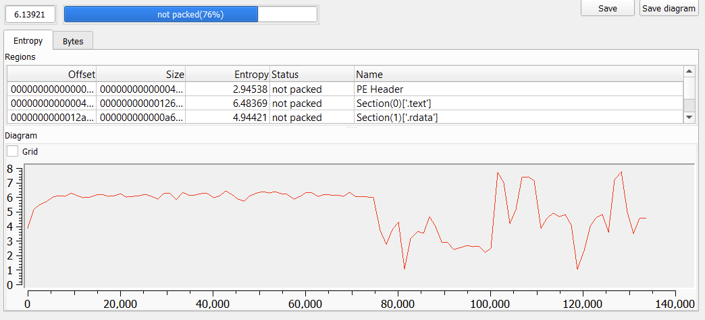

# Flare-On 10, Challenge 12, HVM

## Challenge Description

This is the second smallest challenge this year! If only that mattered.

## Files

Filename | Size | SHA256
--- | --- | ---
hvm.exe | 133,632 bytes | 610a3515dade760d965f074b1424892b592b9f909f03b38a93130bc00496f65a

## High-Level Summary

- hvm.exe uses the Windows Hypervisor Platform API to run shellcode in a Virtual Machine guest partition
- Most of the shellcode is initially encrypted with RC4
- On-demand code decryption and re-encryption is triggered via a VM Exit Context of I/O port access
  - `IN` opcodes in each function's prologue lead to a VM execution interruption
    - HVM then decrypts the function body using the VM's register R8 value as the RC4 key before resuming VM execution
  - `OUT` opcodes in each function's epilogue trigger the re-encryption of the function's code
- The shellcode checks the two command-line arguments supplied to hvm.exe
  - The first needs to succeed a string comparison with the result of a XOR operation
  - The second is base64 decoded, decrypted and compared as well with the same value as above
    - The decryption loop uses XOR keys taken from the keystream of Salsa20 using a custom initializaton state

## Basic Static Analysis

Detect It Easy

- Operation system: `Windows(Vista)[AMD64, 64-bit, Console]`
- Compiler: `Microsoft Visual C/C++(19.36.32537)[C++]`
- Linker: `Microsoft Linker(14.36.32537)`
- Tool: `Visual Studio(2022 version 17.6)`
- DYNAMIC_BASE (DLL can move) bit is not set in DllCharacteristics (good for debugging)
- Imports API functions from two DLLs: kernel32 and WinHVPlatform
  - Looks like it may make us of the Windows Hypervisor Platform
- Resource section: type 256 / name 133 / size 0x1000
  - Dump for later analysis
- Some small entropy spikes near the end



Interesting strings

```txt
12d90 [-] OS/CPU feature not enabled
12db0 Nope!
12db8 Nope!
12dc0 Nope!
12dc8 Nope!
12dd0 [-] Cannot create partition
12df0 [-] Cannot set processor count
12e10 [-] Cannot setup partition
12e30 [-] Cannot allocate memory
12e50 [-] Cannot map memory
12e68 [-] Cannot create virtual processor
12e90 [-] Cannot setup registers
12ee0 @flare-on.com
12ef0 Nope!
```

## Basic Dynamic Analysis

Running the binary without any arguments yields

```txt
> .\hvm.exe
[-] OS/CPU feature not enabled
```

Not much we can do without actually analyzing the code from this point on.

## Advanced Analysis

The code of the provided executable **hvm.exe** is pretty straight forward. All of the core logic is located inside the main function with entrypoint `0x1400017C0` with a few wrapper functions for invocation of the Windows Hypervisor Platform API functions.

The very first API function called is **WHvCapabilityCodeHypervisorPresent** that will check if the Windows Hypervisor capability is present in the operating system. If not, it needs to be added via `Control Panel -> Program and Features -> Turn Windows Features on or off -> HyperV`. If running inside a VM itself, we need to make sure that nested virtualization is supported and activated as well (i.e. Intel VT-x/EPT).

### Preliminary Command-Line Argument Checks

A few checks on existance and length of command-line arguments are done.

```c
  len_argv1 = strlen(argv[1]);
  len_argv2 = strlen(argv[2]);
  if ( len_argv1 > 8 && len_argv1 < 48 )
  {
    if ( len_argv2 > 24 && len_argv2 < 65 )
    {
      if ( len_argv2 % 4 )
      {
        printf("Nope!\n");
        return -1;
      }
      // [...]
    }
    // [...]
  }
```

So we know now, that **hvm.exe** wants to be called

- With two arguments
- The first having a length between 0x9 and 0x2f characters
- The second having a length between 0x19 and 0x41 characters and whose length is a multiple of four

### VM Setup

If all constraints are fulfilled, the following APIs are called to setup the virtual machine

- WHvCreatePartition
- WHvSetPartitionProperty
- WHvSetupPartition
- WHvMapGpaRange
- WHvCreateVirtualProcessor
- WHvSetVirtualProcessorRegisters

The call to WHvMapGpaRange sets up a mapping between previously allocated virtual memory of **hvm.exe** and the VM's physical address space. A flag value of 7 is passed, which means the guest memory has the permissions for read, write and execute set.

```txt
  WHvMapGpaRangeFlagRead              = 0x00000001,
  WHvMapGpaRangeFlagWrite             = 0x00000002,
  WHvMapGpaRangeFlagExecute           = 0x00000004,
```

The initial register values for the virtual processor are set up in function `0x140001070`. All but the Rflags and segment register CS are set to zero. The Rflags register's initial value is set to 0x202 (set IF bit only).

It is a bit harder to spot statically, what the initial value of the CS register is set to. We can put a breakpoint at the address where it is going to be set, `0x1400011E7`, and inspect the stack variable. We can type it as struct `WHV_X64_SEGMENT_REGISTER`.

```txt
Stack[1678]:14FCE0 ; WHV_X64_SEGMENT_REGISTER RegCsVal
Stack[1678]:14FCE0 RegCsVal        WHV_X64_SEGMENT_REGISTER <0, 0FFFFFFFFh, 33h, <0A09Bh>>
```

We can read that as

```txt
Base = 0
Limit = 0xFFFFFFFF
Selector = 0x33 = 0011 0011 (protected mode: CPL = 3, TI = GDT, Index = 6)
Attributes = 0xA09B = 1010 0000 1001 1011 (it gets complicated here)
```

## The VM Execution Loop

The following call to function `0x140001440` will copy the data from **hvm.exe**'s resource (type 256, name 133) to the VM's memory. We already dumped this *suspicious* section during basic static analysis. This seems to be the VM's code!

**hvm.exe** also copies the two command-line arguments passed to itself to the VM's memory at offsets 0xFC00 (argv1) and 0xFE00 (argv2). This way, the VM code can read and process them.

What follows is a small loop that runs / continues to run the VM's virtual processor. This call will block until an exit condition is met, which is returned in the data structure `WHV_RUN_VP_EXIT_CONTEXT`.

The pseudocode for this loop could read like this

```c
  while ( vp_running ) {
    if ( WHvRunVirtualProcessor(hPartition, 0, &ExitContext, 0xE0u) >= 0 ) {
      exit_context = ExitContext.ExitReason;
      if ( ExitContext.ExitReason == WHvRunVpExitReasonX64IoPortAccess ) {
        VpGetRegisters_Rip_R8_R9_140001310(hPartition, &r);
        if ( (ExitContext.IoPortAccess.AccessInfo.AsUINT32 & 1) != 0 )
          rc4_140001730(VA_alloc, r._rip - 16 - r._r9, r._r9, r._r8);// out
        else
          rc4_140001730(VA_alloc, r._rip + 2, r._r9, r._r8);// in
        Inc_VpRegister_Rip_by_2_140001220(hPartition);
      }
      else if ( exit_context == WHvRunVpExitReasonX64Halt ) {
        win_value = wrap_GetVirtualProcessorRegister_Rax_1400013E0(hPartition);
        vp_running = 0;
      } else {
        vp_running = 0;
  }}}
[...]]
  if ( win_value == 0x1337 ) {
    qmemcpy(flag_c, &flag_1400144B0, 0x2A);
    for ( i = 0; i < 41; ++i )
      printf("%c", argv[2][i] ^ (unsigned int)flag_c[i]);
    printf("@flare-on.com\n");
  }
```

So **hvm.exe** checks the ExitReason of the ExitContext. If it is due to a privileged **IoPortAccess** instruction (opcodes IN or OUT), it will query the values of the registers RIP, R8 and R9.

- If it was an IN instruction, **hvm.exe** will RC4 decrypt the VM memory beginning at `RIP + 2` for R9 bytes with the key value in R8.
- If it was an OUT instruction, it will RC4 encrypt the VM memory beginning at `RIP - 16 - R9`, for R9 bytes with the key R8.

Once applied, it will resume the VM program again.

If it meets a **Halt**, the VM program's exit value is read from register RAX. The winning condition seems to be `RAX == 0x1337`, after which the encrypted flag bytes are XOR decrypted with the first 41 characters of the second command line argument (argv2).

And that is pretty much all there is to understand for **hvm.exe** itself.

## Recap

What we know so far

- **hvm.exe** expects two command-line arguments with specific lengths
- It will setup a WHv Virtual Machine with (mostly) encrypted code and writes both arguments into the VM memory
- I/O opcodes in the VM code will stop VM execution
  - **hvm.exe** will then RC4 memory based on register values RIP, R8 and R9
  - And then resumes the VM

What we don't know yet

- What is the entypoint into the VM program?
- Which parts of the code are decrypted via I/O operations?
- How can we get the VM code to yield the winning exit condition of `RAX == 0x1337`?

## Running the VM Until the First VpExit

The two calls to **WHvSetVirtualProcessorRegisters** set all but the CS and Rflags registers to 0, including the instruction pointer RIP. So we expect the virtual processor to start executing the VM code beginning at offset 0.

If we try to disassemble the VM code at offset 0 as 64-bit code though, we get rather weird results. It looks like the virtual processor starts executing a VM boot loader in [real mode](https://en.wikipedia.org/wiki/Real_mode).

### The VM Bootstrapping Code

Disassembling the VM code at offset 0 as 16-bit code yields

```asm
seg000:0000  mov     sp, 8000h             ; setup stack
seg000:0003  cli
seg000:0004  lgdt    fword ptr ds:gdt_D26  ; load "far word" (6 bytes) into GDTR
                                           ; "If the operand-size attribute is
                                           ; 16 bits, the limit (lower 2 bytes)
                                           ; and a 24-bit base address (third,
                                           ; fourth, and fifth byte) are loaded
                                           ; limit = 0x17, base = 0xD0E
seg000:0009  mov     eax, cr0
seg000:000C  or      eax, 1                ; set bit 0 of cr0 to 1, i.e.
seg000:0010  mov     cr0, eax              ; prepare to enter protected mode
seg000:0013  jmp     far ptr new_cs_0x18   ; switch to 32 bit mode with
seg000:0013                                ; far jmp, reload cs with selector
seg000:0013                                ; 0x8 as index into prev.
seg000:0013                                ; loaded gdt
```

The first few instructions load the GTDR register and prepare changing the processor mode from real mode to protected mode. The GDT contains two entries for CS and DS, both with base address 0 and limit 0xFFFF. This basically is the full linear address range of the VM memory.

After the far jump, the VM cpu is in 32-bit protected mode. The complete boot process follows these steps:

- Start at address 0 in 16-bit real mode
- Enable protected mode (set bit 0/PE in register CR0)
- Load GDTR with a pointer to the GDT used for protected mode (GDTR 0xD26, GDT at 0xD0E)
- [Change to 32-bit addressing in protected mode](https://wiki.osdev.org/Protected_Mode) with a far jmp to 0x18, reloading register CS from GDT offset 8
- Setup the 4 level page tables (PML4T)
- Enable long mode (set bit 8 of EFER), at first in 32-bit compatibility submode
- Set paging mode to PAE (set bit 5/PAE in register CR4)
- Enable paging (set bit 31/PG in register CR0)
- Load GDTR with a pointer to the GDT used for long mode (GTDR 0xD44, GDT at 0xD2C)
- [Finally switch to 64-bit long mode](https://wiki.osdev.org/User:Stephanvanschaik/Setting_Up_Long_Mode#Entering_Long_Mode) with a far jmp to 0xCF2, reloading register CS from this GDT offset 8
- Function at 0xCF2 initializes the data segment registers and calls the VM entry function at 0xBB2

Parsing the GDTs can be done with an [IDA script](./code/ida_parse_gdt.py).

### The VM Program at first VpExit

This was a vintage tour through boot loading code. The nice thing is, that it was totally irrelevant to know / look up to solve the challenge. But a proper write-up would be lame without being able to explain it. ;-) Thanks to SmartSmurf for pointing out the 16-bit real mode execution at offset 0.

But even if we don't follow the boot loading code, we could just let the VM run and observe when it first hits an I/O operation. Once the call to **WHvRunVirtualProcessor** unblocks, we can type the stack variable for the ExitContext to `WHV_RUN_VP_EXIT_CONTEXT` and inspect it (shortened output).

```txt
Stack[1C24]:14FDB0 ; WHV_RUN_VP_EXIT_CONTEXT eCtx
Stack[1C24]:14FDB0 eCtx dd WHvRunVpExitReasonX64IoPortAccess; ExitReason
[...]
Stack[1C24]:14FDD0      dq 0BC2h                ; VpContext._Rip
Stack[1C24]:14FDD8      dq 86h                  ; VpContext.Rflags
[...]
```

Whatever way we chose to follow, we have our first VM exit due to an I/O operation at RIP `0xBC2`. With an assumed VM memory buffer address of `0x1C0000`, we can inspect and disassemble the IN instruction. In order to see the previously assigned values for registers R8 and R9, we can start a forced disassembly at `0x1C0BB2`.

```asm
debug034:1C0BB2  mov     r8, 1ACF57FBE20BB050h ; <- RC4 key
debug034:1C0BBC  mov     r9d, 1Bh              ; <- length
debug034:1C0BC2  in      al, 3                 ; <- value of VM's RIP
```

Just before that code is a `0xC3` opcode (RET) - so we can assume that this is the prologue of a function. In fact, this seems to be the *main* function of the VM code.

So if we let **hvm.exe** execute up until resuming of the virtual CPU again, we can see the decrypted function body.

```asm
debug034:1C0BB2  VM_main_1C0BB2 proc near
debug034:1C0BB2  mov     r8, 1ACF57FBE20BB050h  ; RC4 key
debug034:1C0BBC  mov     r9d, 1Bh               ; up to RIP + 0x1B = 0x1C0BDF
debug034:1C0BC2  in      al, 3                  ; trigger for decryption
debug034:1C0BC4  push    rbp                    ; VM resumes here (RIP + 2)
debug034:1C0BC5  mov     rbp, rsp
debug034:1C0BC8  sub     rsp, 90h
debug034:1C0BCF  mov     esi, 0FE00h
debug034:1C0BD4  mov     edi, 0FC00h
debug034:1C0BD9  call    near ptr unk_1C0B3F
debug034:1C0BDE  leave
debug034:1C0BDF  mov     r8, 1ACF57FBE20BB050h  ; same RC4 key again
debug034:1C0BE9  mov     r9d, 1Bh               ; same length
debug034:1C0BEF  out     3, al                  ; re-encryption trigger
debug034:1C0BF1  retn
debug034:1C0BF1  VM_main_1C0BB2 endp
```

We understand now what is going on. The VM code triggers on-demand code decryption that is executed upon resuming after an IN operation. Once a function finishes execution, it will trigger a re-encryption of its real function body.

With that knowledge we can [write an IDA plugin](./code/do_io_patching.py) to perform some decryption and forced disassembly. It will log its operations to the IDA python console window.

```txt
do_io_patching: decoded insn @ 0x1c0bc2, canon mnem = in
[*] Found in instruction @ 0x1c0bc2
[*] Decoding prev1 insn
[*] Found prev1 insn: mov ops[0] reg number 9, immed value 0x1b
[*] Decoding prev2 insn @ 0x1c0bb2
[*] Found prev2 insn: mov ops[0] reg number 8, immed value 0x1acf57fbe20bb050
[*] Encrypted bytes beginning at 0x1c0bc4: b7069357ec8afac7d267d9c4db3ada89d3576e5f017daf7fa4ab60
[*] Decrypted bytes: 554889e54881ec90000000be00fe0000bf00fc0000e861ffffffc9 using key: 0x1acf57fbe20bb050
do_io_patching run() complete!
```

## The Decrypted VM Program / a Debug Setup

We have some options now on how to decrypt the whole VM code:

- Patch **hvm.exe** so that code does not get re-encrypted on OUT instructions
  - Five NOPs overwriting the RC4 call at `0x140001C66` should do the trick
  - Now we can dump / inspect the VM memory as it decrypts itself (the more we fulfill its internal constraints)
- We can dump (if not done already) the [VM code](./files/debug034.bin) from the resource section or the VM memory buffer to disc
  - We can then use [Jiri's excellent sc2pe tool](https://github.com/Dump-GUY/sc2pe) to convert it to an EXE file with `sc2pe -a 64 -o 2994 -p debug034.bin`
  - Load that into IDA Pro and apply the decryption via above Plugin to the 11 relevant functions

Using the second option yields a nice [PE file of the VM code](./files/debug034.bin.exe) that we can debug outside of **hvm.exe**!

All we have to remember is to patch in the argv1/2 values and map their respective memory addresses.

## Analysis of the VM Code

Now that we are able to disassemble, decompile and debug the VM's decrypted code, most of it should be rather easy to analyze. Here is a high level overview with function name suffixes meaning the hex offset of that function in the VM's memory:

- The VM code's main function is `main_B3F`
  - It will yield the winning condition value `RAX = 0x1337` if two argv checking functions succeed
    - First check function is `check_argv1_918`
    - Second check function is `check_argv2_2A62`

The first command-line argument argv1 is compared to the XOR result of the two stackstrings `*#37([@AF+ .  _YB@3!-=7W][C59,>*@U_Zpsumloremips` and `loremipsumloremipsumloremipsumloremipsumloremips`. This funnily yields `FLARE2023FLARE2023FLARE2023FLARE2023` with 12 null bytes at the end. At the end of the main function, it is only checked if argv1 and above XOR result matched for the first 36 (0x24) characters.

Finding the correct value for argv2 that passes the second function is a bit more complicated. On a higher abstraction level,

- argv2 is first base64 decoded in function `base64_decode_5E1`
- It is then decrypted in function `decrypt_argv2_4AF`
- The result is compared with argv1, but it has to match for 48 (0x30) characters
  - Since our textual argv1 only had 36 characters, the last 12 characters of the decrypted argv2 have to be null bytes

That's it, pretty much, on a high abstraction level. Easy as pie... isn't it?

## Recovering the Correct Value of Argv2

We already know that argv2 is expected to be base64 encoded. We also know that - after decryption - at least 48 characters have to match with argv1 padded with null bytes. Factoring in the length constraints from **hvm.exe** and the encoding, we know that argv2's length has to be 64 characters.

But how is it decrypted? That is done in function `decrypt_argv2_4AF`.

- First, a Salsa20 initialization state is created from 16 times the first four characters of argv1
  - This yields `FLARFLAR...` (64 bytes total)
- Then Salsa20 is applied on that input state in function `salsa20_block_shuffle_A7` to yield a 64 byte keystream
- Then the base64 decoded value of argv2 is processed in a loop in chunks of 16 bytes
  - For each chunk, function `decrypt_chunk_421` is called
    - Arguments are the Salsa20 keystream, a pointer to the second half (QWORD) of the chunk and a pointer to the first half (QWORD) of the chunk

It is important to understand that each chunk is processed independently - same chunk, same output.

Analyzing these functions in detail yields the following abstract code with `buf == base64 decoded argv2` and all operations working on QWORD data sizes

```txt
- Outer loop j = 0, 2, 4 (function 4AF)
  - Inner loop i = 7..0 (function 421)
    - Preserve value of buf[ j*8 ]
    - Calculate temp = buf[ j*8 ] ^ buf[ (j+1) * 8 ] ^ salsa_keystream[ i*8 ]
    - Overwrite buf[ j*8 ] with temp
    - Overwrite buf[ (j+1) * 8 ] with preserverd value of buf[ j*8 ]
```

At this point its only fair to admit, that between each paragraph of this write-up may lay a seperate valley of tears.

### Implementeing the Forward Loop / A Nice Exercise

In order to reverse the logic step-by-step, it may help to implement the [forward calculation](./code/calc_argv2_forward.py) with a known test value of the base64 decoded argv2 and [verbosely log each step](./files/inner_loop_forward_log.txt).

For that, we need the Salsa20 keystream for the weird initialization state of `FLARFLARE...`. We can dump that in a debugging run, putting a breakpoint just after function `salsa20_block_shuffle_A7` returns. Or we can use Jesko's super useful [Binary Refinery](https://github.com/binref/refinery).

```bash
$ emit 00000000000000000000000000000000000000000000000000000000000000000000000000000000000000000000000000000000000000000000000000000000 | hex | salsa FLARFLARFLARFLARFLARFLARFLARFLARFLARFLARFLARFLARFLARFLARFLARFLAR | hex -R
026124F56D840C78FAFA18A3B91C245FB91C245F026124F56D840C78FAFA18A3FAFA18A3B91C245F026124F56D840C786D840C78FAFA18A3B91C245F026124F5
```

We know from debugging that a base64 decoded chunk of `AAAABBBBCCCCDDDD` yields `f83e43e92ba16cc9006326f76b820a7e`. And this result was also calculated by above script.

Great, our forward implementation yields the correct result. Now how can we reverse the calculation in a way, that - given the target value of a chunk - we can get the needed input chunk value?

### Reversing the Inner Loop

One approach is to *unroll* the inner loop through substitution.

- Let `q1_i` and `q2_i` be the values of the first and second half (QWORD) of the chunk at inner loop counter value `i`
- Let `q1_buf` and `q2_buf` be the corresponding values of the base64 decoded argv2 chunk
- Let `s_i` be the i-th QWORD of the Salsa20 keystream

With `i = 7`, the first iteration, we have `q1_7 = q1_buf ^ q2_buf ^ s_7` and `q2_7 = q1_buf`.
With `i = 6`, the next iteration, we have

```txt
q1_6 = q1_7                    ^ q2_7   ^ s_6   // substitute q1_7 and q2_7 from above
     = (q1_buf ^ q2_buf ^ s_7) ^ q1_buf ^ s_6   // with q1_buf ^ q1_buf = 0
     = q2_buf ^ s_6 ^ s_7

q2_6 = q1_7                                     // substitute again
     = q1_buf ^ q2_buf ^ s_7
```

If we keep on substituting the formulae from the prior inner loop iteration, we can unroll the inner loop to

```txt
q1_0 = q2_buf ^ s_0 ^ s_1 ^ s_3 ^ s_4 ^ s_6 ^ s_7

q2_0 = q1_buf ^ q2_buf ^ s_1 ^ s_2 ^ s_4 ^ s_5 ^ s_7
```

### Trust but Verify (your Maths)

Assuming our math is correct, we are now able to transpose the equations to `q1_buf` and `q2_buf`.

```txt
q2_buf = q1_0 ^ s_0 ^ s_1 ^ s_3 ^ s_4 ^ s_6 ^ s_7

q1_buf = q2_0 ^ q2_buf ^ s_1 ^ s_2 ^ s_4 ^ s_5 ^ s_7  // substitute again and eliminate
       = q2_0 ^ q1_0 ^ s_0 ^ s_2 ^ s_3 ^ s_5 ^ s_6
```

With given target values of `q1_0 = f83e43e92ba16cc9` and `q2_0 = 006326f76b820a7e`, we should be able to calculate the necessary base64 decoded input:

```txt
> py .\calc_argv2.py
---
Calc'ing substituted equations to get argv2 input for chunk = f83e43e92ba16cc9006326f76b820a7e
---
j=0
q1_0 = 0xc96ca12be9433ef8
q2_0 = 0x7e0a826bf7266300
argv2_binary = AAAABBBBCCCCDDDD
argv2_base64 = b'QUFBQUJCQkJDQ0NDRERERA=='
```

YAY! Now that we are able to calculate one chunk in reverse order with our [reverse calculating script](./code/calc_argv2.py), we are finally able to solve the challenge.

## Calculating the Correct Argv2 Value

Remembering our second constraint, the base64 decoded and decrypted argv2 value needs to match the argv1 string `FLARE2023FLARE2023FLARE2023FLARE2023` with a padding of 12 null bytes. This totals three chunks of 16 bytes each.

The first chunk's QWORDS are

```txt
FLARE2023FLARE2023FLARE2023FLARE2023
^^^^^^^^                             = FLARE202 (q1_0)
        ^^^^^^^^                     = 3FLARE20 (q2_0)
```

The other two chunks are set accordingly.

We can calculate everything on the fly now with our [solution script](./code/solve.py). Running it yields the flag.

```txt
> py .\solve.py
argv1 = FLARE2023FLARE2023FLARE2023FLARE2023
argv2_binary = cc16294c151626f7fd3141f82ad718bfbb1d51550f723382894e46e62eb76dbf8b2c166c026124f5894d32996fe5288d
argv2_base64 = b'zBYpTBUWJvf9MUH4KtcYv7sdUVUPcjOCiU5G5i63bb+LLBZsAmEk9YlNMplv5SiN'
c4n_i_sh1p_a_vm_as_an_exe_ask1ng_4_a_frnd@flare-on.com
```

## Flag

Flag: `c4n_i_sh1p_a_vm_as_an_exe_ask1ng_4_a_frnd@flare-on.com`
