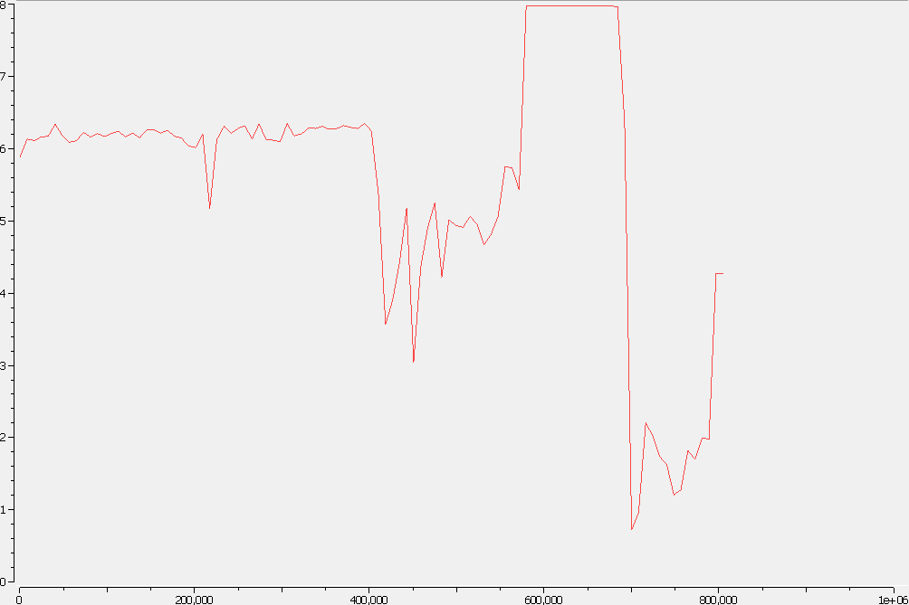
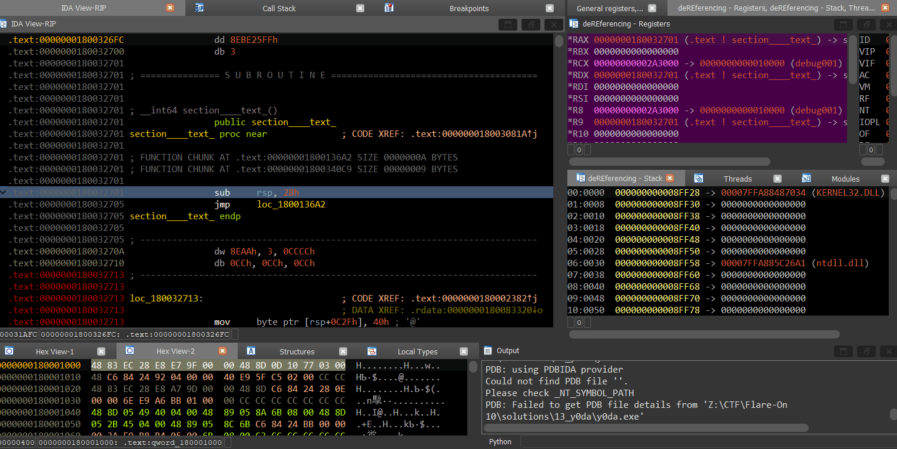
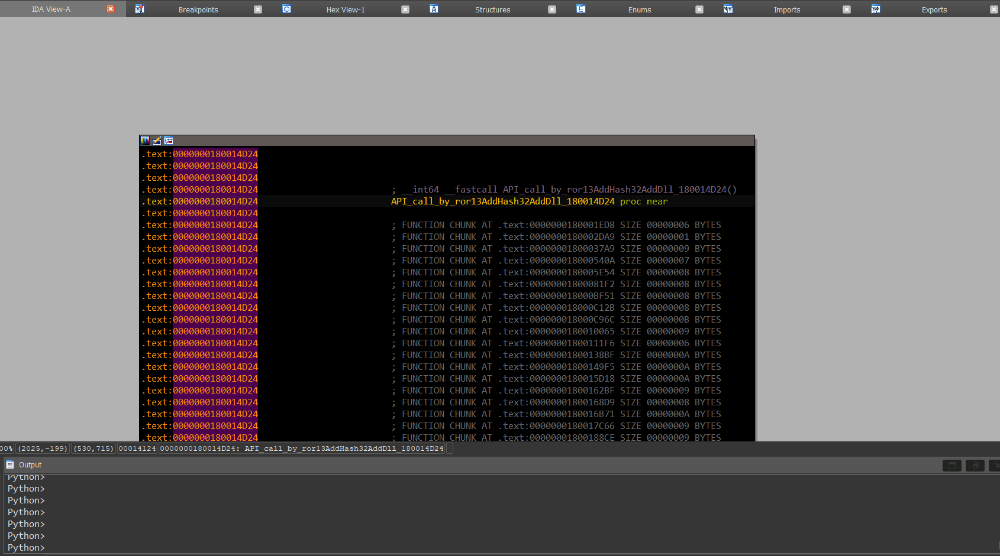

# Flare-On 10, Challenge 13, y0da

## Challenge Description

So close to the end you can almost taste it. Keep going champ, complete this challenge and take your place as one of the Reverse Engineers of All-Time.

## Files

Filename | Size | SHA256
--- | --- | ---
y0da.exe | 804,864 bytes | 040ed920519c37d85bafe5595ddf3a49dd61afb58ba2bc96df1a97570633797c

## High Level Summary

- y0da.exe implements a remote bind shell capability on TCP port 1337
- Anti-analysis
  - The code seems to be patched into a legit program
  - Its control flow is obfuscated with a JMP instruction following each and every assembly instruction
    - This makes analysis life harder as standard approaches for disassembly and decompilation are hampered
- Logical flow
  - Apart from the remote shell, the sample reacts to two _hidden_ commands: `gimmie_advic3` and `gimmie_s3cr3t`
  - `gimmie_advic3` is rather philosophical in nature
  - `gimmie_s3cr3t` asks for a password
  - The password and its components (substrings delimited by underline characters) are hashed with MD5 and compared with static stackstring values
  - The components can be looked up/cracked to yield the password `patience_y0u_must_h4v3`
  - Upon entering this password, y0da.exe
    - RC4 decrypts an embedded resource JPG with the given password
    - Carves the encrypted flag bytes and ROP gadgets from the JPG's overlay
    - Decrypts the flag char-by-char with a ROP chain built from above gadgets
    - Encrypts each flag character again at the end of the ROP chain using random values previously generated with the MT19937 PRNG seeded with `0x5D1FF27D`
    - Base32 encodes the newly encrypted flag using the custom alphabet `Q4T23aSwLnUgHPOIfyKBJVM5+DXZC/Re=`
    - And spits out the encrypted and encoded flag as `OIZC4eMC/UnTPfDDMMaHeQXUHMPZy4LfSgg/HnB5SXVOIyKOBIHMe45B2KBCe5T/HRfRHZ4SKJe3eLJHeMe5IM5QQJ======`

The flag can be retrieved via debugging, from master yoda's output and from the PE file's resource data.

## Basic Analysis Steps

### Basic Static Analysis

Gathering some basic data about the executable without going into too much details.

Tool: Detect It Easy

- Operation system: `Windows(7)[AMD64, 64-bit, Console]`
- Compiler: `Microsoft Visual C/C++(19.16.27412)[POGO_O_C]`
- Linker: `Microsoft Linker(14.16.27412)`
- Tool: `Visual Studio(2017 version 15.9)`
- Very high entropy (> 7.9) around file offsets 580k to 680k



- Resource section
  - 6 RT_ICON, 1 RT_GROUP_ICON
  - Suspicious type `M4ST3R` with name `Y0D4` @ offset `0x8d604 (579076)`, size `0x1b2f5 (111349)`
  - Fits to the high entropy map
  - Dump it straight away, because ... why not
  - (Future reference) RVA 0x91204 in IDA

pestudio

- Compiler timestamp: `0x6A3F62F9`, `Sat Jun 27 05:43:21 2026 | UTC`
  - y0da lives in the future!
- `DLL can move` bit is unchecked by default / no ALSR
- Export and Delay-loaded directories are marked as "invalid"
- y0da.exe does not import any library at all? Weird.

Strings

```txt
c3f00 kernel32.dll
c3f0f LoadLibraryW
c3f1c advapi32.dll
c3f2b OpenProcessToken
```

Weird as well, as there was no import directory.

### Basic Dynamic Analysis

Simply executing it in a safe environment, it displays a flare banner and reads "listening"

```txt
> .\y0da.exe
@@@@@@@@@@@@@@@@@@@@@@@@@@@@@@@@@@@@@@@@((@@@@@@@@@@@@@@@@@@@@@@@@@@@@@@@@@@@@@@
@@@@@@@@@@@@@@@@@@@@@@@@@@@@@@@@@@@@@@((((((@@@@@@@@@@@@@@@@@@@@@@@@@@@@@@@@@@@@
@@@@@@@@@@@@@@@@@@@@@@@@@@@@@@@@@@@@@((((((((@@@@@@@@@@@@@@@@@@@@@@@@@@@@@@@@@@@
@@@@@@@@@@@@@@@@@@@@@@@@@@@@@@@@@@@@((((((((((@@@@@@@@@@@@@@@@@@@@@@@@@@@@@@@@@@
@@@@@@@@@@@@@@@@@@@@@@@@@@@@@@@@@@(((((((((((((%@@@@@@@@@@@@@@@@@@@@@@@@@@@@@@@@
@@@@@@@@@@@@@@@@@@@@@@@@@@@@@@@@@((((((((((((((((@@@@@@@@@@@@@@@@@@@@@@@@@@@@@@@
@@@@@@@@@@@@@@@@@@@@@@@@@@@@@@@@((((((((((((((((((@@@@@@@@@@@@@@@@@@@@@@@@@@@@@@
@@@@@@@@@@@@@@@@@@@@@@@@@@@@@@@((((((((((((((((((((@@@@@@@@@@@@@@@@@@@@@@@@@@@@@
@@@@@@@@@@@@@@@@@@@@@@@@@@@@@@((((((((((((((((((((((@@@@@@@@@@@@@@@@@@@@@@@@@@@@
@@@@@@@@@@@@@@@@@@@@@@@@@@@@&((((((((((((((((((((((((@@@@@@@@@@@@@@@@@@@@@@@@@@@
@@@@@@@@@@@@@@@@@@@@@@@@@@@(((((((((((((((((((((((((((&@@@@@@@@@@@@@@@@@@@@@@@@@
@@@@@@@@@@@@@@@@@@@@@@@@@@((((((((((((((((((((((((((((((@@@@@@@@@@@@@@@@@@@@@@@@
@@@@@@@@@@@@@@@@@@@@@@@@@((((((((((((((((((((((((((((((((@@@@@@@@@@@@@@@@@@@@@@@
@@@@@@@@@@@@@@@@@@@@@@@@((((((((((((((((((((((((((((((((((@@@@@@@@@@@@@@@@@@@@@@
@@@@@@@@@@@@@@@@@@@@@@@(((((((((((((((((@@(((((((((((((((((@@@@@@@@@@@@@@@@@@@@@
@@@@@@@@@@@@@@@@@@@@@@(((((((((((((((((@@@@(((((((((((((((((@@@@@@@@@@@@@@@@@@@@
@@@@@@@@@@@@@@@@@@@@#(((((((((((((((((@@@@@@(((((((((((((((((@@@@@@@@@@@@@@@@@@@
@@@@@@@@@@@@@@@@@@@((((((((((((((((((@@@@@@@@(((((((((((((((((#@@@@@@@@@@@@@@@@@
@@@@@@@@@@@@@@@@@@(((((((((((((((((%@@@@@@@@@@((((((((((((((((((@@@@@@@@@@@@@@@@
@@@@@@@@@@@@@@@@@(((((((((((((((((@@@@@@@@@@@@@@(((((((((((((((((@@@@@@@@@@@@@@@
@@@@@@@@@@@@@@@@(((((((((((((((((@@@@@@@@@@@@@@@@(((((((((((((((((@@@@@@@@@@@@@@
@@@@@@@@@@@@@@@(((((((((((((((((@@@@@@@@@@@@@@@@@@(((((((((((((((((@@@@@@@@@@@@@
@@@@@@@@@@@@@@(((((((((((((((((@@@@@@@@@@@@@@@@@@@@(((((((((((((((((@@@@@@@@@@@@
@@@@@@@@@@@@((((((((((((((((((@@@@@@@@@@@@@@@@@@@@@@(((((((((((((((((%@@@@@@@@@@
@@@@@@@@@@@((((((((((((((((((@@@@@@@@@@@@@@@@@@@@@@@@((((((((((((((((((@@@@@@@@@
@@@@@@@@@@((((((((((((((((((((((((((((((((((((((((%@@@((((((((((((((((((@@@@@@@@
@@@@@@@@@(((((((((((((((((((((((((((((((((((((((((#@@@@((((((((((((((((((@@@@@@@
@@@@@@@@((((((((((((((((((((((((((((((((((((((((@@@@@@@@((((((((((((((((((@@@@@@
@@@@@@@(((((((((((((((((((((((((((((((((((((((@@@@@@@@@@@&(((((((((((((((((@@@@@
@@@@@%((((((((((((((((((((((((((((((((((((((@@@@@@@@@@@@@@@(((((((((((((((((@@@@
@@@@@((((((((((((((((((((((((((((((((((((%@@@@@@@@@@@@@@@@@@(((((((((((((((((@@@
@@@@@@@@@@@@@@@@@@@@(((((((((((((((((((@@@@@@@@@@@@@@@@@@@@@@@@@@@@@@@@@@@@@@@@@
@@@@@@@@@@@@@@@@@@@((((((((((((((((((@@@@@@@@@@@@@@@@@@@@@@@@@@@@@@@@@@@@@@@@@@@
@@@@@@@@@@@@@@@@@@(((((((((((((((((@@@@@@@@@@@@@@@@@@@@@@@@@@@@@@@@@@@@@@@@@@@@@
@@@@@@@@@@@@@@@@@(((((((((((((((@@@@@@@@@@@@@@@@@@@@@@@@@@@@@@@@@@@@@@@@@@@@@@@@
@@@@@@@@@@@@@@@@((((((((((((((@@@@@@@@@@@@@@@@@@@@@@@@@@@@@@@@@@@@@@@@@@@@@@@@@@
@@@@@@@@@@@@@@@(((((((((((((@@@@@@@@@@@@@@@@@@@@@@@@@@@@@@@@@@@@@@@@@@@@@@@@@@@@
@@@@@@@@@@@@@%(((((((((((%@@@@@@@@@@@@@@@@@@@@@@@@@@@@@@@@@@@@@@@@@@@@@@@@@@@@@@
@@@@@@@@@@@@(((((((((((@@@@@@@@@@@@@@@@@@@@@@@@@@@@@@@@@@@@@@@@@@@@@@@@@@@@@@@@@
@@@@@@@@@@@((((((((((@@@@@@@@@@@@@@@@@@@@@@@@@@@@@@@@@@@@@@@@@@@@@@@@@@@@@@@@@@@
@@@@@@@@@@((((((((#@@@@@@@@@@@@@@@@@@@@@@@@@@@@@@@@@@@@@@@@@@@@@@@@@@@@@@@@@@@@@
@@@@@@@@@(((((((@@@@@@@@@@@@@@@@@@@@@@@@@@@@@@@@@@@@@@@@@@@@@@@@@@@@@@@@@@@@@@@@
@@@@@@@@((((((@@@@@@@@@@@@@@@@@@@@@@@@@@@@@@@@@@@@@@@@@@@@@@@@@@@@@@@@@@@@@@@@@@
@@@@@@@(((((@@@@@@@@@@@@@@@@@@@@@@@@@@@@@@@@@@@@@@@@@@@@@@@@@@@@@@@@@@@@@@@@@@@@

[+] Listening...
```

Checking TCPView yields that TCP port 1337 is opened as listen by y0da.exe.

Connecting on that port yields a (y0da) shell.

```txt
$ nc 192.168.58.212 1337
                   ____                  
                _.' :  `._               
            .-.'`.  ;   .'`.-.           
   __      / : ___\ ;  /___ ; \      __  
 ,'_ ""--.:__;".-.";: :".-.":__;.--"" _`,
 :' `.t""--.. '<@.`;_  ',@>` ..--""j.' `;
      `:-.._J '-.-'L__ `-- ' L_..-;'     
        "-.__ ;  .-"  "-.  : __.-"       
            L ' /.------.\ ' J           
             "-.   "--"   .-"            
            __.l"-:_JL_;-";.__           
         .-j/'.;  ;""""  / .'\"-.        
       .' /:`. "-.:     .-" .';  `.      
    .-"  / ;  "-. "-..-" .-"  :    "-.   
 .+"-.  : :      "-.__.-"      ;-._   \  
 ; \  `.; ;                    : : "+. ; 
 :  ;   ; ;                    : ;  : \: 
 ;  :   ; :                    ;:   ;  : 
: \  ;  :  ;                  : ;  /  :: 
;  ; :   ; :                  ;   :   ;: 
:  :  ;  :  ;                : :  ;  : ; 
;\    :   ; :                ; ;     ; ; 
: `."-;   :  ;              :  ;    /  ; 
 ;    -:   ; :              ;  : .-"   : 
 :\     \  :  ;            : \.-"      : 
  ;`.    \  ; :            ;.'_..--  / ; 
  :  "-.  "-:  ;          :/."      .'  :
   \         \ :          ;/  __        :
    \       .-`.\        /t-""  ":-+.   :
     `.  .-"    `l    __/ /`. :  ; ; \  ;
       \   .-" .-"-.-"  .' .'j \  /   ;/ 
        \ / .-"   /.     .'.' ;_:'    ;  
         :-""-.`./-.'     /    `.___.'   
               \ `t  ._  /            
                "-.t-._:'                

 __     _____      _              _____ _          _ _ 
 \ \   / / _ \    | |            / ____| |        | | |
  \ \_/ / | | | __| | __ _ _____| (___ | |__   ___| | |
   \   /| | | |/ _` |/ _` |______\___ \| '_ \ / _ \ | |
    | | | |_| | (_| | (_| |      ____) | | | |  __/ | |
    |_|  \___/ \__,_|\__,_|     |_____/|_| |_|\___|_|_|
                                                       
                                                       
Microsoft Windows [Version 10.0.19045.2006]
(c) Microsoft Corporation. All rights reserved.

C:\Windows>
```

To get a first impression about what API functions may be dynamically resolved and called, we trace the execution with [Hasherezade's excellent Tiny Tracer](https://github.com/hasherezade/tiny_tracer).

In order to define a subset of interesting API function calls we want to get some details about, we can edit `params.txt` in `C:\pin\source\tools\tiny_tracer\install32_64`. One selection could be [this](./files/params.txt).

That will produce a trace file like [this](./files/y0da.exe.tag). Interesting commented excerpts:

```txt
32701;section: [.text]               // AoEP
6080b;kernel32.LoadLibraryA          // Now where does this come from?
LoadLibraryA:
 Arg[0] = ptr 0x000000000008f228 -> "ws2_32.dll"
6080b;kernel32.LoadLibraryA
LoadLibraryA:
 Arg[0] = ptr 0x000000000008f238 -> "user32.dll"
6080b;kernel32.VirtualAlloc         // Call to a different API from same address?
                                    // could be some kind of API lookup + jump
6080b;kernel32.VirtualAlloc         // s. above
6080b;kernel32.VirtualAlloc         // s. above
6080b;kernel32.VirtualAlloc         // s. above
6080b;ws2_32.WSAStartup
6080b;kernel32.CreatePipe
6080b;kernel32.CreatePipe
6080b;ws2_32.socket
6080b;ws2_32.bind
6080b;kernel32.GetStdHandle
6080b;kernel32.WriteConsoleA
6080b;ws2_32.listen                 // We already know it is listening on TCP/1337
6080b;ws2_32.accept
6080b;kernel32.GetEnvironmentVariableA
6080b;kernel32.GetEnvironmentVariableA
47225;kernel32.CreateProcessA       // First API call from different address, was just 6080b (jump rax) before
                                    //  call    qword ptr [rsp+880h] ; kernel32.CreateProcessA   // stack location 0x8fa40
CreateProcessA:
 Arg[0] = 0
 Arg[1] = ptr 0x000000000008fc10 -> "C:\Windows\system32\cmd.exe"
6080b;ws2_32.send
5778d;kernel32.CreateThread        // First thread
                                   // yoda ascii art happens before this and after CreateProcessA
                                   // Ascii art is on stack but not seen in strings
CreateThread:
 Arg[2] = ptr 0x000000018004928c -> {H\x89L$\x08\xe9Tu}                 // Thread 1 code is also JMP-fuscated
 Arg[3] = ptr 0x00000000179e0000 -> {8\x01\x00\x00\x00\x00\x00\x00}
62fd5;kernel32.CreateThread         // Second thread
CreateThread:
 Arg[2] = ptr 0x000000018004e0e7 -> {H\x89L$\x08\xe9\xd9'}
 Arg[3] = ptr 0x00000000179e0000 -> {8\x01\x00\x00\x00\x00\x00\x00}     // same lpParameter as first thread
6080b;kernel32.WaitForSingleObject
6080b;kernel32.VirtualAlloc
6080b;kernel32.VirtualAlloc
15b0f;kernel32.PeekNamedPipe
25410;kernel32.ReadFile
6080b;ws2_32.recv
6080b;ws2_32.send
15b0f;kernel32.PeekNamedPipe
15b0f;kernel32.PeekNamedPipe
15b0f;kernel32.PeekNamedPipe
[...]
```

Now that is lean and clean. It is apparent that no calls to `GetProcAddress` occured at all. And all API calls (so far) seem to originate from the same RVA `6080b`.

Looks like the API addresses are dynamically resolved, possibly with some kind of PEB walking technique.

We can see from the trace

- The network APIs necessary to listen for and accept shell client connections
- `cmd.exe` being spawned as a child process
- Two threads being created with the same `lpParameter` value. Maybe some kind of shared data structure.

## Advanced Analysis Steps / Control-Flow Obfuscation Layer

### Handling the Control-Flow Obfuscation naively

At the beginning of the challenge, one may be left puzzled about how to best combat the JMP-fuscation. Each and every assembly instruction is followed by a JMP back-and-forth through the whole code section of the executable.

A very naive albeit totally legit way of starting out is to just single step debug the program's main function.



While this process is tedious and at times mind-boggling, it is one way to get first impressions about the challenge. Combined with the interesting RVAs found while tracing, one could generate a few first insights.

- Strings seem to be built as stackstrings.
  - That, together with the JMP-fuscation, makes up for a lot of joy and happiness - except for our F7 key.
- The main function could be `0x18003CEDE`
  - Builds stackstrings `ws2_32.dll`, `user32.dll`, `Comspec` and `SYSTEMROOT`
  - Creates the Yoda ASCII ART sent to connecting shell clients upon login
  - Moves hash-like doubleword values into register R15 before calling function `0x180014D24`
    - Following that funuction, we can see PEB walking in place to locate API addresses by **Ror13AddHash32AddDll**
  - ...

Quite a lot can be found out like this, but once we start to single step three threads in parallel all doing the JMP-fuscationg game, things become rather tedious quickly. ;-)

### Playing IDA Pro the Jigsaw Way

One way to improve quality of (RE) life here could be to help your Disassembler of choice to scope the function bodies. For IDA Pro, this could be manually done with setting hotkeys for `DelFunction` and `AppendFunctionTail`. So whenever IDA Pro wrongly thought one of the JMPs goes to a different function, we can delete that function definition and instead append that chunk to a function of our choice.

Example for API lookup function `0x180014D24`:


This way we can much easier spot loops and even gain halfway decent decompilation results for some of the functions.

Since we also identified that API functions are looked up and invoked by **Ror13AddHash32AddDll** value in register R15, we can make use of [FLARE's IDA plugin](https://github.com/mandiant/flare-ida) **Shellcode Hashes** to auto-comment all API values.

### Semi-automated Deobfuscation

A third way to get a quicker and easier understanding - especially of larger functions - with IDA Pro is to leverage its scripting capablities.



While [this code](./code/dump_function.py) is far from perfect, especially concerning completeness after legit jump opcodes, it may help speeding up the understanding of large flat functions. We will rely on that capability later on.

### Important Early Take-Aways

Moving around the code base leveraging one or more of above analysis approaches, we can try to summarize some early take-aways.

- We know of two threads being created with entrypoints `0x18004928c` (further dubbed thread 1) and `0x18004e0e7` (thread 2)
- The threads handle communication between `cmd.exe`, the shell client and between each other through pipes
- Both threads share a data structure of size 0x58

Offset (Hex) | Size (Bytes)| Comment
--- | --- | ---
0 | 8 | listen socket TCP
8 | 8 | accept peer socket
10 | 8 | hReadPipe 2
18 | 8 | hReadPipe 1
20 | 8 | hWritePipe 2
28 | 8 | hWritePipe 1
30 | 8 | VA buffer 2, size 0x4000
38 | 8 | VA buffer 3, size 0x4000
40 | 8 | VA resource M4ST3R Y0D4 / encrypted/decrypted jpg
48 | 4 | size of decrypted resource
4c | 4 | Const 0x10d4  / Y0da's life tip number / overwritten by t1 with MT19337 seed value 0x5D1FF27D @ 2f993
50 | 8 | VA buffer 4, size 0x1000

### High-Level Overview

After spending _some_ time staring at code and [taking crude notes in write-only mode](./files/low_level_notes.txt), we eventually find out more about the high level execution flow.

The main thread function `0x18003CEDE`

- Allocates a bunch of buffers
- Creates the pipes
- Allocates and initially fills in the shared data structure
- Binds, listens and accepts client connections on port 1337/TCP
- Spawns the `cmd.exe` child process
- Sends back the Y0da ASCII art to the connected client
- Creates both threads and then waits

Thread 2 - Entrypoint `0x18004e0e7`

- Creates stackstrings
  - gimmie_advic3
  - gimmie_s3cr3t
- Loops
  - `0x180065bfd` - Calls recv_wrapper
  - `0x1800524ed` - Calls strcmp with RDX = `gimmie_advic3`
    - If it received this, it calls `0x18003c5e2`, which leads to a life tip being sent back
  - `0x180035003` - Calls strcmp with RDX = `gimmie_s3cr3t`
    - If it received this, it calls `0x1800216f6`, which will prompt for a password and process that
      - Given the correct password, it will decrypt the yoda resource data (JPG)
  - Otherwise if will call WriteFile to pass on the received shell command from the client

Thread 1 - Entrypoint `0x18004928c`

- Peeks into the pipe connection with thread 2
- Checks if the yoda resource has been decrypted yet
  - If it is, carves out some data from the JPG
    - Writes back `M4st3r Y0d4 says OIZC4eMC/UnTPfDDMMaHeQXUHMPZy4LfSgg/HnB5SXVOIyKOBIHMe45B2KBCe5T/HRfRHZ4SKJe3eLJHeMe5IM5QQJ======` to remote shell client
  - If it is not, sends input to cmd.exe's read pipe
    - And relays output back to shell client socket

### The Password

We know that thread 2 is checking shell input for the magic words `gimmie_advic3` and `gimmie_s3cr3t`.

The former will eventually yield helpful life tipps like

```txt
- No! Try not. Do. Or do not. There is no try.
- Size of code matters not. Look at me. Judge me by my size, do you?
- A Jedi uses the Force for knowledge and defense, never for attack.
- A Jedi's strength flow from their knowledge of assembly.
- Fear of malware is the path to the dark side.
- Obfuscation leads to anger. Anger  leads to hate. Hate leads to suffering.
- Packers, crypters, shellcode. The dark side are they.
- Train yourself to let go of the decompiler you are afraid to lose.
- The greatest teacher failure is.
- Truly wonderful the mind of a reverse engineer is.
- If no mistake you have made, losing you are. A different game you should play.
- Won this job in a raffle I did, you think?
```

The latter will ask for a password

```txt
C:\Windows>gimmie_s3cr3t
     __.-._
     '-._'7'
      /'.-c
      |  /T
     _)_/LI
 
To know the secret, you want? 
Me the password, give:
```

The entered password is checked in function `0x18004ebc7`

- The full password's MD5 value must be equal to `AA 32 19 32 CC DD 8C CE 33 4A 1C 33 54 EE D3 B1`
  - The MD5 function's entrypoint is at `0x180002483`
- The password consists of four substrings delimited by the underline character `0x5f`
- The substrings must match one of these MD5 values, which can be googled/cracked to the following words
  - `4C 84 76 DB 19 7A 10 39 15 3C A7 24 67 4F 7E 13` / patience
  - `62 7F E1 1E EE F8 99 4B 72 54 FC 1D A4 A0 A3 C7` / y0u
  - `D0 E6 EF 34 E7 6C 41 B0 FA C8 4F 60 82 89 D0 13` / must
  - `48 36 7C 67 0F 61 89 CF 3F 41 3B E3 94 F4 F3 35` / h4v3
- Only one combination fulfils the first MD5 constraint: `patience_y0u_must_h4v3`

Once the correct password is supplied, function `0x18001bb76` will call the RC4 decrypt function `0x18005A19A` to decrypt the yoda resource JPG.


So glare-on is a thing...

### M4st3r Y0d4 says

Once we supply the correct password to thread 2, thread 1 will eventually do its thing with the decrypted JPG. While we do not know (yet), that thread 1 will carve the encrypted flag from the JPG overlay, decrypt, re-encrypt and encode it, we do get this output back:

```txt
          .--.           
 ::\`--._,'.::.`._.--'/::
 ::::.  ` __::__ '  .::::
 ::::::-:.`'..`'.:-::::::
 ::::::::\ `--' /::::::::

M4st3r Y0d4 says OIZC4eMC/UnTPfDDMMaHeQXUHMPZy4LfSgg/HnB5SXVOIyKOBIHMe45B2KBCe5T/HRfRHZ4SKJe3eLJHeMe5IM5QQJ======
```

Thanks for that, M4st3r Y0d4. Is this the flag?

## Understanding the Output

While the character set is reminiscient of an encoding like Base64, the five padding characters `=` speak against it.

But first things, first: What actually happened in thread 1, when the resource data has been decrypted? Thread 1 will call function `0x180050e82`, responsible for most of the magic

- It will carve data from the JPG's overlay
- Then a pseudo-random number generator (PRNG) is initialized
- Then a _super-spaghetti_ function is called in a loop that does some stack magics
- And finally, the encoded output is generated for M4st3r Y0d4

### The Overlay Data of the Decrypted Resource JPG

The lovely glare-on JPG contains overlay data.

Function `0x180050e82` calls function `0x1800358D2` twice to carve data from this overlay

- First to retrieve a pointer to the JPG buffer following the magic bytes `FF E1 AA 3B`
  - This is the encrypted flag, size 0x39
- Then to retrieve a pointer to the JPG buffer following the magic bytes `FF E2 A1 C5`
  - This is actually a collection of Return-Oriented Programming gadgets (ROP gadgets)
  - These are copied to a buffer with flProtect value of PAGE_EXECUTE_READWRITE.

### The MT19937 PRNG

Following the data carving, a PRNG is initiated. This is an implementation of the [Mersenne Twister](https://en.wikipedia.org/wiki/Mersenne_Twister) 19937 (MT19937) with seed value of `0x5D1FF27D`. Function `0x180038e4a` does the initialization and can be identified as MT19937 by comparing the used constants and an array of 624 double word values.

Once seeded, 0x3c random byte values are generated with MT19937. Re-using the same seed, these _random_ values are deterministic - i.e., we can generate them ourselves.

### The ROP Chain

Function `0x18004936E` will decrypt and re-encrypt the flag using code built as a ROP chain. The chain is built on the stack by function `0x18001D361` using the gadgets carved from the JPG. This function is super long - if we want to have a chance of understanding it, a proper disassembly would be very helpful.

Using the [function dumping script](./code/dump_function.py) from above, we can retrieve a [full disassembly](./files/0x18001d361_disassembly.txt). We can see, that each gadget is pushed onto the stack in the same manner:

```asm
0x180038551 49 8b f1               mov     rsi, r9
0x18001aa0c 48 83 c6 3e            add     rsi, 3Eh ; '>'
0x18002933c 56                     push    rsi
```

Register R9 holds the virtual address of the gadgets, the ADD opcode locates the address of the gadget that is finally pushed onto the stack. This is repeated for a total of 552 gadgets!

We can use the knowledge of above snippet to extend our function dumping script to a [ROP chain re-assembler](./code/reassemble_rop_code.py) that

- Collects each gadget offset (the ADD operand)
- Saves them in a list
- Grabs the gadget bytes and generates a disassembly of each gadget

Once we have collected them all - i.e. the RET opcode is hit - we can parse the gadget list in reverse order to create a full [ROP chain disassembly](./files/0x18001d361_ropchain_disassembly.asm). The full debug log of the ROP chain re-assembling can be found [here](./files/rop_reassembly_debug.log).

What the ROP chain does is twofold:

1. Take one flag input character (from the decrypted JPG), applies 150 calculations on it to yield a plaintext flag character
2. Re-encrypt this plaintext character using the pre-generated MT19937 random numbers.

The ROP chain is called in a loop for each flag character. But only one flag character can be found on the stack in plaintext form at any given time.

### The Base32 Encoding

Once all flag characters have been re-encrypted, they are encoded with a call to function `0x18002BDDF`.

It base32 encodes a byte buffer using a custom/non-standard alphabet. It can be typed as `void __fastcall base32_encode_custom_alpha_18002BDDF(_BYTE *in_buf, unsigned int len, _BYTE *out_buf)`

What identifies it as base32 is the calculation and processing of input chunks of size 5 bytes and output chunk size of 8 bytes.

The custom alphabet is dynamically generated in function `0x1800559B0` in an obfuscated manner:

```c
  v3[0] = 'g';
  v3[1] = '\x95';
  v3[2] = '\xC8';
  v3[3] = '\x8D';
  v3[4] = '\x91';
  v3[5] = '1';
  v3[6] = '\xC3';
  qmemcpy(&v3[7], "!~J:MVU\x7FX]-", 11);
  v3[18] = '\xB7';
  v3[19] = '\xCD';
  v3[20] = '%';
  v3[21] = '\xFF';
  qmemcpy(&v3[22], "&dm", 3);
  v3[25] = '\xBD';
  v3[26] = '\xCC';
  v3[27] = '\xDD';
  qmemcpy(&v3[28], ":P", 2);
  v3[30] = '\xC6';
  v3[31] = '\x9C';
  v3[32] = '\xBB';
  v3[33] = '\xF9';
  for ( i = 0; i < 34ui64; ++i )
    v3[i] = (i ^ -(((-(~(~((((32 * (((8 * (i + (i ^ v3[i]))) | ((i + (i ^ v3[i])) >> 5)) - 107)) | ((((8 * (i + (i ^ v3[i]))) | ((i + (i ^ v3[i])) >> 5)) - 107) >> 3))
                          - i) ^ 0xC3)
                       - i) ^ 0xA9)
                   - 60) ^ 0x1C)
                 + 73))
          - 30;
  return v3[input];
```

To easily obtain the custom alphabet, one can put a breakpoint at address `0x18000ED5C` and inspect the stack memory at `[rsp+8]`. This yields the alphabet `Q4T23aSwLnUgHPOIfyKBJVM5+DXZC/Re=`.

## Obtaining the Flag

There are several ways how to get the flag and be done with this years' Flare-On:

- Observe the flag characters being decrypted byte-by-byte in-memory, e.g. during a debugging session
- Decode and decrypt master yoda's message
- Decrypt the flag from the PE file's resource data

While the first approach gets us the flag likely fastest, it may feel lame and won't let us sleep until we can decode and decrypt master yoda's message in a proper fashion.
In order to flow with the force and to be able to rest peacefully, we of course want to understand the s3cr3t yoda language.

### Observing the Flag In-Memory with Debugging & Conditional Breakpoints

The easiest (and most naive) way to grab the flag characters is to dynamically observe them being decrypted and stored on the stack. For that to work, we do not need to understand what the ROP chain does - or even that it is a ROP chain after all.

Function `0x18004936E` is responsible for decrypting and re-encrypting the flag bytes that were carved from the decrypted resource JPG. It can be typed as `void __fastcall t1_decrypt_and_re_ecnrypt_flag_18004936E(_BYTE *flag, unsigned int flag_len, _BYTE *mt_rands, void *VA_ROP_gadgets)`.

It will loop `flag_len` times and call the ROP chain generating function `0x18001D361` at address `0x18005A9B5`. To dynamically snatch the decrypted flag characters, one can put a breakpoints on:

- `0x18005A9B5` - The call to the ROP chain
- `0x18001A81B` - The final `ret` instruction inside function `0x18001D361` that will start executing the ROP chain.

With a few single steps through the ROP chain, we can identify the stack location `[rbp+20h]` where each flag character is worked on. Every time the ROP chain returns to function `0x18004936E`, one plaintext character of the flag can be read from that location.

To grab all of the characters, we can put the following condition on the breakpoint at `0x18005A9B5`: `print(idaapi.get_bytes(0x1d9dff0,1))`. Since it is a stack address that likely changes between each execution, we may have to exchange `0x1d9dff0` to the actual value of `[rbp+20h]`.

### Understanding Y0da's Message

But master yoda already provided us with the flag, we just didn't understand his message...

```txt
M4st3r Y0d4 says OIZC4eMC/UnTPfDDMMaHeQXUHMPZy4LfSgg/HnB5SXVOIyKOBIHMe45B2KBCe5T/HRfRHZ4SKJe3eLJHeMe5IM5QQJ======
```

Knowing the custom base32 alphabet, we can transcode the string to the [RFC4648 base32 alphabet](https://datatracker.ietf.org/doc/html/rfc4648#page-8) like this

```python
yoda_says_b32 = yoda_says_custom_b32_alpha.translate(
    str.maketrans(
        "Q4T23aSwLnUgHPOIfyKBJVM5+DXZC/Re=", "ABCDEFGHIJKLMNOPQRSTUVWXYZ234567="
    )
)
```

Then we are able to use a standard base32 decoding approach to get the encrypted flag bytes.

```python
from base64 import b32decode
yoda_says_bytes = b32decode(yoda_says_b32)
```

Master yoda likes the MT19937 PRNG seeded with `0x5D1FF27D`. We can generate these on the fly as well.

```python
prng = mt19937(0x5D1FF27D)
mt_rands = bytearray(0x3C)
for i in range(0, len(mt_rands), 4):
    mt_rands[i : i + 4] = int.to_bytes(prng.extract_number(), 4, "big")
```

Now we _just_ need to reverse yoda's XOR encryption (last parts of the ROP chain).

```python
flag = bytearray(len(yoda_says_bytes))
for j in range(len(yoda_says_bytes)):
    flag[j] = (
        yoda_says_bytes[j]
        ^ mt_rands[j]
        ^ ((mt_rands[j + 1] << 1 & 0xFF) & (mt_rands[j + 2] >> 1 & 0xFF))
        ^ (mt_rands[j + 3] << 2 & 0xFF)
    )
```

... to retrieve the flag from yoda's message ...

```txt
> py .\decode_yoda_says.py
P0w3rfu1_y0u_h4v3_b3c0m3_my_y0ung_flareaw4n@flare-on.com
```

The full script can be found [here](./code/decode_yoda_says.py)

### Decrypting the Flag Y0da Style

But where did yoda get the flag from in the first place? He carved the - differently encrypted - flag bytes from the resource data.

After inspecting the PE file with Detect It Easy, we know where to grab the resource data from.

```python
    with open("../y0da.exe", "rb") as f:
        f.seek(0x8D604)
        encrypted_jpg = f.read(0x1B2F5)
    f.close()
```

It is a JPG file with overlay data encrypted with RC4. The key is the password `patience_y0u_must_h4v3`.

```python
    cipher = ARC4.new(b"patience_y0u_must_h4v3")
    decrypted_jpg = cipher.decrypt(encrypted_jpg)
```

Yoda carves the `0x39` encrypted flag bytes from the JPG overlay that are stored behind the magic bytes `FF E1 AA 3B`. These can be found at offset `0x1B0F5`.

```python
    jpg_flag_bytes = decrypted_jpg[0x1B0F5 : 0x1B0F5 + 0x39]
```

We can now apply the 150 ROP chain decryption steps on each byte...

```python
    flag = bytearray(len(jpg_flag_bytes))
    for j in range(len(jpg_flag_bytes)):
        flag[j] = ROPchain(jpg_flag_bytes[j])
```

... to retrieve the flag ...

```txt
> py .\decrypt_flag_from_jpg.py
P0w3rfu1_y0u_h4v3_b3c0m3_my_y0ung_flareaw4n@flare-on.com
```

The full script can be found [here](./code/decrypt_flag_from_jpg.py)
