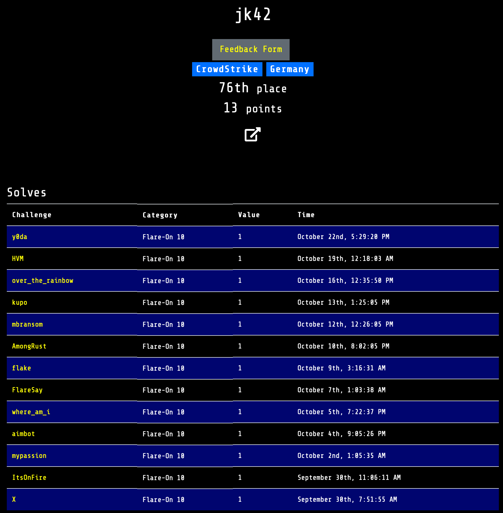

# Flare-On 10 (2023)

Google Mandiant hosted their 10th [Flare-On CTF](http://flare-on.com) this year running from 2023-09-30 to 2023-11-11.

It consisted of 13 Reverse Engineering challenges ranging from mostly Windows executables (incl. obfuscation, multi-stage shellcodes), 16 Bit DOS nostalgica (incl. a boot sector ransomware), a just-in-time code decrypting Windows Hypervisor guest partition and a Forth environment (in a 2.11BSD OS). Also included quite some crypto puzzling.

All-in-all it has been a blast participating, best CTF of the year! Thanks to everyone at Google Mandiant that makes this awesome go-to CTF event possible year after year, keep it up - especially the increased difficulty.

## Write-Ups

My write-ups for some of the challenges can be found here

1. [X](./01_X/)
2. [ItsOnFire](./02_ItsOnFire/)
3. [mypassion](./03_mypassion/)
4. [aimbot](./04_aimbot/)
5. [where_am_i](./05_where_am_i/)
6. [FlareSay](./06_FlareSay/)
7. [flake](./07_flake/)
8. [AmongRust](./08_AmongRust/)
9. [mbransom](./09_mbransom/)
10. [kupo](./10_kupo/)
11. [over_the_rainbow](./11_over_the_rainbow/)
12. [HVM](./12_HVM/)
13. [y0da](./13_y0da/)

## Personal Result

I'm happy to have achieved this year's goal of reaching top 100 with finishing rank #82. Something to beat for Flare-On 11! ;-)

## Official Solutions

[Flare-On 10 Solution Page](N/A)

