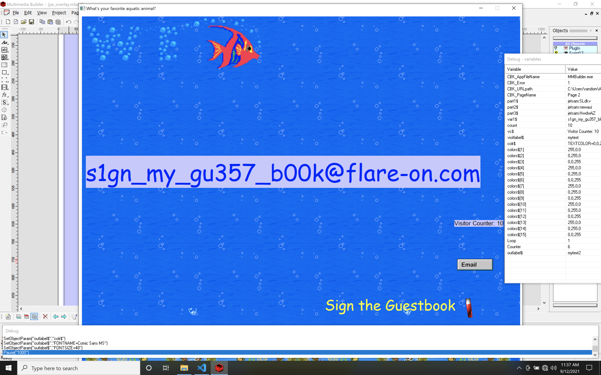

# Flare-On 8, Challenge 4, myaquaticlife

## Task

What would Flare-On do without a healthy amount of nostalgia for the abraisive simplicity of 1990's UI design? Probably do more actual work and less writing fun challenges like this.

## Files

Filename | Size | SHA256
--- | --- | ---
myaquaticlife.exe | 2,389,687 bytes | 6B2A83DC83DBCF45DDF1EFFEB7E93C67149E5F33E8C3F4AC9FC233631C1DF88D

## High Level Summary

- myaquaticlife.exe is a UPX packed 32 Bit Windows PE binary created with a program called `Multimedia Builder (Version 4.9.8.13)`.
- It is rendering an aquarium themed web page with 16 sea animals that is bundled with a 32 Bit Windows DLL named `fathom.dll`.
- Clicking on a sea animal will call `fathom.dll!SetFile`, each time appending a code part, while clicking on the text on the entry page will call `fathom.dll!PluginFunc19` to decrypt & display the flag, if the correct sea animals were clicked.
  - The correct code pieces are **flotsam** parts 1-3 (animals 4, 3, 13 counting from 1 in the upper left corner) and **jetsam** parts 1-3 (animals 11, 7, 10) yielding the flag **s1gn_my_gu357_b00k@flare-on.com**.



## Technical Analysis Steps (short)

- UPX-unpack the binary.
- Debug myacquaticlife_unpacked.exe with IDA pro (attach pro process, local windows debugger)
- Find in modules list: `C:\Users\random\AppData\Local\Temp\MMBPlayer\fathom.dll`
- Set breakpoints on exported functions: PluginFunc19 (known from strings), SetData, SetFile, SetPath, SetString, GetData, GetFile
- Continue program execution & click on first fish upper left corner
- Breakpoint fathom_SetFile is hit
  - Stack param: 02:0008  0019CFB8 -> 0230C1F0 (debug062) -> ("derelict:MZZWP")
  - SetFile will append the value after `:` to a string offset that is based on word flotsam/jetsam/lagan/derelict.

- Clicking on the text in the aquarium page will trigger breakpoint @ PluginFunc19
- Fails ("you chose poorly") if flotsam string is empty -> so flotsam fishes have to be clicked
- Also fails if jetsam string is empty -> so jetsam fishes are important too

- The xmmword values really look fishy (pun!).

```txt
pos_flag = xmm0 values 90625...FCA3A8
fathom.dll:733BF390 xmmword_733BF390 xmmword 0A8A3FCD1A79DD2BA8F8F87A4E4CBF9h
fathom.dll:733BF3A0 xmmword_733BF3A0 xmmword 169E81F938E5AF9F909A96A3A9A42596h
```

Decompiled PluginFunc19

```c
[...]
  flotsam_string = (const char *)flotsam_offset;
  *(_OWORD *)flag = encrypted_flag_part1;
  *(_OWORD *)&flag[16] = encrypted_flag_part2;
  if ( !*(_DWORD *)(flotsam_offset - 12) )      // length of flotsam_offset_value
    return display_html_page2("you chose.. poorly", 18);
  jetsam_string = (const char *)jetsam_offset;
  if ( !*(_DWORD *)(jetsam_offset - 12) )       // length of jetsam_offset_value
    return display_html_page2("you chose.. poorly", 18);
[...]]
  for ( i = 0; i < 31; ++i )                    // decrypt flag bytes loop
  {
    flag[i] ^= flotsam_string[i % strlen(flotsam_string)];
    flag[i] -= jetsam_string[i % 0x11u];
  }
  *(_OWORD *)decrypted_flag = *(_OWORD *)flag;
  *(_OWORD *)&decrypted_flag[16] = *(_OWORD *)&flag[16];
  md5_decrypted_flag = md5((BYTE *)decrypted_flag, (int)calculated_md5_value);
  if ( !md5_decrypted_flag )
  {
    v4 = strcmp(calculated_md5_value, "6c5215b12a10e936f8de1e42083ba184");
[...]
        display_html_page2(flag, strlen(flag));
[...]
```

- The decrypted bytes are md5 hashed. The md5 hash value is compared to `6c5215b12a10e936f8de1e42083ba184` (target hash value of flag?).
- Since only flotsam and jetsam string parts are used to calculate the possible flag value, all sea animals with string values lagan and derelict can be ignored.
- There are 3 sea animals with flotsam parts 1-3 and 3 with jetsam parts 1-3.
- Clicking these in-order will yield the flag bytes:

```hex
0019CF80  73 31 67 6E 5F 6D 79 5F  67 75 33 35 37 5F 62 30  s1gn_my_gu357_b0
0019CF90  30 6B 40 66 6C 61 72 65  2D 6F 6E 2E 63 6F 6D 00  0k@flare-on.com.
```

## Flag

`s1gn_my_gu357_b00k@flare-on.com`
