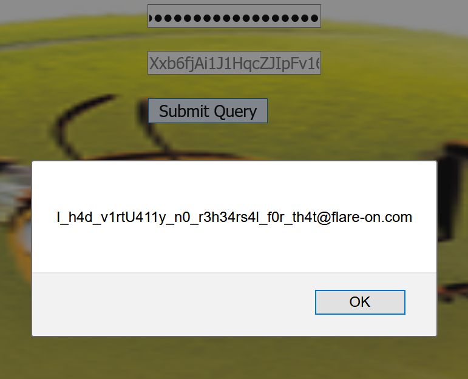

# Flare-On 8, Challenge 8, beelogin

## Task

You're nearly done champ, just a few more to go. we put all the hard ones at the beginning of the challenge this year so its smooth sailing from this point. Call your friends, tell 'em you won. They probably don't care. Flare-On is your only friend now.

## Files

Filename | Size | SHA256
--- | --- | ---
beelogin.html | 3,252,550 bytes | 19317EDD9A73A29BA3459E909C0162A7E5E1CCD13B36A160917204712722B8E7

## High Level Summary

- beelogin.html is a Bee Movie themed HTML page containing a form with five input fields of type password.
- The challenge consists of four nested stages of obfuscated JavaScript code.
  - Stage 1 (the outer file) is in total 59,091 lines long and contains an extensive amount of junk JavaScript code.
    - Only about 14 lines of JavaScript are relevant, calling eval() on a "decrypted" base64 encoded payload.
    - A successful `eval()` is triggered if input field four is given the 64 character long string `ChVCVYzI1dU9cVg1ukBqO2u4UGr9aVCNWHpMUuYDLmDO22cdhXq3oqp8jmKBHUWI`
    - To acquire this string, one had to calculate valid key character values by applying proper constraints
      - Input character values are likely from `string.printable`.
      - The output has to be valid JavaScript code to be successfully eval'd, meaning it's characters are likely from `string.printable` as well.
      - The input character at index i is applied at least three times on the 221 character long intermediate key (at offsets i, i+64 and i+128)
  - Stage 2 is 783,129 bytes of mostly JavaScript obfuscated by JSFuck, which had to be deobfuscated.
  - Stage 3 is 16,293 bytes of JavaScript in the same fashion as Stage 1.
    - A second 64 character long string had to be calculated in the same way as in Stage 1, yielding `UQ8yjqwAkoVGm7VDdhLoDk0Q75eKKhTfXXke36UFdtKAi0etRZ3DoHPz7NxJPgHl`.
    - This string has to be concatenated with the solution to Stage 1 with a semicolon `;`
    - The proper input for form field four thus is `ChVCVYzI1dU9cVg1ukBqO2u4UGr9aVCNWHpMUuYDLmDO22cdhXq3oqp8jmKBHUWI;UQ8yjqwAkoVGm7VDdhLoDk0Q75eKKhTfXXke36UFdtKAi0etRZ3DoHPz7NxJPgHl`.
  - Stage 4 is 8,163 bytes of JSFuck again, yielding `alert("I_h4d_v1rtU411y_n0_r3h34rs4l_f0r_th4t@flare-on.com")`

