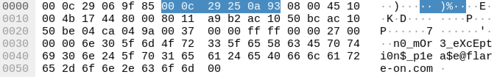
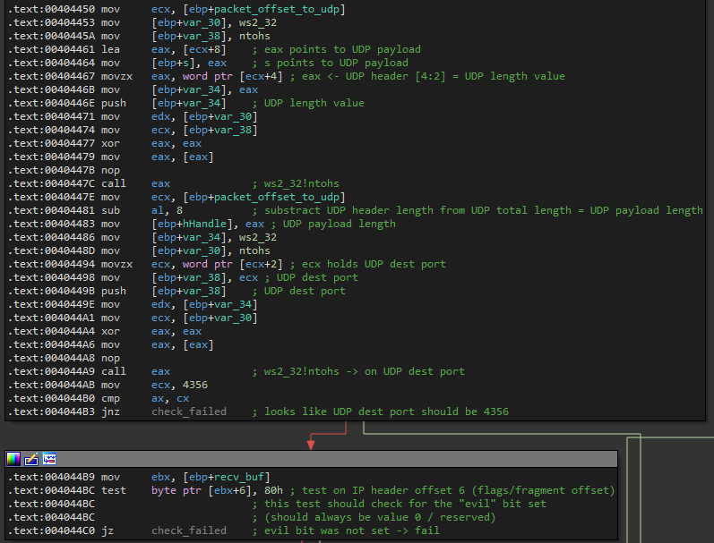
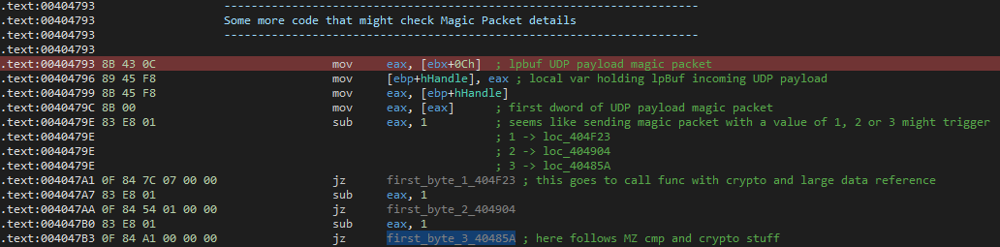
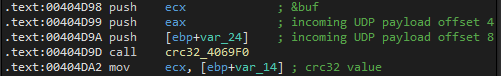
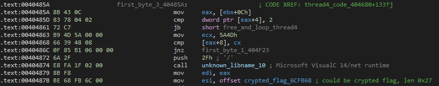
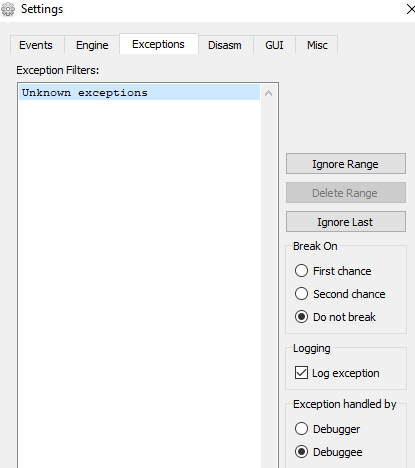
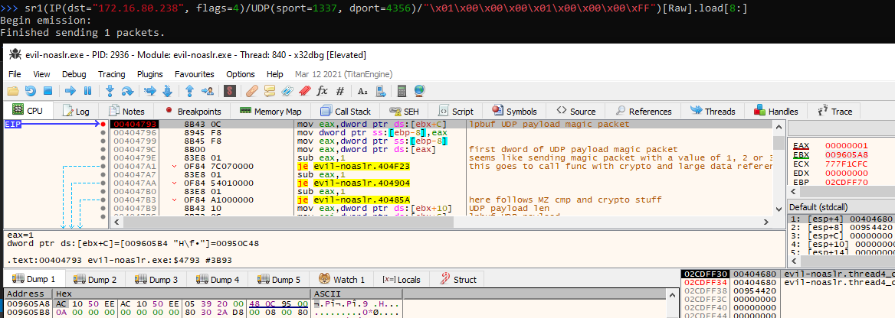
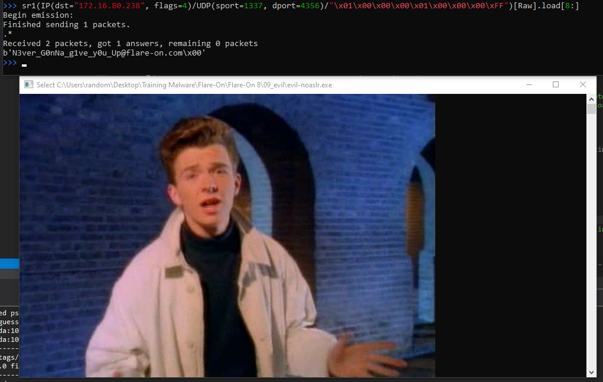

# Flare-On 8, Challenge 9, evil

## Task

Mandiant's unofficial motto is "find evil and solve crime". Well here is evil but forget crime, solve challenge. Listen kid, RFCs are for fools, but for you we'll make an exception :)

The challenge has 3 false flags: `!t_$uRe_W0u1d_B3_n1ce_huh!@flare-on.com` `1s_tHi$_mY_f1aG@flare-on.com` `N3ver_G0nNa_g1ve_y0u_Up@flare-on.com`

## Files

Filename | Size | SHA256
--- | --- | ---
evil.exe | 2,964,480 bytes | 83902600c32ff5d37cbdbed813d99c3b05b0f53311170c3b8c39a4db958f8eaa

## High Level Summary

- evil.exe is a 32 Bit Windows PE binary that registers a Vectored Exception Handler (VEH) as a means of Control Flow Obfuscation.
  - Whenever exceptions are intentionally raised by accessing memory offset 0 or by a division by zero, the VEH dynamically patches the code section after the opcodes that raised the exception with `call eax`.
  - `eax` will hold the Virtual Address of an API function, that the VEH resolved using a custom hashing routine.
- At the beginning of the main function, an extensive array of Anti-Analysis and VM-Detection methods are executed to slow down further analysis.
- evil's main function then creates two threads that repeatedly execute randomly picked Anti-Analysis methods.
  - Thread 1 periodically creates threads that execute Anti-Analysis methods.
  - Thread 2 serves as a "guardian" for Thread 1, checking it's status and re-starting it if it should have terminated.
- evil will terminate, if it wasn't called with a command line argument. The argument is used as an IPv4 address to bind UDP sockets to.
- Then a function is called containing quite some dead code, that also sets up raw UDP network sockets and thread synchronization Semaphore & Mutex.
- After that, two more threads are created that handle network communications through these sockets.
  - Thread 3 listens for incoming UDP packets destined for port 4356 and having the **evil** bit set in the IP header.
  - Thread 4 will generate four parts of the flag decrypting key if it is passed four UDP packets with specific payloads ("L0ve", "s3cret", "5Ex", "g0d").
  - Once the key parts are in place, a last crafted UDP packet will return the flag `n0_mOr3_eXcEpti0n$_p1ea$e@flare-on.com`



## Technical Details

evil.exe is a 32 Bit Windows PE binary. The following unusual artifacts stand out upon first inspection:

- Executing evil.exe in an admin console doesn't seem to do anything (please only do this in controlled & isolated environments).
- The import directory only contains entries from kernel32.dll.
- The DOS stub message is missing and was replaced with the fake flag `!t_$uRe_W0u1d_B3_n1ce_huh!@flare-on.com`.

```hexdump
Offset(h) 00 01 02 03 04 05 06 07 08 09 0A 0B 0C 0D 0E 0F
00000000  4D 5A 90 00 03 00 00 00 04 00 00 00 FF FF 00 00  MZ..........ÿÿ..
00000010  B8 00 00 00 00 00 00 00 40 00 00 00 00 00 00 00  ¸.......@.......
00000020  00 00 00 00 00 00 00 00 00 00 00 00 00 00 00 00  ................
00000030  00 00 00 00 00 00 00 00 00 00 00 00 10 01 00 00  ................
00000040  0E 1F BA 0E 00 B4 09 CD 21 B8 01 4C CD 21 74 5F  ..º..´.Í!¸.LÍ!t_
00000050  24 75 52 65 5F 57 30 75 31 64 5F 42 33 5F 6E 31  $uRe_W0u1d_B3_n1
00000060  63 65 5F 68 75 68 21 40 66 6C 61 72 65 2D 6F 6E  ce_huh!@flare-on
00000070  2E 63 6F 6D 2E 0D 0D 0A 24 00 00 00 00 00 00 00  .com....$.......
```

- IDA Pro fails to enter graph mode for function `main`.
- Scrolling down a bit for the first disassembly look & feel, a couple of oddities catch the eye.

```asm
[...]
.text:0040650B                 xor     eax, eax
.text:0040650D                 mov     eax, [eax]           ; eax has just been cleared, this is going to be exceptionally bad
.text:0040650F                 jz      short loc_406514
.text:00406511                 jnz     short loc_40649E
.text:00406513                 dec     ebp
.text:00406514
.text:00406514 loc_406514:
.text:00406514                 call    near ptr 8544A6A2h  ; what the heck is this? marked as red in IDA for a good reason
[...]
.text:00406538                 dd 0B7h, 45C76674h          ; okay, are we done with code yet, IDA?
.text:00406540                 db 0DCh
.text:00406541                 dd offset loc_402E70
.text:00406545                 db 0C7h, 45h, 0E0h
.text:00406548                 dd 246132h, 46D845C7h, 6A05D227h, 0FF006A00h, 75FFE475h
.text:00406548                 dd 6A006ADCh, 0E0558B00h, 33D84D8Bh, 0E8F0F7C0h, 4D8BD2FFh
[...]
```

In order to compare a disassembly window to a running debug session, make a copy of the binary and remove the `DLL can move` bit from the field `DllCharacteristics` in the PE optional header. To do this, use `setdllcharacteristics.exe` from [Didier Steven's Toolsuite (@DidierStevens)](https://github.com/DidierStevens/DidierStevensSuite). He also hosts a **lot** of other useful tools to check out!

```shell
setdllcharacteristics.exe -d evil-noaslr.exe
```

### First Debug Run

On a first debug run with x32dbg stepping through the main function and following the first call to 0x4023D0, one can observe:

- evil.exe seems to install several Structured Exception Handling Routines (SEH Linked List HEAD Pointer starts at fs:[0] for 32 Bit PE binaries).
- evil.exe seems to force Exceptions to occur (ACCESS_VIOLATION when trying to access ds:[0] and DIVIDE_BY_ZERO when trying to div 0).
  - This might be a trick to obfuscate the control flow to installed Exception handlers.
- Additionally, dynamic code patching can be observed when continuing from exception to exception (self-modifying code).

Upon reaching the very first intended exception raising code @ 0x402460, the SEH chain looks like this:

```txt
Address  Handler  Module/Label             Comment
0019FED8 00443740 evil-noaslr              
0019FF1C 004438E4 evil-noaslr              
0019FF60 00427CF0 <evil-noaslr.SEH_443380> 
0019FFCC 7787AD20 ntdll                    
0019FFE4 77888A47 ntdll                    
```

Trying to set software or hardware breakpoints on the addresses of the installed SEH handler(s) does not seem to work, as x32dbg does not break upon passing the exception to the debuggee.
It seems, that there is even more evil going on that has yet to be revealed!

At this point of analysis, it may be a good idea to read up on exception handling in the windows operating system. Good - old but gold - blog posts can be found here: [A Crash Course on the Depths of Win32™ Structured Exception Handling](https://bytepointer.com/resources/pietrek_crash_course_depths_of_win32_seh.htm) and [Under the Hood: New Vectored Exception Handling in Windows XP](https://docs.microsoft.com/en-us/archive/msdn-magazine/2001/september/under-the-hood-new-vectored-exception-handling-in-windows-xp).

### Finding the Exception Handler

Inside function main, no installation of a vectored exception handler could be observed that would take precedence over SEH routines. So something must have happened before main is executed. This could be a good time to try out [Hasherezade's TinyTracer](https://github.com/hasherezade/tiny_tracer) to trace API calls. The generated TAG file can also be used to add corresponding comments in IDA Pro using @hasherezade's [IDA plugin IFL](https://github.com/hasherezade/ida_ifl) (hint: generally follow her on Twitter and check out her awesome tools on Github).

Inspecting the TAG file yields:

```txt
2157;ntdll.RtlAddVectoredExceptionHandler
 Arg[0] = 0x00000001 = 1
 Arg[1] = ptr 0x00406ad0 -> {U\x8b\xecd\xa1\x00\x00\x00}
```

Using TinyTracer, it was quickly discovered, that ntdll!RtlAddVectoredExceptionHandler is called at evil's RVA 0x2157 and that the VEH routine to be installed has the address 0x406AD0.

So what is going on at RVA 0x2157? Using IDA's **Jump to address (hotkey: g)**

```asm
.text:00402150 sub_402150 proc near
.text:00402150 push    offset sub_406AD0   ; our VEH_40AD0 to be installed as a vectored exception handler
.text:00402155 push    1
.text:00402157 call    dword_6D16E4        ; must have gotten the VA for ntdll!RtlAddVectoredExceptionHandler
.text:0040215D retn
.text:0040215D sub_402150 endp
```

IDA's **xrefs (hotkey: x)** points to 0x402130+F as the culprit, that obviously writes the VA of ntdll!RtlAddVectoredExceptionHandler to dword_6D16E4.

```asm
.text:00402130 sub_402130 proc near
.text:00402130 mov     edx, 542F881Eh      ; some kind of input that makes sub_4054B0 lookup the VA of ntdll!RtlAddVectoredExceptionHandler
.text:00402135 mov     ecx, 246132h        ; some kind of input that makes sub_4054B0 lookup the VA of ntdll!RtlAddVectoredExceptionHandler
.text:0040213A call    sub_4054B0          ; must be a function that returns the VA of ntdll!RtlAddVectoredExceptionHandler
.text:0040213F mov     dword_6D16E4, eax
.text:00402144 retn
.text:00402144 sub_402130 endp
```

### Interim Summary 1 - Taking the first Hurdle

- sub_4054B0 seems to be a function that looks up the VA of an API function (rename to resolve_API_function_4054B0).
  - It likely does so by working on the ecx and edx values.
  - Diving deeper into this function will confirm, that ecx holds the value of the DLL name and edx holds the value of the API function name to look up.
    - ecx = 0x246132 means ntdll
    - edx = 0x542F881E means RtlAddVectoredExceptionHandler
  - For future reference, all encountered values can be found in [enums.h](IDA_script/enums.h). These can be used in IDA to replace the number values with enum entry names (hotkey m).
- sub_406AD0 is installed as a vectored exception handling routine (further dubbed **VEH_406AD0**).
- sub_402130 and sub_402150 are the last two functions of a function pointer table @ 0x445150, all of which are called from sub_431ED6 during runtime initialization (before main).

### So what does VEH_406AD0 actually do?

Taking a deeper look at the disassembly of VEH_406AD0.

- Adding the standard data structures to IDA's database helps resolving offsets: EXCEPTION_POINTERS, EXCEPTION_RECORD, CONTEXT.
- Type the function prototype: `int __stdcall VEH_406AD0(EXCEPTION_POINTERS *struct_exception_pointers)`

```asm
.text:00406AD0                   ; int __stdcall VEH_406AD0(EXCEPTION_POINTERS *struct_exception_pointers)
.text:00406AD0                   VEH_406AD0      proc near               ; DATA XREF: install_VEH_402150↑o
.text:00406AD0
.text:00406AD0                   var_C           = dword ptr -0Ch
.text:00406AD0                   var_4           = dword ptr -4
.text:00406AD0                   struct_exception_pointers= dword ptr  8
[...]
.text:00406AEA 8B 75 08                          mov     esi, [ebp+struct_exception_pointers] ; VEH handler gets passed PEXCEPTION_POINTERS
[...]
.text:00406AEE 8B 46 04                          mov     eax, [esi+EXCEPTION_POINTERS.ContextRecord]
.text:00406AF1 8B B8 A8 00 00 00                 mov     edi, [eax+CONTEXT._Edx]
.text:00406AF7 8B 98 AC 00 00 00                 mov     ebx, [eax+CONTEXT._Ecx]
[...]
.text:00406B28 BA A4 EA 1B A3                    mov     edx, VirtualProtect_ ; check enums.h
[...]
.text:00406B34 B9 32 61 24 00                    mov     ecx, kernel32   ; check enums.h
.text:00406B39 E8 72 E9 FF FF                    call    resolve_API_function_4054B0
[...]
.text:00406B43 A3 7C 1C 6D 00                    mov     kernel32_VirtualProtect, eax
[...]
.text:00406B57 8B D3                             mov     edx, ebx        ; put CONTEXT._Ecx into EDX (value for API func)
.text:00406B59 8B CF                             mov     ecx, edi        ; put CONTEXT._Edx into ECX (value for DLL)
.text:00406B5B E8 50 E9 FF FF                    call    resolve_API_function_4054B0
.text:00406B60 8B F8                             mov     edi, eax
[...]
.text:00406B66 8D 45 08                          lea     eax, [ebp+struct_exception_pointers]
.text:00406B69 50                                push    eax             ; lpflOldProtect
.text:00406B6A 8B 46 04                          mov     eax, [esi+EXCEPTION_POINTERS.ContextRecord]
.text:00406B6D 6A 40                             push    PAGE_EXECUTE_READWRITE ; flNewProtect
.text:00406B6F 68 00 10 00 00                    push    1000h           ; dwSize
.text:00406B74 FF B0 B8 00 00 00                 push    [eax+CONTEXT._Eip] ; lpAddress
.text:00406B7A FF 15 7C 1C 6D 00                 call    kernel32_VirtualProtect ; kernel32.VirtualProtect
.text:00406B80 8B 46 04                          mov     eax, [esi+EXCEPTION_POINTERS.ContextRecord]
.text:00406B83 B9 FF D0 00 00                    mov     ecx, 0D0FFh
.text:00406B88 89 B8 B0 00 00 00                 mov     [eax+CONTEXT._Eax], edi ; put the VA of the resolved API function
.text:00406B88                                                           ; into CONTEXT._Eax
.text:00406B8E 8B 46 04                          mov     eax, [esi+EXCEPTION_POINTERS.ContextRecord]
.text:00406B91 8B 80 B8 00 00 00                 mov     eax, [eax+CONTEXT._Eip]
.text:00406B97 66 89 48 03                       mov     [eax+3], cx     ; patch 0xFF 0xD0 into CONTEXT._Eip + 3
.text:00406B97                                                           ; -> call EAX (with EAX holding the
.text:00406B97                                                           ; recently resolved API function's VA)
.text:00406B9B 8B 46 04                          mov     eax, [esi+EXCEPTION_POINTERS.ContextRecord]
.text:00406B9E 83 80 B8 00 00 00+                add     [eax+CONTEXT._Eip], 3 ; increase EIP by 3 for the exception CONTEXT
.text:00406B9E 03
.text:00406BA5 8D 45 08                          lea     eax, [ebp+struct_exception_pointers]
.text:00406BA8 50                                push    eax             ; lpflOldProtect
.text:00406BA9 FF 75 08                          push    [ebp+struct_exception_pointers] ; flNewProtect
.text:00406BAC 8B 46 04                          mov     eax, [esi+EXCEPTION_POINTERS.ContextRecord]
.text:00406BAF 68 00 10 00 00                    push    1000h           ; dwSize
.text:00406BB4 FF B0 B8 00 00 00                 push    [eax+CONTEXT._Eip] ; lpAddress
.text:00406BBA FF 15 7C 1C 6D 00                 call    kernel32_VirtualProtect ; kernel32.VirtualProtect
[...]
.text:00406BD3 C2 04 00                          retn    4               ; ntdll.[LdrSetDllManifestProber+f8]*
```

#### Summary of VEH_406AD0

- `CONTEXT._edx` and `CONTEXT._ecx` are put into ecx and edx and then used as parameters for the already known API lookup function `resolve_API_function_4054B0`
- The VA of the looked up function is put back into `CONTEXT._eax`
- After changing the memory page permissions to PAGE_EXECUTE_READWRITE via kernel32!VirtualProctect at `CONTEXT._Eip`,
  - The opcodes 0xFF 0xD0 (call eax) are patched to the code section at `CONTEXT._Eip + 3` and
  - `CONTEXT._Eip` is increased by 3 (execution is to be continued there after VEH finishes).

#### How does it behave in action?

The very first exception handling by VEH_406AD0 is caused by the following code (main -> call 0x4023D0)

```asm
[...]
.text:00402437 C7 45 F0 32 61 24 00                 mov     dword ptr [ebp-10h], 246132h    ; kernel32, see enums.h
.text:0040243E C7 45 E8 72 F6 FF 66                 mov     dword ptr [ebp-18h], 66FFF672h  ; GetSystemTime, see enums.h
[...]
.text:00402458 8B 55 F0                             mov     edx, [ebp-10h]
.text:0040245B 8B 4D E8                             mov     ecx, [ebp-18h]
.text:0040245E 33 C0                                xor     eax, eax
.text:00402460 8B 00                                mov     eax, [eax]        ; VEH_406AD0 to the rescue
.text:00402462                      loc_402462:
.text:00402462 EB FF                                jmp     short near ptr loc_402462+1
.text:00402464 E8 0F B7 45 D6 BA 3A+                dd 45B70FE8h, 0FB3ABAD6h, 0C069FE76h, 0F4241h, 176684B9h
[...]
```

So how does VEH_406AD0 patch the code section when the instruction at 0x402460 raises an ACCESS_VIOLATION exception?

- Look up kernel32!GetSystemTime and save it to `CONTEXT._eax`.
- Patch 0x402460 + 3 with 0xFF 0xD0 (call eax).
- Continue execution at 0x402460 + 3.

```asm
.text:00402462 EB                                db 0EBh
.text:00402463 FF D0                             call    eax             ; kernel32!GetSystemTime
```

#### Automating the Patching with IDA Python

I wrote an [IDA Plugin](IDA_script/do_veh_patching.py) to help patch the code like the VEH_406AD0 would. Place the cursor right after the address / instruction that raises the exception and press Hotkey `Alt + 9` to patch the following three opcode bytes with `nop; call eax`. While the VEH_406AD0 would just leave `CONTEXT._Eip + 2` as it is - just an unused byte - i chose to patch it with a nop instruction. This helps defining functions in IDA (hotkey: p) after applying all the patches, which also allows decompilation.

### Continuation of the Anti-Analysis-Safari @ 0x4023D0

Now that the first hurdle has been taken, it is time to better understand what is happening in the first function that is called from main (VA 0x4023D0). As it turns out, this is a nice compilation of anti-analysis and vm detection methods chained together for a wild code safari.

#### Patching ntdll!DbgBreakPoint (Safari Code from 0x402465 up to 0x4024E9)

evil.exe patches the first byte of ntdll!DbgBreakPoint with 0xC3 (ret). It used to hold 0xCC (int 3 / software breakpoint).

Before 0x4024CA (patching ntdll!DbgBreakPoint)

```asm
77964D10 | CC                       | int3                                               | ntdll!DbgBreakPoint (orig)
77964D11 | C3                       | ret                                                |
```

After 0x4024CA

```asm
77964D10 | C3                       | ret                                                | ndtll!DbgBreakPoint (altered by 0x4024CA)
77964D11 | C3                       | ret                                                |
```

Solution: Patch 0x4024CC with 0xCC to neutralize this anti-analysis method with miminal effort.

#### Patching ntdll!DbgUiRemoteBreakin (Safari Code from 0x04024EB up to 0x402592)

evil.exe patches the function prologue of ntdll!DbgUiRemoteBreakin with a call to kernel32!TerminateProcess.

Unpatched ntdll!DbgUiRemoteBreakin

```asm
7799DC70 | 6A 08                    | push 8                                             |
7799DC72 | 68 B0CA9F77              | push ntdll.779FCAB0                                |
7799DC77 | E8 689FFDFF              | call ntdll.77977BE4                                |
7799DC7C | 64:A1 30000000           | mov eax,dword ptr fs:[30]                          |

7799DC70  6A 08 68 B0 CA 9F 77 E8 68 9F FD FF 64 A1 30 00  j.h°Ê.wèh.ýÿd¡0.  
```

Patched ntdll!DbgUiRemoteBreakin

```asm
7799DC70 | 6A 00                    | push 0                                             |
7799DC72 | 68 FFFFFFFF              | push FFFFFFFF                                      |
7799DC77 | B8 1099FE75              | mov eax,<kernel32.TerminateProcess>                |
7799DC7C | FFD0                     | call eax                                           |

7799DC70  6A 00 68 FF FF FF FF B8 10 99 FE 75 FF D0 30 00  j.hÿÿÿÿ¸..þuÿÐ0.  
```

Solution: Patch 0x40257C up to and including 0x0402592 with nops (0x90) to neutralize this evil patching.

#### Anti-VM: VMware Detection (call do_vmware_checks_402F20 @ Safari Code 0x4025B1)

This function does two checks if evil.exe is running in a VMware virtual machine. If VMware is detected by one of these checks, evil.exe will terminate.

The first method tries to execute a [VMware specific port command](https://www.aldeid.com/wiki/VMXh-Magic-Value) @ 0x402F70. This will raise an exception if not running in VMware.

```asm
.text:00402F58 B8 61 51 4D 43                       mov     eax, 434D5161h
.text:00402F5D 05 07 07 00 13                       add     eax, 13000707h  ; 564D5868 = 'VMXh'
.text:00402F62 B9 14 00 00 00                       mov     ecx, 14h        ; VMware get memory size command
.text:00402F67 66 BA 78 13                          mov     dx, 1378h
.text:00402F6B 66 81 C2 E0 42                       add     dx, 42E0h       ; 5658 = 'VX'
.text:00402F70 ED                                   in      eax, dx
.text:00402F71 89 45 E4                             mov     [ebp+var_1C], eax
[...]
.text:00402F95 76 08                                jbe     short loc_402F9F ; vmware_check_passed
```

Neutralize this check with patching 0x402F70 up to 0x402F95 to:

```asm
[...]
.text:00402F70 90                                   nop
.text:00402F71 33 C0                                xor     eax, eax
.text:00402F73 90                                   nop
[...]
.text:00402F95 EB 08                                jmp     short loc_402F9F ; vmware_check_passed
```

The second method beginning at 0x402F9F checks to see how the system reacts after a specific change to the code segment register cs via ntdll!ZwSetLdtEntries. This check seems to be based on Derek Soeder's [vmgpftest.cpp](https://eeyeresearch.typepad.com/blog/2006/09/another_vmware_.html). This check method from the year 2006 seems to not detect VMware Fusion.

Neutralize this check - just to be sure - with patching

```asm
.text:00402F9F BA 99 A2 4F 31                       mov     edx, 314FA299h
.text:00402FA4 B9 84 66 17 00                       mov     ecx, 176684h
.text:00402FA9 E8 02 25 00 00                       call    sub_4054B0
.text:00402FAE 89 45 E0                             mov     [ebp+var_20], eax
.text:00402FB1 83 7D E0 00                          cmp     [ebp+var_20], 0
.text:00402FB5 75 05                                jnz     short loc_402FBC
.text:00402FB7 E9 8C 00 00 00                       jmp     loc_403048
```

to

```asm
.text:00402F9F BA 99 A2 4F 31                       mov     edx, ZwSetLdtEntries ; ZwSetLdtEntries
.text:00402FA4 B9 84 66 17 00                       mov     ecx, ntdll      ; ntdll
.text:00402FA9 E8 02 25 00 00                       call    resolve_API_function_4054B0
.text:00402FAE 89 45 E0                             mov     [ebp+ntdll_ZwSetLdtEntries], eax
.text:00402FB1 83 7D E0 00                          cmp     [ebp+ntdll_ZwSetLdtEntries], 0
.text:00402FB5 90                                   nop
.text:00402FB6 90                                   nop
.text:00402FB7 E9 8C 00 00 00                       jmp     exitFunc
```

These and more VM detection techniques can also be studied at [this webpage](https://sites.google.com/site/bletchleypark2/malware-analysis/malware-technique/anti-vm).

#### Anti-VM: VirtualBox Detection (call do_virtualbox_check_4033F0 @ Safari Code 0x4025B6)

This function uses Windows COM objects to query [WMI for Win32_PnPEntity](https://docs.microsoft.com/en-us/windows/win32/cimwin32prov/win32-pnpentity) to get a list of plug and play devices. It calculates the SHA1 of each entry and compares it to `EEFB155137A9A267394B9E9FA3055FF0DE09A4A7`, which is the SHA1 hash value of the upper cased UTF-16LE string `PCI\VEN_80ee&DEV_cafe`. [See also VirtualBox detection](https://www.virtualbox.org/pipermail/vbox-dev/2010-January/007780.html).

One can read up about this by googling for [Virtual Box Detection via WMI Win32_PnPEntity](https://github.com/hfiref0x/VBoxHardenedLoader/issues/93) or by doing painful rabbitholing into the abyss of COM objects and having fun with these `fastprox.[?CreateLimitedRepresentation@CInstancePart@@QAEPAEPAVCLimitationMapping@@HPAE@Z+160]*`. Choose your amount of pain. ;-)

#### A Package of six moar Anti-Debug techniques (Safari Code from 0x4025BB up to the end)

The last part of the anti-analysis safari consists of the generation of some kind of function pointer *table* holding the addresses of six more anti-debug functions. These are called in a loop right away and will also be repeatedly re-used later on. These functions are:

- sub_4027D0 (further dubbed check_PEB_being_debugged_4027D0)
  - Checks [PEB offset 0x2](https://www.aldeid.com/wiki/PEB-Process-Environment-Block), which holds the value for *BeingDebugged*.
- sub_402820 (further dubbed check_kernel32_CheckRemoteDebuggerPresent_402820)
  - Calls kernel32!ExitProcess if call to kernel32!CheckRemoteDebuggerPresent reveals debugging.
- sub_4028B0 (further dubbed check_PEB_NtGlobalFlag_4028B0)
  - Checks [PEB offset 0x68](https://anti-debug.checkpoint.com/techniques/debug-flags.html#manual-checks-ntglobalflag), which holds the value for *NtGlobalFlag*.
  - Calls kernel32!ExitProcess if debugging is detected (PEB.NtGlobalFlags & 0x70 = 0x70).
- sub_402900 (further dubbed check_Token_SeDebugPrivilege_402900)
  - Calls kernel32!ExitProcess if the SeDebugPrivilege token privilege is detected.
- sub_402BE0 (further dubbed check_hw_breakpoints_DR_regs_402BE0)
  - Calls kernel32!ExitProcess if the ThreadContext's Dr0-Dr3 registers are not zero (indicating hardware breakpoint addresses).
- sub_402CA8 (further dubbed check_get_tick_count_delta_402CA8)
  - Calls kernel32!ExitProcess if the tickcount delta is off-limits after a sleep (indicating increased time passing due to e.g. single stepping).

### Interim Summary 2 - Function anti_analysis_safari_4023D0

- Patches first byte of ntdll!DbgBreakPoint (0xCC - int 3) with 0xC3 (ret) @ 0x4024CA
  - Disarm by patching 0x4024CC with 0xCC (from 0xC3)
- Patches start of function ntdll!DbgUiRemoteBreakin with a call to kernel32!TerminateProcess @ 0x40257C
  - Disarm by Patching NOPs (0x90) into 0x40257C up to and including 0x402592
- Does VMware checks with call to 0x402F20 @ 0x4025B1
  - Patch conditional JBE @ 0x402F95 (0x76 0x08) with unconditional JMP (0xEB 0x08)
    - `*` Patch IN EAX, DX with NOPs (might have stopped tiny_tracer execution)
  - Second Check did not reveal Fusion, so no patch needed for x32dbg
    - `*` Patch conditional jump @ 0x402FB5 with NOPs (needed for tiny_tracer, as pin doesn't support FAR RET (IP 0x402f14) with transfer to different code segment (from 0x0023 to 0x000f))
- Does Virtualbox checks with call to 0x4033F0 @ 0x4025B6
  - No Patch needed for Fusion / x32dbg
    - `*` Patch conditional jump @ 0x40314A (JNE) to conditional jump (JE) to skip the iteration over Win32_PnPEntities altogether
- Calls six more functions in a loop @ 0x402666 doing different checks (PEB BeingDebugged/NtGlobalFlag, SeDebugPrivilege, HW Breakpoints in DRx, CheckRemoteDebuggerPresent, GetTickCount Delta)
  - No Patching needed for x32dbg with ScyllaHide

Patches marked with `*` are additionally needed to let tiny_tracer run through the full program. They are not needed for x32dbg debug runs with ScyllaHide plugin.

This concludes the Anti-Analysis-Safari thus far.

Great resources to further read up on Anti-Analysis:

- <https://0xpat.github.io/Malware_development_part_3/>
- <https://anti-debug.checkpoint.com>
- The “Ultimate”Anti-Debugging Reference by Peter Ferrie.

### Continuation in Function main() @ 0x40648C

Yay! What a scenery it has been so far. Dynamic code patching via VEH-based control flow indirection, an excessive safari through the land of anti-analysis techniques. Is there actually any functional code in here? ;-)

After patching up the anti-analysis functions like described above including the ones marked with `*`, another tiny_tracer run shows creation of three threads @ RVAs 656c (temporarily named thread 1, created from main), 65a2 (temporarily named thread 2, created from main) and 2778 (no idea at this point). After that, the program terminates (no idea why yet).

Before the code to create the first two threads, there is also code to

- Reserve 0x1CC bytes of heap memory @ 0x40649E (further dubbed the *config_block_1CC*).
- Create a Mutex with fake flag name `1s_tHi$_mY_f1aG@flare-on.com` @ 0x406510.
  - If the Mutex already existed, indicating that another process of evil.exe is already running, this instance will skip the creation of threads 1 & 2.

### Understanding Threads 1 & 2

Thread 1 is created at 0x40656C and will run an infinite loop, repeatedly calling sub_402710 and then calling kernel32!Sleep. Taking a deeper look at sub_402710, it becomes apparent, that it is calling sub_403620 @ 0x402747 and then calling CreateThread @ 0x402778 (matches RVA from last tiny_tracer run!) for a code block that must have been returned by sub_403620. As it turns out, sub_403620 randomly picks one of the six anti-debug trick functions from the Safari. With this knowledge, the functions can be renamed

- sub_402710 -> wrap_CreateThead_random_dbg_check_402710
- sub_403620 -> pick_a_random_debug_check_function_403620

Also thread 1's code reference can be renamed to thread1_code_anti_debug_loop_402E70. The hThread handle to Thread 1 is saved to offset 0x8 of struct *block_18* that is passed to thread 2 as lpParameter.

Thread 2 is created at 0x4065A2. Taking a closer look at its code @ 0x402D50, thread 2 will call kernel32!WaitForSingleObject(hThread1, INFINITE) @ 0x402D88. This call will block forever, as long as thread 1 executes. Should it terminate for whatever reason (mayhaps by an eagerly aggressive RE trying to solve this challenge), thread 2 will recreate an instance of thread 1 and a new thread 2 "guardian" before exiting the current instance.

Thus we can rename thread 2's code to thread2_code_guardian_thread1_402D50.

To disarm the anti-analysis functionality of threads 1 & 2, one can patch the function prologue of wrap_CreateThead_random_dbg_check_402710 with 0xC3 (ret) directly @ 0x402710. This way, thread 1 will continue doing its loop happily creating threads that instantely return and thread 2 stays happy, because thread 1 is there to stay.

### Moving on in Function main - Code from 0x4065A4 up to the next Function Call @ 0x40660A

Moving on to 0x4065E2, there is a `cmp [ebp+8], 2`, which references **argc** of function main. The next conditional jump 0x4065F9 (jnz) will lead to cleanup code and program termination. Obviously evil.exe expects exactly one command line argument. It is yet to be discovered, what it is used for. At least this explains, why the last tiny_tracer run terminated after the creation of thread 1 & 2.

At 0x40660A, sub_403A70 is called. It takes *config_block_1CC* as an argument passed in register ecx while also taking evil.exe's command line argument as a stack parameter. Taking a closer look at sub_403A70:

- It begins with a call to sub_410EE0 @ 0x403A7E.
  - Whatever sub_401EE0 does, I renamed it to wrap_funny_jump_410EE0 as it seemed to be a nice rabbit hole with deep dive capability. Since it does not seem to call any API function whatsoever and it does not seem to have meaningful input or return values, I put it on my list of functions to take a look at if i may run out of things to look at. Luckily, it turned out to be unnecessary to understand.
- At 0x403AC5, ws2_32!inet_addr is called on evil.exe's command line argument. Looks like evil.exe is expecting an IP address as an argument.
- At 0x403B20, ws2_32!socket is called to create a raw UDP socket s (needs admin rights!)
- At 0x403B60, ws2_32!bind is called with a struct sockaddr containing the IP address from above and the socket s.
- Afterwards, the socket is configured with SIO_RCVALL via WSAIoctl @ 0x403BB4 and with an SO_RCVTIMEO of 10s via setsockopt @ 0x403C0B.
- Then a second socket is created with the option IP_HDRINCL.
- The sockets 1 and 2 are saved to offsets 0x194 and 0x190 respectively of *config_block_1CC*.
- Near the end, a mutex and a semaphore are created and saved to offsets 0x1C4 and 0x1C0 respectively of *config_block_1CC*. While it is not known at this time of the analysis, these will be used to synchronize the execution of threads 3 & 4.
- And because it's always an evil thing to do, another call to the disarmed function wrap_CreateThead_random_dbg_check_402710 occurs @ 0x403D06.

### Interim Summary 3 - Data Structures *config_block_1CC* and *block_18*

Up to this point, the following knowledge has been acquired about the data structures:

#### *config_block_1CC*

Offset | Meaning / Comment
--- | ---
0x190 | socket 2 / set by 0x403C3C after second call socket(AF_INET, SOCK_RAW, IPPROTO_UDP), option IP_HDRINCL
0x194 | socket 1 / set by 0x403B27 after call socket(AF_INET, SOCK_RAW, IPPROTO_UDP), options SIO_RCVALL & SO_RCVTIMEO of 10s
0x198 | hThread thread2 from main @ 0x4065B0 / 0x13241104 @ 0x403A9B
0x1C0 | semaphore set @ 0x403CAA after CreateSemaphoreA
0x1C4 | mutex set @ 0x403CE7 after CreateMutexA / thread3 waits for @ 0x40455C, with 10s timeout
0x1C8 | pointer to struct *block_18* (struct size 0x18 filled during anti_analysis_safari_4023D0 with pointers to the six anti-debug functions)

#### *block_18*

Offset | Meaning / Comment
--- | ---
0x4 | hMutex with name `1s_tHi$_mY_f1aG@flare-on.com`
0x8 | hThread thread1 from main @ 0x406586
0x10 | kind of a linked list/structure including function pointers (of the six anti-debug trick functions)
0x14 | used in a div, likely as a modulo, for prng selection of the anti-debug function to create a thread with

### Thread 3 (code @ 0x404310)

Thread 3 is created in function main at 0x40663D. It's handle is saved to offset 0x1A4 of *config_block_1CC*.

- Thread 3 loops
  - At 0x404366, it executes another call of wrap_CreateThead_random_dbg_check_402710, which has already been disarmed.
  - At 0x4043B7, ws2_32!recvfrom is called on socket s (offset 0x194 *config_block_1CC*).
    - If it times out (WSAGetLastError returned WSAETIMEDOUT), it jumps back to the loop start.
    - Beginning with 0x404405, a received IP packet is checked

The checks are

- 0x40440C: IP header offset 9 == IPPROTO_UDP (0x11)?
- 0x404447: UDP datagram length > 0?
- 0x4044B0: UDP destination port == 4356?
- 0x4044BC: IP header offset 6 & 0x80 == 0x80 (**evil** bit set)?



If all checks are passed, parts of the packet are copied to a custom data structure (*packet_block_14*).

Offset | Size | Comment
--- | --- | ---
0x0 | 0x4 | IP source address
0x4 | 0x4 | IP destination address
0x8 | 0x2 | UDP source port
0xC | 0x4 | Pointer to buffer, that the UDP payload is copied to
0x10 | 0x4 | UDP payload length (= size of buffer 0xC)

At 0x40455C, thread 3 tries to acquire the mutex (offset 0x1C4 *config_block_1CC*). If it succeeds, another call to the already disarmed wrap_CreateThead_random_dbg_check_402710 is executed before copying the packet data and releasing the semaphore (offset 0x1C0 *config_block_1CC* @ 0x404621) and releasing the mutex (offset 0x1C4 @ 0x40464B).

### Thread 4 (code @ 0x404680)

Thread 4 is created in function main at 0x406676. It's handle is saved to offset 0x1A8 of *config_block_1CC*.

- Thread 4 loops
  - At 0x4046CC, it attempts to acquire the semaphore (offset 0x1C0) with 10s timeout.
  - At 0x404703, it attempts to acquire the mutex (offset 0x1C4) with 10s timeout.
    - If one of those are "non signalled", it jumps back to loop start.
  - Because it never gets old, a call to wrap_CreateThead_random_dbg_check_402710 follows @ 0x404716 once both mutex & semaphore were acquired.
  - At 0x404747, thread 4 saves a pointer to the custom packet data (*packet_block_14*).
  - It then increases a magic packet counter (offset 0x1B8 *config_block_1CC*) before releasing the mutex again @ 0x404786.

At this point it becomes apparent, that the mutex and semaphore are used to synchronize threads 3 & 4. The mutex guarantees, that either thread 3 or thread 4 is continued to work on received packets while the other blocks waiting to acquire the mutex. The semaphore might be used to limit the amount of total processed packets up to the semaphores maximum count of 0x40, as thread 4 never releases the acquired semaphore.

Beginning at 0x404793, thread 4 code inspects the UDP payload. Depending on the first dword value, a different code part will be executed.



#### Thread 4: A Decryption Function - 0x4067A0

Type 1 and type 3 packets will trigger thread 4 code, that will call the decryption function some_crypto_stuff_4067A0.

- This function expects 0x10 key bytes passed through a pointer in register ecx.
  - The key bytes are appended to a eight byte prefix known as [PUBLICKEYSTRUC or BLOBHEADER](https://docs.microsoft.com/en-us/windows/win32/api/wincrypt/ns-wincrypt-publickeystruc)
    - BYTE bType = 0x8 (PLAINTEXTKEYBLOB)
    - BYTE bVersion = 0x2 (CUR_BLOB_VERSION?)
    - WORD reserved = 0x0
    - ALG_ID aiKeyAlg = 0x6802
  - These key bytes are passed to function CryptImportKey @ 0x4068CA.
  - Weird: [According to MSDN](https://docs.microsoft.com/en-us/windows/win32/seccrypto/alg-id), ALG_ID 0x6802 is listed as CALG_SEAL ("not supported").
- The data and size of data to decrypt is passed through two stack parameters.
- The encrypted data is overwritten with its decrypted value.
- The function could be typed: `int __usercall some_crypto_stuff_4067A0@<eax>(LPVOID *key@<ecx>, char *pbData, int pbDataLen)`.

#### Thread 4: Type dependent Code Execution - Type 1

A type 1 packet will continue code execution @ 0x404F23. This leads to a call of function sub_403FC0 which calls several windows gdi graphics API functions like GetDC, CreateCompatibleDC, CreateDIBSection, SelectObject, GetObjectA, BitBlt.

At 0x4040DA, a first call occurs to some_crypto_stuff_4067A0 (see above).

- ecx (key @ 0x6CFBC8) = `55 8B EC 64 A1 00 00 00 6A FF 68 D4 21 41 00 50`
- pbData (crypted buffer @ 0x5B7330) = `90 22 4C 7B 0F 20 9F 89 A2 76 A1 48 0A 9B E4 E1 E2 FA 28 03 07 82 83 70 2A 35 7D 8C 21 09 94 45 45 2C C6 EA 37 9D 30 13 A3 17 55 3E 24 12 D0 B0` (first 0x30 bytes)
- pbDataLen = 1,148,982 bytes
- The result is used in further windows gdi API function calls.

At 0x40422A, a second call to some_crypto_stuff_4067A0 is executed.

- ecx (key @ 0x6CFBA0) = `55 8B EC 64 A1 00 00 00 6A FF 68 D4 21 41 00 50` (same as above)
- pbData (crypted buffer @ 0x6CFBA0) = `9C 5C 0C 96 6C 7F D8 B9 CC 38 F6 17 6D AA BA 84 BD 83 D8 74 58 D7 D3 32 4C 59 1D FE 5C 24 FB 2B 6B 4F A9 0F 26`
- pbDataLen = 0x25
- The result is sent back to the packet origin via function wrap_ws2_32_sendto_403D40.
- The decryption function (see above) imports a PUBLICKEYSTRUC and key bytes indicating an ALG_ID of CALG_SEAL (0x6802), which is marked as "not supported" in MSDN. Trying out CALG_RC4 (0x6801) just for fun and giggles unexpectedly decrypts this pbData to fake flag `N3ver_G0nNa_g1ve_y0u_Up@flare-on.com\x00`. While it is not necessary to know for solving this challenge, it is now known that function some_crypto_stuff_4067A0 uses the RC4 cipher (if any person reading this could point out why, please don't hesitate to brighten me up - it seems to be another **evil** trick).

Knowing this, the encrypted buffer 0x5B7330 can be decrypted to a bitmap file containing a screenshot of rick astley (more rick roll! YAY!).

#### Thread 4: Type dependent Code Execution - Type 2

A type 2 packet will continue code execution @ 0x404904. This code begins spaghetti-like that might best be left for a future dynamic analysis.

What stands out though is code that looks like crc32 calculation in the function crc32_4069F0 called @ 0x404D9D. After inspecting this function it could be prototyped with `unsigned int __cdecl crc32_4069F0(int buf, unsigned int dwLen, int *crc)`.



Just following the incoming packets data, it can be derived, that the crc32 calculation is done on the UDP payload offset 8 data with a the size of offset 4. The calculated crc32 value is also written to a global offset, that seems to be selected as 0x6D1680, 0x6D1684, 0x6D1688 or 0x6D168C depending on some yet unknown comparisons.

In an interim conclusion, "correct" type 2 packets might trigger a crc32 calculation of their UDP payload offset 8 with the value written to global offsets between 0x6D1680 and 0x6D168C.

#### Thread 4: Type dependent Code Execution - Type 3

A type 3 packet will continue code execution @ 0x40485A. It starts off with a check of the incoming packet's UDP payload value at offset 8. If it is not 0x5A4D ("MZ", often known as magic bytes for windows PE files), it will jump over to the fake flag returning code part for type 1 packets.



At 0x4048B8, a call to some_crypto_stuff_4067A0 is executed.

- ecx (key @ 0x6D1680) = initially empty, but it seems to be set within the spaghetti code handling type 2 packets (e.g. around 0x0404D7C)
- pbData (crypted buffer @ 0x6CFB68) = `32 38 A7 02 70 DF E7 2B F7 7A 77 F5 76 29 1B A2 87 E4 C2 F9 53 CC 3F 6E E8 9A A6 82 0C BD A4 D1 96 E8 7A 89 00 C5 F5`
- pbDataLen = 0x27
- The result is sent back to the packet origin with a call to function wrap_ws2_32_sendto_403D40 @ 004048D9.
- This smells a lot like the final flag, but it has yet to be determined how to correctly fill the key buffer @ 0x6D1680.
- From analysis of type 2 packet handling code, it is know that these will fill the key buffer with crc32 values. It is apparent, that it has to be found out how!

#### Thread 4: Type dependent Code Execution - Type 4+

As evil.exe is evil, it seems to be important to implement heartbleed style code. This is triggered by type 4+ packets executing code @ 0x4047B9.

- In this case, the second dword of the incoming UDP payload will also be used a size value.
- It will then copy this amount of (**uninitialized?**) bytes into a packet buffer and is sent back to the origin. CVE-2014-0160, anyone?

### Further Dynamic Analysis Approach

From the extensive static analysis of thread 3 and 4 code above, the following can be summed up:

- All UDP packets sent to evil.exe, listening on the IP address it gets as a command line parameter, have to have the evil bit set and be destined for UDP port 4356.
- The UDP payload has to be structured like this:
  - Offset 0x0: DWORD packet type
  - Offset 0x4: DWORD data length
  - Offset 0x8: VOID *data
- Type 1 packets will trigger a rick roll, receiving back fake flag `N3ver_G0nNa_g1ve_y0u_Up@flare-on.com\x00`.
- Type 2 packets will calculate the crc32 value of VOID *data and write the result into key buffer @ 0x6D1680.
- Type 3 packets with VOID *data beginning with "MZ" will trigger decryption of what is likely the final flag.
- Type 4+ packets are just **evil**.

### Crafting Magic Packets - Type 1

Approach:

- Set breakpoint at 0x404793 (before the packet type dependent jumps).
- Run evil.exe as admin with command line argument "172.16.80.238" (local ip) in x32dbg.
- Let debuggee handle all exceptions.



Crafting a packet with scapy that passes thread 3 checks (IP evil bit, UDP dst port 4356) and has a thread 4 packet type 1 & length value 1 (dwords at UDP payload offsets 0x0 & 0x4).

```python
>>> sr1(IP(dst="172.16.80.238", flags=4)/UDP(sport=1337, dport=4356)/"\x01\x00\x00\x00\x01\x00\x00\x00\xFF")[Raw].load[8:]
Begin emission:
Finished sending 1 packets.
```

Once the packet is sent, the breakpoint 0x404793 is triggered! YAY!


Resuming evil.exe will yield the expected fake flag `N3ver_G0nNa_g1ve_y0u_Up@flare-on.com` and a rick roll screenshot (overlaying?) the console window of x32dbg running evil.exe.



### Crafting Magic Packets - Type 2

Crafting a type 2 packet with a dummy payload to trigger the debugging.

```python
>>> sr1(IP(dst="172.16.80.238", flags=4)/UDP(sport=1337, dport=4356)/"\x02\x00\x00\x00\x01\x00\x00\x00\xFF")[Raw].load[8:]
```

Stepping through the type 2 packet handling routine, the code between 0x404904 and 0x404D10 seems to decode the following strings and string pointers:

String Address | Pointer to String | Value
--- | --- | ---
0x6D17A8 | 0x6D17B0 | L0ve
0x6D179A | 0x6D1784 | s3cret
0x6D17BC | 0x6D17B8 | 5Ex
0x6D178C | 0x6D17C8 | g0d

Naughty.

Following the string decoding, the incoming UDP payload VOID *data is compared to each of the string values. If it matches one of these, the crc32 value of that data will be calculated and - depending on the matched string - saved to the key buffer dwords beginning at 0x6D1680.

### Putting It All Together to Retrieve the Flag

Approach:

- Send type 2 packet with offset 4 = 4 (len) and offset 8 = "L0ve" to fill first key dword @ 0x6D1680 (with crc32 of "L0ve")
- Send type 2 packet with offset 4 = 5 and offset 8 = "s3cret" to fill second key dword @ 0x6D1684 (with crc32 of "s3cret")
- Send type 2 packet with offset 4 = 3 and offset 8 = "5Ex" to fill third key dword @ 0x6D1688 (with crc32 of "5Ex")
- Send type 2 packet with offset 4 = 3 and offset 8 = "g0d" to fill fourth key dword @ 0x6D168C (with crc32 of "g0d")

Doing so will nicely fill the key buffer @ 0x6D1680 like this:
`006D1680  90 50 96 AE F0 8E C1 97 0E 31 BC 27 27 40 97 05  .P.®ð.Á..1¼''@..`

Time to retrieve the flag with a type 3 packet!

```txt
>>> sr1(IP(dst="172.16.80.238", flags=4)/UDP(sport=1337, dport=4356)/"\x03\x00\x00\x00\x50\x00\x00\x00\x4d\x5a")[Raw].load[8:]                                         
Begin emission:
Finished sending 1 packets.
.*
Received 2 packets, got 1 answers, remaining 0 packets
b'\x05\x87\nG\xf2SpDI\x949\xd6\xf9\xef\x01b\xb7\x80\xad\x01\xe9\xe5\x12\x85Wf\xd9~\xbc\xcd\xcb\xbd\x98"\x94\xea\x9b\'\xee'
```

No. That didn't work...

What went wrong? Looks like the (inlined) string comparisons are working on null terminated strings (C like), even though their length is passed as an argument.
As it also turned out, the crc32 value is calculated on the string value **including** the zero termination! AAAAArrgh! This brings back distant memories of challenge 3 crc32 calculation that included the newline character. Off you go!

Sending the correct type 2 packets looks like this:

```txt
>>> send(IP(dst="172.16.80.238", flags=4)/UDP(sport=1337, dport=4356)/"\x02\x00\x00\x00\x05\x00\x00\x00L0ve\x00")                                                     
.
Sent 1 packets.
>>> send(IP(dst="172.16.80.238", flags=4)/UDP(sport=1337, dport=4356)/"\x02\x00\x00\x00\x07\x00\x00\x00s3cret\x00")                                                   
.
Sent 1 packets.
>>> send(IP(dst="172.16.80.238", flags=4)/UDP(sport=1337, dport=4356)/"\x02\x00\x00\x00\x04\x00\x00\x005Ex\x00")                                                      
.
Sent 1 packets.
>>> send(IP(dst="172.16.80.238", flags=4)/UDP(sport=1337, dport=4356)/"\x02\x00\x00\x00\x04\x00\x00\x00g0d\x00")                                                      
.
Sent 1 packets.
```

This fills up the key buffer like this:
`006D1680  E3 FC 31 F4 D8 E9 B0 78 77 06 6B 5A A2 4F 5B 95  ãü1ôØé°xw.kZ¢O[.`

Sending the final type 3 packet will now retrieve the flag - or we could use the SEAL/RC4 knowledge to decrypt it manually.

```txt
>>> sr1(IP(dst="172.16.80.238", flags=4)/UDP(sport=1337, dport=4356)/"\x03\x00\x00\x00\x03\x00\x00\x00MZ\x00")[Raw].load[8:]                                          
Begin emission:
Finished sending 1 packets.
.*
Received 2 packets, got 1 answers, remaining 0 packets
b'n0_mOr3_eXcEpti0n$_p1ea$e@flare-on.com\x00'
```

## Flag

`n0_mOr3_eXcEpti0n$_p1ea$e@flare-on.com`
